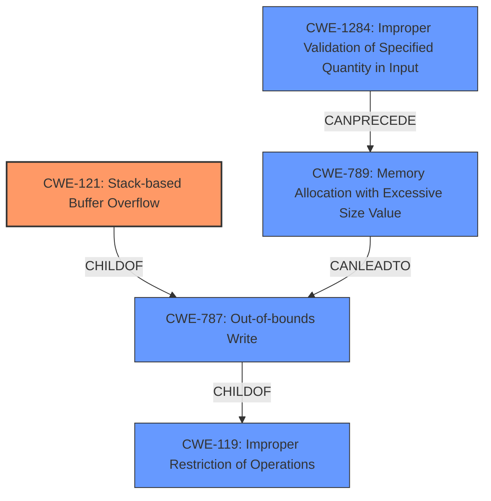

# Raw Analyzer Response for CVE-2021-26561

# Summary
| CWE ID | CWE Name | Confidence | CWE Abstraction Level | CWE Vulnerability Mapping Label | CWE-Vulnerability Mapping Notes |
|---|---|---|---|---|---|
| CWE-121 | Stack-based Buffer Overflow | 1.0 | Variant | Allowed | Primary CWE |
| CWE-1284 | Improper Validation of Specified Quantity in Input | 0.7 | Base | Allowed | Secondary Candidate |

## Evidence and Confidence

*   **Confidence Score:** 0.9
*   **Evidence Strength:** HIGH

## Relationship Analysis
The primary CWE is CWE-121, a **Variant** of CWE-787 (**Base**: Out-of-bounds Write) which is a **ChildOf** CWE-119 (**Class**: Improper Restriction of Operations within the Bounds of a Memory Buffer). CWE-121 is chosen because the vulnerability is specifically a stack-based buffer overflow. CWE-1284 can **CanPrecede** CWE-789 (**Variant**: Memory Allocation with Excessive Size Value), which can lead to a buffer overflow.

## Vulnerability Chain
The vulnerability chain starts with the **improper handling of the syno_finder_site HTTP header**. The **lack of validation** of the size of the input leads to a **stack-based buffer overflow**, which allows an attacker to **execute arbitrary code**.

## Summary of Analysis
The primary weakness is a **stack-based buffer overflow** (CWE-121). This is due to the `sscanf` function copying the `syno_finder_site` value from the HTTP response into a fixed-size stack buffer without proper bounds checking. This matches the description of CWE-121 as a **Variant** of a buffer overflow where the buffer is allocated on the stack. The evidence is strong, as the vulnerability description and CVE reference links explicitly mention the **stack-based buffer overflow**. The confidence score is high (0.9) because the evidence directly supports the CWE selection.

CWE-119 (Improper Restriction of Operations within the Bounds of a Memory Buffer) was considered, but it is a more general **Class**-level CWE. Since the vulnerability is specifically a **stack-based** buffer overflow, CWE-121 is a more precise and appropriate choice. The mapping guidance for CWE-119 discourages its use when more specific CWEs are available.

CWE-120 (Buffer Copy without Checking Size of Input ('Classic Buffer Overflow')) was considered because it relates to buffer overflows. However, the description specifies "Buffer Copy" operations, and the CVE summary states that `sscanf` is the function that causes the overflow. The description of `sscanf` is that it *parses* the string. Therefore, CWE-120 is not appropriate.

CWE-1284 (Improper Validation of Specified Quantity in Input) was considered as a possible secondary weakness, as the root cause could be the **lack of validation** of the size of the `syno_finder_site` HTTP header value. This is supported by the CVE reference links content summary: "The syno_finder_site value from the HTTP response is copied into a local stack buffer (local_880) of fixed size (128 bytes) using sscanf without proper bounds checking."

Relevant CWE Information:

# Enhanced Context (25 CWEs)
The following CWEs were identified as potentially relevant to this vulnerability:

## CWE-191: Integer Underflow (Wrap or Wraparound)
**Abstraction Level**: Base
**Similarity Score**: 0.76
**Source**: dense

**Description**:
The product subtracts one value from another, such that the result is less than the minimum allowable integer value, which produces a value that is not equal to the correct result.

**Mapping Guidance**:
- Usage: Allowed
- Rationale: This CWE entry is at the Base level of abstraction, which is a preferred level of abstraction for mapping to the root causes of vulnerabilities.

## CWE-131: Incorrect Calculation of Buffer Size
**Abstraction Level**: Base
**Similarity Score**: 0.76
**Source**: dense

**Description**:
The product does not correctly calculate the size to be used when allocating a buffer, which could lead to a buffer overflow.

**Mapping Guidance**:
- Usage: Allowed
- Rationale: This CWE entry is at the Base level of abstraction, which is a preferred level of abstraction for mapping to the root causes of vulnerabilities.

## CWE-124: Buffer Underwrite ('Buffer Underflow')
**Abstraction Level**: Base
**Similarity Score**: 0.75
**Source**: dense

**Description**:
The product writes to a buffer using an index or pointer that references a memory location prior to the beginning of the buffer.

**Mapping Guidance**:
- Usage: Allowed
- Rationale: This CWE entry is at the Base level of abstraction, which is a preferred level of abstraction for mapping to the root causes of vulnerabilities.

## CWE-805: Buffer Access with Incorrect Length Value
**Abstraction Level**: Base
**Similarity Score**: 0.75
**Source**: dense

**Description**:
The product uses a sequential operation to read or write a buffer, but it uses an incorrect length value that causes it to access memory that is outside of the bounds of the buffer.

**Mapping Guidance**:
- Usage: Allowed
- Rationale: This CWE entry is at the Base level of abstraction, which is a preferred level of abstraction for mapping to the root causes of vulnerabilities.

## CWE-680: Integer Overflow to Buffer Overflow
**Abstraction Level**: Compound
**Similarity Score**: 0.75
**Source**: dense

**Description**:
The product performs a calculation to determine how much memory to allocate, but an integer overflow can occur that causes less memory to be allocated than expected, leading to a buffer overflow.

**Mapping Guidance**:
- Usage: Discouraged
- Rationale: This CWE entry is a named chain, which combines multiple weaknesses.

## CWE-126: Buffer Over-read
**Abstraction Level**: Variant
**Similarity Score**: 0.74
**Source**: dense

**Description**:
The product reads from a buffer using buffer access mechanisms such as indexes or pointers that reference memory locations after the targeted buffer.

**Mapping Guidance**:
- Usage: Allowed
- Rationale: This CWE entry is at the Variant level of abstraction, which is a preferred level of abstraction for mapping to the root causes of vulnerabilities.

## CWE-1325: Improperly Controlled Sequential Memory Allocation
**Abstraction Level**: Base
**Similarity Score**: 0.74
**Source**: dense

**Description**:
The product manages a group of objects or resources and performs a separate memory allocation for each object, but it does not properly limit the total amount of memory that is consumed by all of the combined objects.

**Mapping Guidance**:
- Usage: Allowed
- Rationale: This CWE entry is at the Base level of abstraction, which is a preferred level of abstraction for mapping to the root causes of vulnerabilities.

## CWE-789: Memory Allocation with Excessive Size Value
**Abstraction Level**: Variant
**Similarity Score**: 0.74
**Source**: dense

**Description**:
The product allocates memory based on an untrusted, large size value, but it does not ensure that the size is within expected limits, allowing arbitrary amounts of memory to be allocated.

**Mapping Guidance**:
- Usage: Allowed
- Rationale: This CWE entry is at the Variant level of abstraction, which is a preferred level of abstraction for mapping to the root causes of vulnerabilities.

## CWE-193: Off-by-one Error
**Abstraction Level**: Base
**Similarity Score**: 0.74
**Source**: dense

**Description**:
A product calculates or uses an incorrect maximum or minimum value that is 1 more, or 1 less, than the correct value.

**Mapping Guidance**:
- Usage: Allowed
- Rationale: This CWE entry is at the Base level of abstraction, which is a preferred level of abstraction for mapping to the root causes of vulnerabilities.

## CWE-190: Integer Overflow or Wraparound