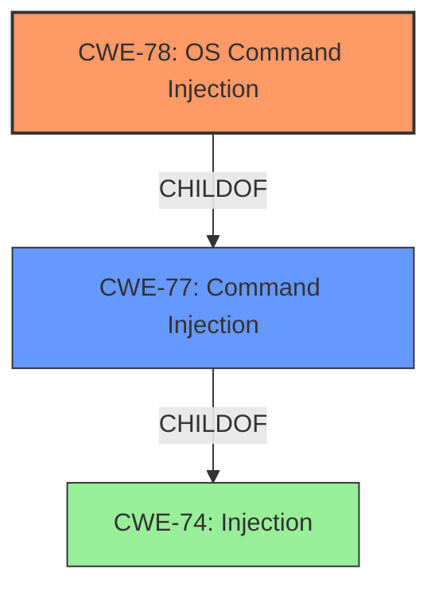

# Analysis Report for CVE-2021-26576

# Vulnerability Analysis Report: CVE-2021-26576

## Description


## Analysis (with Relationship Data)

# Summary
| CWE ID | CWE Name | Confidence | CWE Abstraction Level | CWE Vulnerability Mapping Label | CWE-Vulnerability Mapping Notes |
|---|---|---|---|---|---|
| CWE-78 | Improper Neutralization of Special Elements used in an OS Command ('OS Command Injection') | 1.0 | Base | Allowed | Primary CWE |

## Evidence and Confidence

*   **Confidence Score:** 1.0
*   **Evidence Strength:** HIGH

## Relationship Analysis
The primary CWE is CWE-78, which is a Base level CWE. It is a child of the Class level CWE-77, which is Improper Neutralization of Special Elements used in a Command ('Command Injection'). CWE-78 is more specific to OS commands, while CWE-77 is for any command language. Since the vulnerability is specifically a **command injection** in the BMC firmware, which executes OS commands, CWE-78 is the more appropriate choice.



## Vulnerability Chain
The vulnerability chain is simple:
1.  Improper neutralization of special elements in OS commands (CWE-78) leads to command injection.

## Summary of Analysis
The vulnerability description clearly states a **command injection** vulnerability in the BMC firmware of HPE Apollo 70 System. The key phrase "**command injection**" directly aligns with CWE-78, Improper Neutralization of Special Elements used in an OS Command ('OS Command Injection').

The retriever results also list CWE-78 as a top candidate. CWE-77 is also high on the list, but the key is to find the most specific match, which is CWE-78 because it's related to OS commands.

The relationship analysis confirms that CWE-78 is a child of CWE-77, making it a more specific and appropriate choice. The mapping guidance for CWE-78 states that it is at the Base level of abstraction, which is preferred.

The final decision is based on the clear description of the vulnerability as a **command injection**, the retriever results, and the relationship analysis, which all support mapping to CWE-78. This selection is at the optimal level of specificity.

Relevant CWE Information:

# Enhanced Context (25 CWEs)
The following CWEs were identified as potentially relevant to this vulnerability:

## CWE-74: Improper Neutralization of Special Elements in Output Used by a Downstream Component ('Injection')
**Abstraction Level**: Class
**Similarity Score**: 0.73
**Source**: dense

**Description**:
The product constructs all or part of a command, data structure, or record using externally-influenced input from an upstream component, but it does not neutralize or incorrectly neutralizes special elements that could modify how it is parsed or interpreted when it is sent to a downstream component.

**Mapping Guidance**:
- Usage: Discouraged
- Rationale: CWE-74 is high-level and often misused when lower-level weaknesses are more appropriate.

## CWE-77: Improper Neutralization of Special Elements used in a Command ('Command Injection')
**Abstraction Level**: Class
**Similarity Score**: 1.00
**Source**: alternate_terms

**Description**:
The product constructs all or part of a command using externally-influenced input from an upstream component, but it does not neutralize or incorrectly neutralizes special elements that could modify the intended command when it is sent to a downstream component.

**Mapping Guidance**:
- Usage: Allowed-with-Review
- Rationale: CWE-77 is often misused when OS command injection (CWE-78) was intended instead [REF-1287].

## CWE-78: Improper Neutralization of Special Elements used in an OS Command ('OS Command Injection')
**Abstraction Level**: Base
**Similarity Score**: 0.70
**Source**: alternate_terms

**Description**:
The product constructs all or part of an OS command using externally-influenced input from an upstream component, but it does not neutralize or incorrectly neutralizes special elements that could modify the intended OS command when it is sent to a downstream component.

**Mapping Guidance**:
- Usage: Allowed
- Rationale: This CWE entry is at the Base level of abstraction, which is a preferred level of abstraction for mapping to the root causes of vulnerabilities.


## CWE Relationship Analysis

Current CWEs represent these abstraction levels: .


### Vulnerability Chain Analysis

**Chain starting from CWE-78:**
- 78 (Improper Neutralization of Special Elements used in an OS Command ('OS Command Injection')) - ROOT


**Chain starting from CWE-74:**
- 74 (Improper Neutralization of Special Elements in Output Used by a Downstream Component ('Injection')) - ROOT


### CWE Relationship Diagram

```mermaid
graph TD
    classDef primary fill:#f96,stroke:#333,stroke-width:2px
    classDef secondary fill:#69f,stroke:#333
    classDef tertiary fill:#9e9,stroke:#333
```


*Report generated on 2025-04-02 11:01:47*
