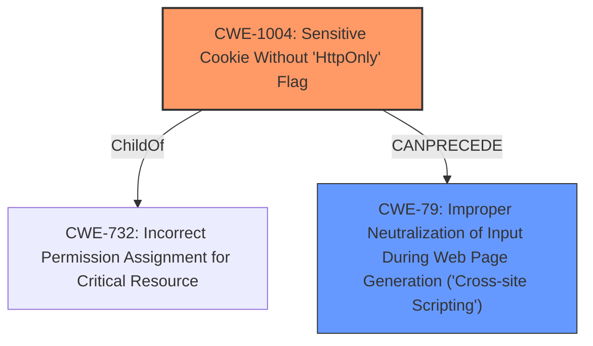

# Analysis for CVE-2021-26589

# Summary
| CWE ID | CWE Name | Confidence | CWE Abstraction Level | CWE Vulnerability Mapping Label | CWE-Vulnerability Mapping Notes |
|---|---|---|---|---|---|
| CWE-1004 | Sensitive Cookie Without 'HttpOnly' Flag | 1.0 | Variant | Allowed | Primary CWE |
| CWE-79 | Improper Neutralization of Input During Web Page Generation ('Cross-site Scripting') | 0.7 | Base | Allowed | Secondary CWE |

## Evidence and Confidence

*   **Confidence Score:** 0.9
*   **Evidence Strength:** HIGH

## Relationship Analysis
The primary CWE selected is CWE-1004, a Variant of CWE-732, focusing on the specific issue of a missing HttpOnly flag in a sensitive cookie. CWE-79, a Base CWE, represents the broader Cross-Site Scripting vulnerability. The relationship here is that the missing HttpOnly flag (CWE-1004) increases the risk of XSS (CWE-79) because it allows client-side scripts to access the cookie, which can then be exploited to inject malicious scripts.

## Vulnerability Chain
The vulnerability chain starts with the **missing HttpOnly attribute** in the session cookie (CWE-1004). This allows client-side scripts to access the cookie. If an attacker can inject malicious script (e.g., through a separate vulnerability or social engineering), they can steal the cookie and potentially impersonate the user, leading to **cross-site scripting** (CWE-79).

## Summary of Analysis
The initial analysis focused on identifying the root cause. The vulnerability description clearly states that the **rootcause** is a **missing HttpOnly attribute** leading to a **cross-site scripting** (XSS) **weakness**.

The Retriever Results listed CWE-1004 "Sensitive Cookie Without 'HttpOnly' Flag" as the top combined result. This aligns perfectly with the vulnerability description's root cause. CWE-79 "Improper Neutralization of Input During Web Page Generation ('Cross-site Scripting')" was also listed, reflecting the potential impact.

CWE-1004 is chosen as the primary CWE because it directly addresses the **rootcause** of the vulnerability. The presence of CWE-1004 increases the likelihood and impact of CWE-79. This is because the missing HttpOnly flag makes it easier for an attacker to steal the session cookie and launch XSS attacks.

The selection of CWE-1004 is at the optimal level of specificity (Variant), directly addressing the **missing HttpOnly attribute**. CWE-79 is included as a secondary CWE to indicate the resulting XSS vulnerability.

Relevant CWE Information:

# Enhanced Context (25 CWEs)

## CWE-1240: Use of a Cryptographic Primitive with a Risky Implementation
**Abstraction Level**: Base
**Similarity Score**: 0.79
**Source**: dense

**Description**:
To fulfill the need for a cryptographic primitive, the product implements a cryptographic algorithm using a non-standard, unproven, or disallowed/non-compliant cryptographic implementation.

**Mapping Guidance**:
- Usage: Allowed
- Rationale: This CWE entry is at the Base level of abstraction, which is a preferred level of abstraction for mapping to the root causes of vulnerabilities.

*This CWE is not applicable because the vulnerability is not related to the implementation of cryptographic algorithms.*

## CWE-319: Cleartext Transmission of Sensitive Information
**Abstraction Level**: Base
**Similarity Score**: 0.78
**Source**: dense

**Description**:
The product transmits sensitive or security-critical data in cleartext in a communication channel that can be sniffed by unauthorized actors.

**Mapping Guidance**:
- Usage: Allowed
- Rationale: This CWE entry is at the Base level of abstraction, which is a preferred level of abstraction for mapping to the root causes of vulnerabilities.

*This CWE is related to transmitting sensitive information in cleartext, which is not the core issue of this vulnerability.*

## CWE-328: Use of Weak Hash
**Abstraction Level**: Base
**Similarity Score**: 0.78
**Source**: dense

**Description**:
The product uses an algorithm that produces a digest (output value) that does not meet security expectations for a hash function that allows an adversary to reasonably determine the original input (preimage attack), find another input that can produce the same hash (2nd preimage attack), or find multiple inputs that evaluate to the same hash (birthday attack).

**Mapping Guidance**:
- Usage: Allowed
- Rationale: This CWE entry is at the Base level of abstraction, which is a preferred level of abstraction for mapping to the root causes of vulnerabilities.

*This CWE is not applicable because the vulnerability is not related to the usage of weak hash functions.*

## CWE-74: Improper Neutralization of Special Elements in Output Used by a Downstream Component ('Injection')
**Abstraction Level**: Class
**Similarity Score**: 0.78
**Source**: dense

**Description**:
The product constructs all or part of a command, data structure, or record using externally-influenced input from an upstream component, but it does not neutralize or incorrectly neutralizes special elements that could modify how it is parsed or interpreted when it is sent to a downstream component.

**Mapping Guidance**:
- Usage: Discouraged
- Rationale: CWE-74 is high-level and often misused when lower-level weaknesses are more appropriate.

*CWE-74 is too general. While XSS (CWE-79) can be seen as a type of injection, the root cause is the missing HttpOnly flag, making CWE-1004 a more precise fit.*

## CWE-330: Use of Insufficiently Random Values
**Abstraction Level**: Class
**Similarity Score**: 0.77
**Source**: dense

**Description**:
The product uses insufficiently random numbers or values in a security context that depends on unpredictable numbers.

**Mapping Guidance**:
- Usage: Discouraged
- Rationale: This CWE entry is a level-1 Class (i.e., a child of a Pillar). It might have lower-level children that would be more appropriate

*This CWE is not applicable because the vulnerability is not related to randomness.*

## CWE-1391: Use of Weak Credentials
**Abstraction Level**: Class
**Similarity Score**: 0.77
**Source**: dense

**Description**:
The product uses weak credentials (such as a default key or hard-coded password) that can be calculated, derived, reused, or guessed by an attacker.

**Mapping Guidance**:
- Usage: Allowed-with-Review
- Rationale: This CWE entry is a Class and might have Base-level children that would be more appropriate

*This CWE is not applicable because the vulnerability is not related to weak credentials.*

## CWE-345: Insufficient Verification of Data Authenticity
**Abstraction Level**: Class
**Similarity Score**: 0.77
**Source**: dense

**Description**:
The product does not sufficiently verify the origin or authenticity of data, in a way that causes it to accept invalid data.

**Mapping Guidance**:
- Usage: Discouraged
- Rationale: This CWE entry is a level-1 Class (i.e., a child of a Pillar). It might have lower-level children that would be more appropriate

*This CWE is not applicable because the vulnerability is not related to data authenticity.*

## CWE-807: Reliance on Untrusted Inputs in a Security Decision
**Abstraction Level**: Base
**Similarity Score**: 0.76
**Source**: dense

**Description**:
The product uses a protection mechanism that relies on the existence or values of an input, but the input can be modified by an untrusted actor in a way that bypasses the protection mechanism.

**Mapping Guidance**:
- Usage: Allowed
- Rationale: This CWE entry is at the Base level of abstraction, which is a preferred level of abstraction for mapping to the root causes of vulnerabilities.

*This CWE is not a good fit, as the vulnerability isn't about relying on untrusted input for security decisions.*

## CWE-1289: Improper Validation of Unsafe Equivalence in Input
**Abstraction Level**: Base
**Similarity Score**: 0.76
**Source**: dense

**Description**:
The product receives an input value that is used as a resource identifier or other type of reference, but it does not validate or incorrectly validates that the input is equivalent to a potentially-unsafe value.

**Mapping Guidance**:
- Usage: Allowed
- Rationale: This CWE entry is at the Base level of abstraction, which is a preferred level of abstraction for mapping to