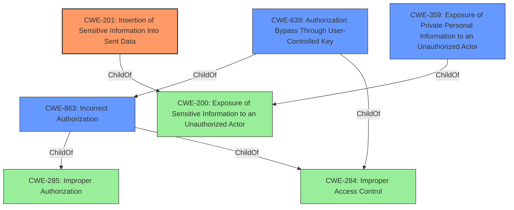

# Analysis for CVE-2021-26593

# Summary
| CWE ID | CWE Name | Confidence | CWE Abstraction Level | CWE Vulnerability Mapping Label | CWE-Vulnerability Mapping Notes |
|---|---|---|---|---|---|
| CWE-201 | Insertion of Sensitive Information Into Sent Data | 1.0 | Base | Allowed | Primary CWE |
| CWE-359 | Exposure of Private Personal Information to an Unauthorized Actor | 0.8 | Base | Allowed | Secondary Candidate |
| CWE-639 | Authorization Bypass Through User-Controlled Key | 0.7 | Base | Allowed | Secondary Candidate |
| CWE-863 | Incorrect Authorization | 0.6 | Class | Allowed-with-Review | Secondary Candidate |

## Evidence and Confidence

*   **Confidence Score:** 0.85
*   **Evidence Strength:** HIGH

## Relationship Analysis
The primary CWE, CWE-201, is a child of CWE-200 (Exposure of Sensitive Information to an Unauthorized Actor), indicating that it's a more specific type of information exposure. CWE-359 is also a child of CWE-200 and a peer of CWE-201, representing a slightly different focus on private personal information. CWE-639 (Authorization Bypass Through User-Controlled Key) and CWE-863 (Incorrect Authorization) relate to authorization issues that could lead to the information exposure.

## Vulnerability Chain
The vulnerability chain involves an **incorrect authorization** mechanism that allows a user to retrieve another user's data. This leads to the **insertion of sensitive information** (the 2FA secret) into the data that is sent to the attacker, resulting in the **exposure of private personal information**.

## Summary of Analysis
The initial analysis identified several potential CWEs, including CWE-201, CWE-359, CWE-639, and CWE-863. The final decision was based on a thorough review of the vulnerability description, the CVE reference link content summary, and the complete CWE specifications.

The primary weakness is CWE-201 (**Insertion of Sensitive Information Into Sent Data**). The CVE description clearly states that "the Directus API disclosing sensitive two-factor authentication (2FA) secrets for all users" and "allows an attacker to retrieve the 2FA secret used for generating one-time passwords." This aligns perfectly with the CWE-201 description: "The code transmits data to another actor, but a portion of the data includes sensitive information that should not be accessible to that actor."

CWE-359 (**Exposure of Private Personal Information to an Unauthorized Actor**) is also relevant, as the 2FA secret constitutes private personal information. However, CWE-201 is more specific in describing the mechanism of the vulnerability (the *insertion* of sensitive information into sent data), making it the primary choice.

CWE-639 (**Authorization Bypass Through User-Controlled Key**) describes how the attacker is able to retrieve user data by manipulating the user ID, but it's not explicitly stated that the key is user controlled. This could be argued to be implied, since the attacker can enumerate the users.

CWE-863 (**Incorrect Authorization**) is a higher-level class that could apply, but is less descriptive than the selected Base CWEs.

The graph relationships show the connections between these CWEs, with CWE-201 and CWE-359 both being children of CWE-200 (Exposure of Sensitive Information to an Unauthorized Actor). The selected CWEs are at the optimal level of specificity, accurately representing the vulnerability's root cause and mechanism.