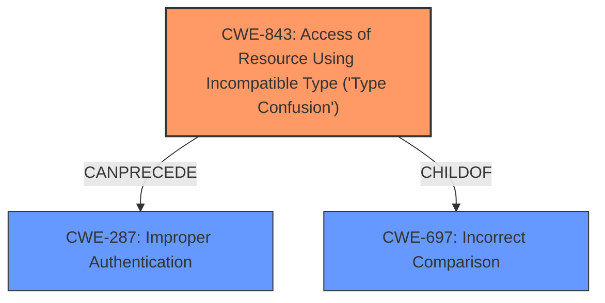

# Raw Analyzer Response for CVE-2021-26600

# Summary
| CWE ID | CWE Name | Confidence | CWE Abstraction Level | CWE Vulnerability Mapping Label | CWE-Vulnerability Mapping Notes |
|---|---|---|---|---|---|
| CWE-843 | Access of Resource Using Incompatible Type ('Type Confusion') | 1.0 | Base | Allowed | Primary CWE.  The vulnerability stems from using a loose comparison operator `!=` instead of a strict one `!==`, leading to **type confusion** and authentication bypass. |
| CWE-697 | Incorrect Comparison | 0.6 | Pillar | Discouraged | Secondary Candidate.  The use of `!=` instead of `!==` represents an **incorrect comparison**. |
| CWE-287 | Improper Authentication | 0.4 | Class | Allowed-with-Review | Secondary Candidate. The **type confusion** led to an **authentication bypass**. |

## Evidence and Confidence

*   **Confidence Score:** 0.8
*   **Evidence Strength:** HIGH

## Relationship Analysis
The primary weakness is **CWE-843 (Access of Resource Using Incompatible Type ('Type Confusion'))**. This is caused by using the `!=` operator instead of `!==`, leading to type juggling, which results in **CWE-287 (Improper Authentication)** because an attacker can bypass authentication. **CWE-697 (Incorrect Comparison)** is a high-level pillar that captures the essence of using the wrong operator but lacks the specificity of **CWE-843**.

## Vulnerability Chain
The vulnerability chain starts with the **type confusion** (**CWE-843**) due to the use of the loose comparison operator `!=`. This leads to an **authentication bypass** (**CWE-287**), allowing unauthorized access.

## Summary of Analysis
The initial analysis identified **CWE-843** as the primary weakness due to **type confusion**. The use of the `!=` operator, which allows type juggling, directly leads to the authentication bypass. The vulnerability description explicitly mentions **type confusion** as the root cause: "ImpressCMS before 1.4.3 has plugins/preloads/autologin.php **type confusion** with resultant Authentication Bypass (!= instead of !==)." The CVE Reference Links Content Summary also indicates that "The vulnerability is due to the comparison operator `!=` allowing for type juggling during comparison, which can be exploited."

**CWE-697 (Incorrect Comparison)** was considered but deemed less specific than **CWE-843**. While the use of `!=` instead of `!==` is indeed an **incorrect comparison**, **CWE-843** better captures the underlying issue of **type confusion**.  The relationship analysis shows **CWE-843** as a child of **CWE-697**, indicating a more specific classification.

**CWE-287** was considered as a possible impact of the **type confusion**. While authentication bypass is a direct consequence of the **type confusion**, the primary weakness lies in the **incorrect** handling of types, making **CWE-843** the more appropriate choice for the root cause.

The selected CWEs are at the optimal level of specificity. **CWE-843** is a Base level CWE, which is a preferred level of abstraction. It accurately represents the **type confusion** that is the root cause of the vulnerability.