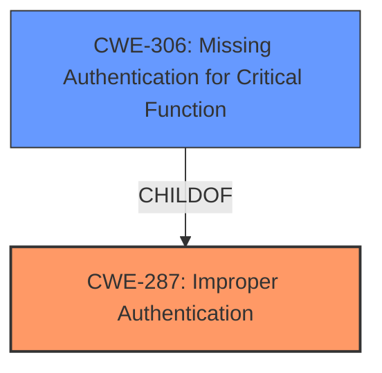

# Raw Analyzer Response for CVE-2021-26620

# Summary
| CWE ID | CWE Name | Confidence | CWE Abstraction Level | CWE Vulnerability Mapping Label | CWE-Vulnerability Mapping Notes |
|---|---|---|---|---|---|
| CWE-287 | Improper Authentication | 0.9 | Class | Primary | Discouraged |
| CWE-306 | Missing Authentication for Critical Function | 0.7 | Base | Secondary | Allowed |

## Evidence and Confidence

*   **Confidence Score:** 0.8
*   **Evidence Strength:** MEDIUM

## Relationship Analysis
The primary relationship is the ChildOf relationship, where CWE-306 is a child of CWE-287. This indicates that CWE-306 is a more specific case of improper authentication where authentication is completely missing for a critical function. Since the vulnerability description mentions **insufficient authentication**, CWE-287 is the more appropriate primary classification. However, the possibility of authentication being entirely absent cannot be ruled out; hence, CWE-306 is considered as a secondary, more specific candidate.

## Vulnerability Chain
The chain begins with **insufficient authentication**, leading to information leakage. This can be represented as:
Improper Authentication (CWE-287) -> Information Leakage.
There may be other CWEs involved in a more detailed chain, but the description provides insufficient details.

## Summary of Analysis
The initial assessment identifies CWE-287 as the primary weakness due to the explicit mention of **insufficient authentication** in the vulnerability description. The retriever results also list CWE-287 as the top candidate.

The vulnerability description states: "Remote attackers are able to steal important information in the server by exploiting vulnerabilities such as **insufficient authentication** when accessing the shared folder and changing users passwords." This provides direct evidence for improper authentication (CWE-287).

The relationship analysis shows that CWE-306 (Missing Authentication for Critical Function) is a child of CWE-287. While it's possible that authentication is entirely missing, the description emphasizes it being **insufficient**. Therefore, CWE-287 is the more accurate primary classification. However, I considered CWE-306 as a secondary candidate since the level of insufficiency is not defined and could imply completely missing authentication.

CWE-287 is at the Class level, and the guidance discourages its use when more specific CWEs are applicable. However, given the available information, CWE-287 best captures the essence of the weakness, with the option of including the more specific CWE-306 as a secondary classification.

Relevant CWE Information:

# Enhanced Context (25 CWEs)

## CWE-807: Reliance on Untrusted Inputs in a Security Decision
**Abstraction Level**: Base
**Similarity Score**: 0.79
**Source**: dense

**Description**:
The product uses a protection mechanism that relies on the existence or values of an input, but the input can be modified by an untrusted actor in a way that bypasses the protection mechanism.
**Rationale for Not Selecting:** The description focuses on authentication issues, not the reliance on untrusted inputs for security decisions.

## CWE-472: External Control of Assumed-Immutable Web Parameter
**Abstraction Level**: Base
**Similarity Score**: 0.79
**Source**: dense

**Description**:
The web application does not sufficiently verify inputs that are assumed to be immutable but are actually externally controllable, such as hidden form fields.
**Rationale for Not Selecting:** This CWE is specific to web applications and immutable parameters, which are not explicitly mentioned in the description.

## CWE-302: Authentication Bypass by Assumed-Immutable Data
**Abstraction Level**: Base
**Similarity Score**: 0.79
**Source**: dense

**Description**:
The authentication scheme or implementation uses key data elements that are assumed to be immutable, but can be controlled or modified by the attacker.
**Rationale for Not Selecting:** While authentication bypass is related, the description does not specifically mention immutable data being controlled by the attacker.

## CWE-274: Improper Handling of Insufficient Privileges
**Abstraction Level**: Base
**Similarity Score**: 0.77
**Source**: dense

**Description**:
The product does not handle or incorrectly handles when it has insufficient privileges to perform an operation, leading to resultant weaknesses.
**Rationale for Not Selecting:** This CWE is about privilege handling, whereas the description is about authentication.

## CWE-303: Incorrect Implementation of Authentication Algorithm
**Abstraction Level**: Base
**Similarity Score**: 0.77
**Source**: dense

**Description**:
The requirements for the product dictate the use of an established authentication algorithm, but the implementation of the algorithm is incorrect.
**Rationale for Not Selecting:** The description doesn't mention an incorrect implementation of an authentication algorithm.

## CWE-280: Improper Handling of Insufficient Permissions or Privileges
**Abstraction Level**: Base
**Similarity Score**: 0.77
**Source**: dense

**Description**:
The product does not handle or incorrectly handles when it has insufficient privileges to access resources or functionality as specified by their permissions. This may cause it to follow unexpected code paths that may leave the product in an invalid state.
**Rationale for Not Selecting:** This CWE is about privilege handling, whereas the description is about authentication.

## CWE-289: Authentication Bypass by Alternate Name
**Abstraction Level**: Base
**Similarity Score**: 0.77
**Source**: dense

**Description**:
The product performs authentication based on the name of a resource being accessed, or the name of the actor performing the access, but it does not properly check all possible names for that resource or actor.
**Rationale for Not Selecting:** The vulnerability doesn't specifically mention alternate names being used for authentication bypass.

## CWE-1289: Improper Validation of Unsafe Equivalence in Input
**Abstraction Level**: Base
**Similarity Score**: 0.77
**Source**: dense

**Description**:
The product receives an input value that is used as a resource identifier or other type of reference, but it does not validate or incorrectly validates that the input is equivalent to a potentially-unsafe value.
**Rationale for Not Selecting:** There's no mention of unsafe equivalence or resource identifier validation in the provided description.

## CWE-799: Improper Control of Interaction Frequency
**Abstraction Level**: Class
**Similarity Score**: 0.76
**Source**: dense

**Description**:
The product does not properly limit the number or frequency of interactions that it has with an actor, such as the number of incoming requests.
**Rationale for Not Selecting:** The description does not mention any issues related to limiting interaction frequency.

## CWE-1220: Insufficient Granularity of Access Control
**Abstraction Level**: Base
**Similarity Score**: 0.76
**Source**: dense

**Description**:
The product implements access controls via a policy or other feature with the intention to disable or restrict accesses (reads and/or writes) to assets in a system from untrusted agents. However, implemented access controls lack required granularity, which renders the control policy too broad because it allows accesses from unauthorized agents to the security-sensitive assets.
**Rationale for Not Selecting:** The description focuses on authentication, not access control granularity.

## CWE-178: Improper Handling of Case Sensitivity
**Abstraction Level**: Base
**Similarity Score**: 4810.21
**Source**: sparse

**Description**:
The product does not properly account for differences in case sensitivity when accessing or determining the properties of a resource, leading to inconsistent results.
**Rationale for Not Selecting:** Case sensitivity issues are not mentioned in the vulnerability description.

## CWE-863: Incorrect Authorization
**Abstraction Level**: Class
**Similarity Score**: 4649.72
**Source**: sparse

**Description**:
The product performs an authorization check when an actor attempts to access a resource or perform an action, but it does not correctly perform the check.
**Rationale for Not Selecting:** The vulnerability focuses on authentication issues, not authorization.

## CWE-285: Improper Authorization
**Abstraction Level**: Class
**Similarity Score**: 4613.89
**Source**: sparse

**Description**:
The product does not perform or incorrectly performs an authorization check when an actor attempts to access a resource or perform an action.
**Rationale for Not Selecting:** The vulnerability focuses on authentication issues, not authorization.

## CWE-639: Authorization Bypass Through User-Controlled Key
**Abstraction Level**: Base
**Similarity Score**: 4534.16
**Source**: sparse

**Description**:
The system's authorization functionality does not prevent one user from gaining access to another user's data or record by modifying the key value identifying the data.
**Rationale for Not Selecting:** The vulnerability focuses on authentication issues, not authorization bypass through user-controlled keys.

## CWE-420: Unprotected Alternate Channel
**Abstraction Level**: base
**Similarity Score**: 3.64