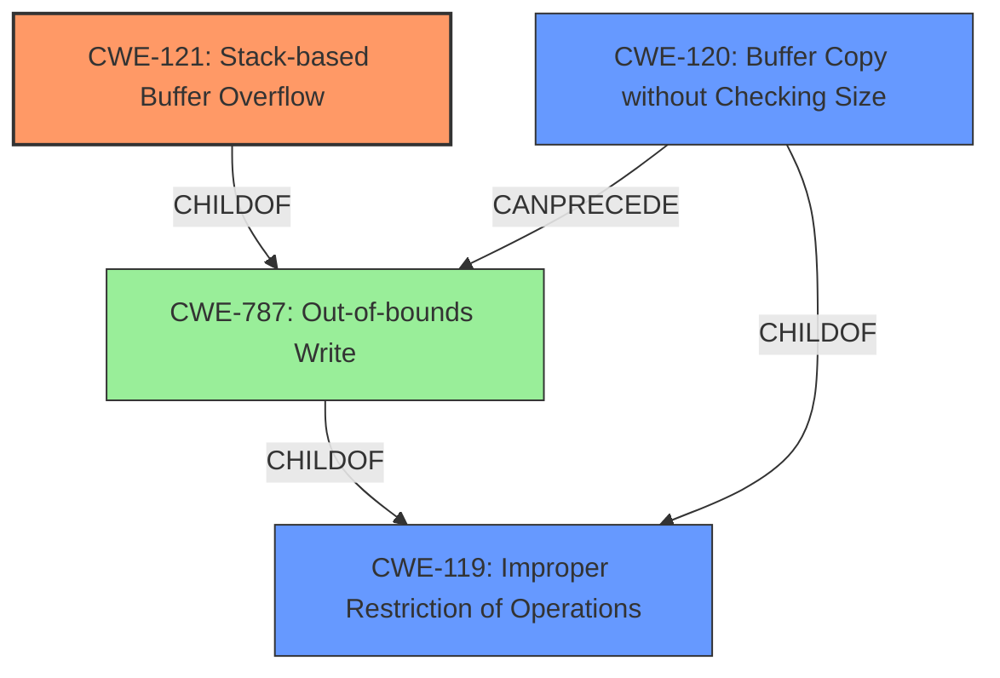

# Enhanced Analysis for CVE-2021-26675

# Summary
| CWE ID | CWE Name | Confidence | CWE Abstraction Level | CWE Vulnerability Mapping Label | CWE-Vulnerability Mapping Notes |
|---|---|---|---|---|---|
| CWE-121 | Stack-based Buffer Overflow | 1.0 | Variant | Primary | Allowed |
| CWE-119 | Improper Restriction of Operations within the Bounds of a Memory Buffer | 0.7 | Class | Secondary | Discouraged |
| CWE-120 | Buffer Copy without Checking Size of Input ('Classic Buffer Overflow') | 0.6 | Base | Secondary | Allowed-with-Review |

## Evidence and Confidence

*   **Confidence Score:** 0.9
*   **Evidence Strength:** HIGH

## Relationship Analysis
The primary CWE is CWE-121, a Variant of CWE-787 (Out-of-bounds Write) which itself is a ChildOf CWE-119 (Improper Restriction of Operations within the Bounds of a Memory Buffer). CWE-120 (Buffer Copy without Checking Size of Input) is another child of CWE-119 and can often precede CWE-787. Given that the vulnerability is explicitly described as a stack-based buffer overflow, CWE-121 is the most specific and appropriate choice. CWE-119 is a more general classification and is discouraged when more specific CWEs are available.



## Vulnerability Chain
The chain of events is as follows:
1.  **Root Cause:** **Stack-based buffer overflow** due to missing length checks in the `uncompress` function.
2.  **Weakness:** Improper copy of data to a stack buffer without validating the size.
3.  **Impact:** Potential remote code execution by overwriting the stack with malicious code, or denial of service through crashing the `dnsproxy` process.

## Summary of Analysis
The initial assessment identified a **stack-based buffer overflow**, which directly maps to CWE-121. The supporting evidence from the vulnerability description key phrases and the CVE reference links content summary confirms this. The root cause is the **lack of length checks** when copying data into the stack buffer. The evidence is strong, with explicit mentions of the affected component (`dnsproxy`) and the vulnerable function (`uncompress`). The fix involved adding length checks to prevent writing beyond the buffer's boundaries.

The retriever results suggest CWE-119, CWE-190 and CWE-120. While CWE-119 is a parent class and could be considered, CWE-121 provides more specificity. CWE-190 (Integer Overflow or Wraparound) is not directly relevant because the vulnerability is a buffer overflow, not an integer overflow. CWE-120 is a possible, but the key issue here is the location of the buffer (stack), thus making CWE-121 a better fit.

Based on the provided evidence and the CWE specifications, CWE-121 is the most appropriate and specific classification.

Relevant CWE Information:

*   **CWE-121 (Stack-based Buffer Overflow):** This CWE accurately describes the vulnerability, as the buffer overflow occurs on the stack.
*   **CWE-119 (Improper Restriction of Operations within the Bounds of a Memory Buffer):** This CWE is a more general category that encompasses buffer overflows, but CWE-121 is more specific and therefore preferred.
*   **CWE-120 (Buffer Copy without Checking Size of Input):** While this CWE is also related to buffer overflows, it doesn't specify the location of the buffer (stack vs. heap).

CWEs considered but not used:

*   **CWE-190 (Integer Overflow or Wraparound):** This CWE was considered because integer overflows can sometimes lead to buffer overflows, but the primary cause of this vulnerability is the missing length check, not an integer overflow.
*   **CWE-193 (Off-by-one Error):** While an off-by-one error could contribute to a buffer overflow, the core issue is the missing length check.
*   **CWE-406 (Insufficient Control of Network Message Volume (Network Amplification)):** This CWE is related to network amplification attacks and is not directly relevant to a buffer overflow vulnerability.
*   **CWE-128 (Wrap-around Error):** Similar to CWE-190, this is not the primary cause of the vulnerability.
*   **CWE-124 (Buffer Underwrite ('Buffer Underflow')):** This CWE describes writing before the beginning of the buffer, which is the opposite of a buffer overflow.
*   **CWE-1284 (Improper Validation of Specified Quantity in Input):** This CWE is relevant if the size of the buffer was not properly validated, but the primary issue is the missing length check during the copy operation.
*   **CWE-122 (Heap-based Buffer Overflow):** This CWE is similar to CWE-121, but it applies to buffers allocated on the heap, not the stack.
*   **CWE-787 (Out-of-bounds Write):** This is a parent of CWE-121, but CWE-121 is more specific.


## CWE Relationship Analysis

Current CWEs represent these abstraction levels: .


### Vulnerability Chain Analysis

**Chain starting from CWE-121:**
- 121 (Stack-based Buffer Overflow) - ROOT


**Chain starting from CWE-787:**
- 787 (Out-of-bounds Write) - ROOT


### CWE Relationship Diagram

```mermaid
graph TD
    classDef primary fill:#f96,stroke:#333,stroke-width:2px
    classDef secondary fill:#69f,stroke:#333
    classDef tertiary fill:#9e9,stroke:#333
```