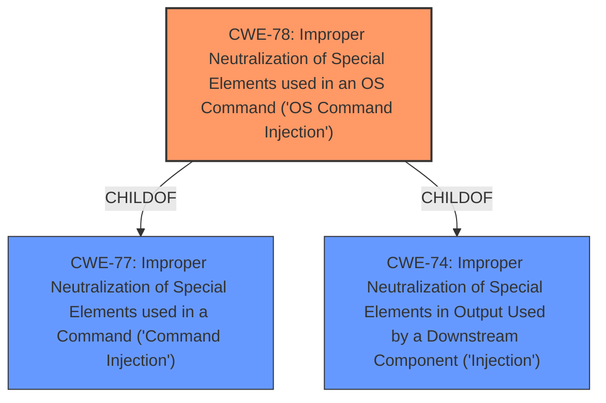

# Enhanced Analysis for CVE-2021-26679

# Summary
| CWE ID | CWE Name | Confidence | CWE Abstraction Level | CWE Vulnerability Mapping Label | CWE-Vulnerability Mapping Notes |
|---|---|---|---|---|---|
| CWE-78 | Improper Neutralization of Special Elements used in an OS Command ('OS Command Injection') | 1.0 | Base | Allowed | Primary CWE |

## Evidence and Confidence

*   **Confidence Score:** 1.0
*   **Evidence Strength:** HIGH

## Relationship Analysis
The primary CWE selected is CWE-78, which is a Base level CWE. It is a child of the Class level CWE-77 and CWE-74. The analysis focused on identifying the root cause as **OS command injection**, which fits the description of CWE-78. No other relationships influenced the decision.



## Vulnerability Chain
The vulnerability chain consists of:
1.  **Improper Neutralization of Special Elements used in an OS Command** (CWE-78)
2.  Execution of arbitrary commands as root on the underlying operating system.

The root cause is the **command injection** vulnerability, leading to the impact of arbitrary command execution.

## Summary of Analysis
The initial analysis and resulting conclusion are based on the provided evidence, which is strong. The vulnerability description clearly states a **command injection** vulnerability in the Aruba ClearPass Policy Manager. The key phrase "allows remote authenticated users to run arbitrary commands on the underlying host" strongly suggests CWE-78. The retriever results also list CWE-78 as a high-ranking candidate, further supporting this selection.

The graph relationships show that CWE-78 is a child of CWE-77 and CWE-74, which are more general. Since the vulnerability description specifies OS commands, CWE-78 is the more specific and appropriate choice.

The selected CWE is at the optimal level of specificity because it directly addresses the root cause of the vulnerability, which is the improper neutralization of special elements used in an OS command. This aligns with the MITRE mapping guidance for selecting Base-level CWEs when they accurately represent the weakness.

Relevant CWE Information:

# Enhanced Context (25 CWEs)
The following CWEs were identified as potentially relevant to this vulnerability:

## CWE-78: Improper Neutralization of Special Elements used in an OS Command ('OS Command Injection')
**Abstraction:** Base
**Similarity Score**: 5.03
**Source**: graph

**Description**:
CWE-78: Improper Neutralization of Special Elements used in an OS Command ('OS Command Injection')

**Mapping Guidance**:
- Usage: Allowed
- Rationale: This CWE entry is at the Base level of abstraction, which is a preferred level of abstraction for mapping to the root causes of vulnerabilities.

Observed Examples:
- **CVE-2020-10987:** OS command injection in Wi-Fi router, as exploited in the wild per CISA KEV.
- **CVE-2020-10221:** Template functionality in network configuration management tool allows OS command injection, as exploited in the wild per CISA KEV.
- **CVE-2020-9054:** Chain: improper input validation (CWE-20) in username parameter, leading to OS command injection (CWE-78), as exploited in the wild per CISA KEV.

## CWE-77: Improper Neutralization of Special Elements used in a Command ('Command Injection')
**Abstraction:** Class
**Similarity Score**: 1.000
**Source**: alternate_terms

**Description**:
The product constructs all or part of a command using externally-influenced input from an upstream component, but it does not neutralize or incorrectly neutralizes special elements that could modify the intended command when it is sent to a downstream component.

**Mapping Guidance**:
- Usage: Allowed-with-Review
- Rationale: CWE-77 is often misused when OS command injection (CWE-78) was intended instead [REF-1287].
**Comments:** Ensure that the analysis focuses on the root-cause error that allows the execution of commands, as there are many weaknesses that can lead to this consequence. See Terminology Notes. If the weakness involves a command language besides OS shell invocation, then CWE-77 could be used.
**Reasons:**
- Frequent Misuse
**Suggested Alternatives:**
- CWE-78: OS Command Injection

Observed Examples:
- **CVE-2022-1509:** injection of sed script syntax ("sed injection")
- **CVE-2024-5184:** API service using a large generative AI model allows direct prompt injection to leak hard-coded system prompts or execute other prompts.
- **CVE-2020-11698:** anti-spam product allows injection of SNMP commands into confiuration file

CWE-77 was considered but not used because the vulnerability description specifically mentions commands on the underlying host, implying OS commands. CWE-78 is more specific to OS command injection.


## CWE Relationship Analysis

Current CWEs represent these abstraction levels: .


### Vulnerability Chain Analysis

**Chain starting from CWE-78:**
- 78 (Improper Neutralization of Special Elements used in an OS Command ('OS Command Injection')) - ROOT


**Chain starting from CWE-74:**
- 74 (Improper Neutralization of Special Elements in Output Used by a Downstream Component ('Injection')) - ROOT


### CWE Relationship Diagram

```mermaid
graph TD
    classDef primary fill:#f96,stroke:#333,stroke-width:2px
    classDef secondary fill:#69f,stroke:#333
    classDef tertiary fill:#9e9,stroke:#333
```