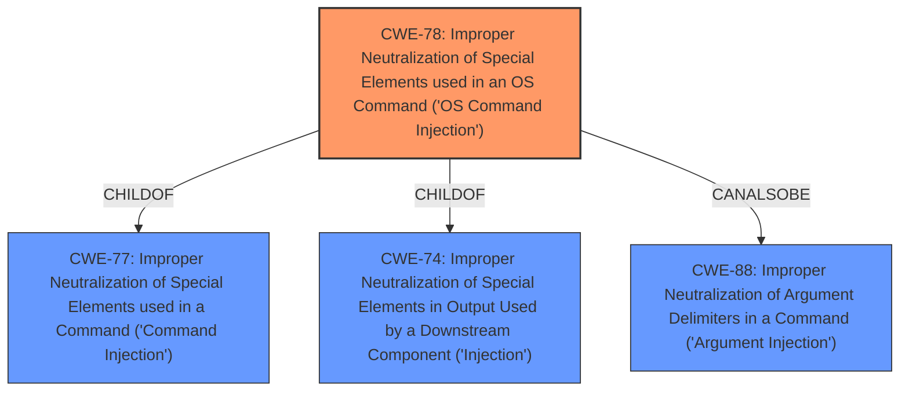

# Analysis for CVE-2021-26684

# Summary
| CWE ID | CWE Name | Confidence | CWE Abstraction Level | CWE Vulnerability Mapping Label | CWE-Vulnerability Mapping Notes |
|---|---|---|---|---|---|
| CWE-78 | Improper Neutralization of Special Elements used in an OS Command ('OS Command Injection') | 1.0 | Base | Allowed | Primary CWE |

## Evidence and Confidence

*   **Confidence Score:** 1.0
*   **Evidence Strength:** HIGH

## Relationship Analysis
The primary CWE selected is CWE-78, which is a Base level CWE. It is a child of CWE-77 (Improper Neutralization of Special Elements used in a Command ('Command Injection')) and CWE-74 (Improper Neutralization of Special Elements in Output Used by a Downstream Component ('Injection')). This indicates a hierarchical relationship where CWE-78 is a specific type of command injection. The `CANALSOBE` relationship with CWE-88 (Improper Neutralization of Argument Delimiters in a Command ('Argument Injection')) suggests that argument injection could potentially be involved but the description focuses on OS commands.

## Vulnerability Chain
The vulnerability chain starts with a **command injection weakness** in the web-based management interface, which allows remote authenticated users to inject commands, leading to the ability to execute arbitrary commands as root on the underlying operating system, and ultimately, complete system compromise.

## Summary of Analysis
The primary **weakness** is **command injection**, specifically in the ClearPass web-based management interface. This allows remote authenticated users to run arbitrary commands on the underlying host. A successful exploit could allow an attacker to execute arbitrary commands as root on the underlying operating system leading to complete system compromise.

The vulnerability description clearly states "A remote authenticated **command injection** vulnerability was discovered...". The "CWE for similar CVE Descriptions" section lists CWE-78 as the "Primary CWE Match". The retriever results also list CWE-78 as a strong candidate.

Based on the evidence provided, CWE-78 (Improper Neutralization of Special Elements used in an OS Command ('OS Command Injection')) is the most appropriate CWE. It is a Base level CWE, which is preferred. The description of CWE-78 aligns directly with the vulnerability description, indicating that the product constructs an OS command using external input without proper neutralization of special elements.

CWE-77 (Improper Neutralization of Special Elements used in a Command ('Command Injection')) was considered, as CWE-78 is a child of CWE-77. However, CWE-78 is more specific as it explicitly refers to OS commands, which aligns better with the vulnerability description.

CWE-89 (Improper Neutralization of Special Elements used in an SQL Command ('SQL Injection')) was not selected as it involves SQL commands, which are not mentioned in the vulnerability description.

CWE-22 (Improper Limitation of a Pathname to a Restricted Directory ('Path Traversal')) was not selected as the vulnerability is related to command execution, not file path manipulation.

CWE-269 (Improper Privilege Management) was not selected because the description points to **command injection** rather than improper privilege management.

CWE-912 (Hidden Functionality) was not selected as there is no mention of undocumented or hidden functionality being the source of the vulnerability.

CWE-73 (External Control of File Name or Path) was not selected since the description does not indicate external control of filenames, but rather **command injection**.

CWE-94 (Improper Control of Generation of Code ('Code Injection')) was not selected as it is more general and applies to code injection, whereas CWE-78 is specifically for OS Command Injection.

CWE-20 (Improper Input Validation) was not selected as it is too general. The vulnerability stems from a specific type of input issue: **command injection**.

CWE-23 (Relative Path Traversal) was not selected as the vulnerability is not related to path traversal.

The selection of CWE-78 is based on the root cause being the **improper neutralization** of special elements used in OS commands. This directly allows an attacker to execute arbitrary commands on the system.