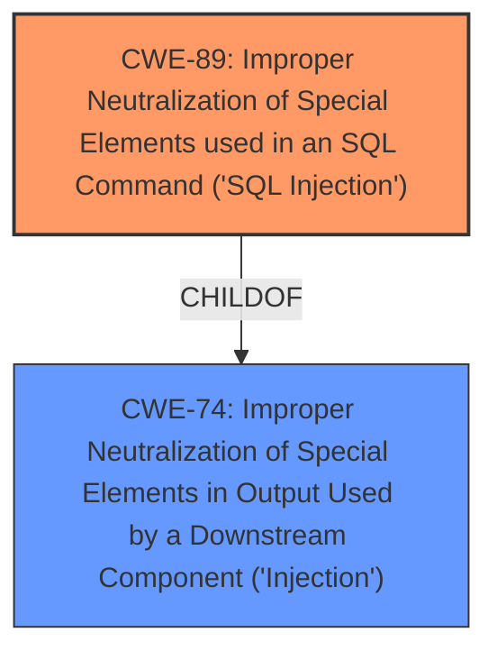

# Analysis for CVE-2021-26685

# Summary
| CWE ID | CWE Name | Confidence | CWE Abstraction Level | CWE Vulnerability Mapping Label | CWE-Vulnerability Mapping Notes |
|---|---|---|---|---|---|
| CWE-89 | Improper Neutralization of Special Elements used in an SQL Command ('SQL Injection') | 1.0 | Base | Allowed | Primary CWE |

## Evidence and Confidence

*   **Confidence Score:** 1.0
*   **Evidence Strength:** HIGH

## Relationship Analysis
The primary relationship that influenced my decision was the ChildOf relationship between CWE-89 and CWE-74 (Improper Neutralization of Special Elements in Output Used by a Downstream Component ('Injection')). However, CWE-74 is a Class, and CWE-89 is a Base weakness, making CWE-89 the more specific and appropriate choice. There are no other relationships that appear to influence this.

## Vulnerability Chain
The chain of events in this vulnerability is:

1.  **Root Cause:** **SQL Injection** (**CWE-89**) due to improper neutralization of special elements in SQL commands.
2.  **Impact:** An attacker can obtain and modify sensitive information in the underlying database.

## Summary of Analysis
The analysis is based on the provided vulnerability description, which clearly states that the vulnerability is a **SQL injection** in the Aruba ClearPass Policy Manager.

The evidence from the vulnerability description is: "A remote authenticated SQL Injection vulnerabilitiy was discovered in Aruba ClearPass Policy Manager version(s) Prior to 6.9.5, 6.8.8-HF1, 6.7.14-HF1. A vulnerability in the web-based management interface API of ClearPass could allow an authenticated remote attacker to conduct **SQL injection** attacks against the ClearPass instance. An attacker could exploit this vulnerability to obtain and modify sensitive information in the underlying database."

The **CWE for similar CVE Descriptions** section also lists CWE-89 as the primary match and the top CWE.
The Retriever Results list CWE-89 as the top combined result with a score of 1.000.

The detailed CWE specifications for CWE-89 confirms that it is the correct CWE, as it describes the weakness as: "The product constructs all or part of an SQL command using externally-influenced input from an upstream component, but it does not neutralize or incorrectly neutralizes special elements that could modify the intended SQL command when it is sent to a downstream component."

The decision to select CWE-89 is based on direct evidence from the vulnerability description, the **CWE for similar CVE Descriptions**, the Retriever Results, and the detailed CWE specifications for CWE-89.

CWEs considered but not used:

*   CWE-78: Improper Neutralization of Special Elements used in an OS Command ('OS Command Injection') - This was considered because it is another type of injection, but the vulnerability is specifically SQL injection, not OS command injection.
*   CWE-22: Improper Limitation of a Pathname to a Restricted Directory ('Path Traversal') - This was considered because it appeared in the Retriever Results but is not relevant to the described vulnerability.
*   CWE-20: Improper Input Validation - While input validation issues often lead to injection vulnerabilities, CWE-20 is a broad class. Since the specific weakness is SQL injection, CWE-89 is more appropriate.
*   CWE-502: Deserialization of Untrusted Data - Not relevant to the described vulnerability.
*   CWE-287: Improper Authentication - Not relevant to the described vulnerability, which is SQL injection.
*   CWE-73: External Control of File Name or Path - Not relevant to the described vulnerability.
*   CWE-94: Improper Control of Generation of Code ('Code Injection') - This was considered because it is another type of injection, but the vulnerability is specifically SQL injection.
*   CWE-138: Improper Neutralization of Special Elements - This is a class-level CWE, and CWE-89 provides a more specific description of the vulnerability.
*   CWE-209: Generation of Error Message Containing Sensitive Information - Not relevant to the described vulnerability.