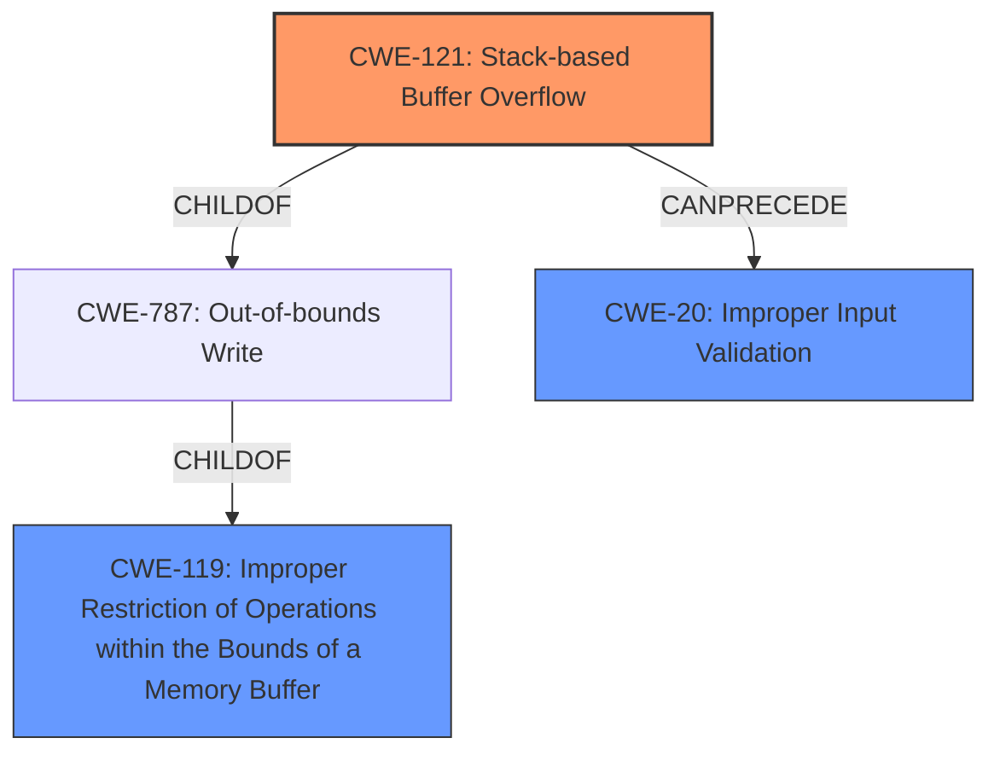

# Analysis for CVE-2021-26709

# Summary
| CWE ID | CWE Name | Confidence | CWE Abstraction Level | CWE Vulnerability Mapping Label | CWE-Vulnerability Mapping Notes |
|---|---|---|---|---|---|
| CWE-121 | Stack-based Buffer Overflow | 1.0 | Variant | Primary | Allowed |
| CWE-119 | Improper Restriction of Operations within the Bounds of a Memory Buffer | 0.7 | Class | Secondary | Discouraged |
| CWE-20 | Improper Input Validation | 0.5 | Class | Secondary | Allowed |

## Evidence and Confidence

*   **Confidence Score:** 0.9
*   **Evidence Strength:** HIGH

## Relationship Analysis
The primary CWE is CWE-121, a Variant of CWE-787 (Out-of-bounds Write), which in turn is a ChildOf CWE-119. CWE-119 is a more general Class-level CWE. The description clearly states a **stack-based buffer overflow**, making CWE-121 the most specific and appropriate choice. The potential chain includes CWE-20 (Improper Input Validation) which could have led to the buffer overflow.

## Vulnerability Chain
The vulnerability chain starts with **improper input validation** (potentially CWE-20), leading to the **stack-based buffer overflow** (CWE-121), and ultimately allowing an unauthenticated remote attacker to **take over the device**.

## Summary of Analysis
The initial analysis identified **stack-based buffer overflow** as the primary weakness. The retriever results suggested CWE-119 and CWE-190, but the description's explicit mention of a **stack-based buffer overflow** makes CWE-121 the most accurate choice. The evidence from the "CVE Reference Links Content Summary" supports this, mentioning insufficient bounds checking when handling user-supplied input in the `login.xgi` endpoint via `user` and `pass` parameters. The hierarchical relationships confirm that CWE-121 is a specific type of CWE-119, making it a more precise classification. CWE-121 is at the Variant level of abstraction, which is a preferred level.

Relevant CWE Information:

# Enhanced Context (25 CWEs)

## CWE-124: Buffer Underwrite ('Buffer Underflow')
**Abstraction Level**: Base
**Similarity Score**: 0.77

## CWE-191: Integer Underflow (Wrap or Wraparound)
**Abstraction Level**: Base
**Similarity Score**: 0.77

## CWE-805: Buffer Access with Incorrect Length Value
**Abstraction Level**: Base
**Similarity Score**: 0.76

## CWE-131: Incorrect Calculation of Buffer Size
**Abstraction Level**: Base
**Similarity Score**: 0.76

## CWE-126: Buffer Over-read
**Abstraction Level**: Variant
**Similarity Score**: 0.75

## CWE-193: Off-by-one Error
**Abstraction Level**: Base
**Similarity Score**: 0.75

## CWE-130: Improper Handling of Length Parameter Inconsistency
**Abstraction Level**: Base
**Similarity Score**: 0.74

## CWE-125: Out-of-bounds Read
**Abstraction Level**: Base
**Similarity Score**: 0.74

## CWE-680: Integer Overflow to Buffer Overflow
**Abstraction Level**: Compound
**Similarity Score**: 0.74

## CWE-190: Integer Overflow or Wraparound
**Abstraction Level**: Base
**Similarity Score**: 0.74

## CWE-190: Integer Overflow or Wraparound
**Abstraction Level**: Base
**Similarity Score**: 7740.82

## CWE-125: Out-of-bounds Read
**Abstraction Level**: Base
**Similarity Score**: 7305.57

## CWE-1284: Improper Validation of Specified Quantity in Input
**Abstraction Level**: Base
**Similarity Score**: 7220.87

## CWE-193: Off-by-one Error
**Abstraction Level**: Base
**Similarity Score**: 7197.97

## CWE-119: Improper Restriction of Operations within the Bounds of a Memory Buffer
**Abstraction Level**: Class
**Similarity Score**: 7164.83

## CWE-128: Wrap-around Error
**Abstraction Level**: base
**Similarity Score**: 5.03

## CWE-120: Buffer Copy without Checking Size of Input ('Classic Buffer Overflow')
**Abstraction Level**: base
**Similarity Score**: 4.82

## CWE-123: Write-what-where Condition
**Abstraction Level**: base
**Similarity Score**: 4.33

## CWE-170: Improper Null Termination
**Abstraction Level**: base
**Similarity Score**: 4.33

## CWE-1284: Improper Validation of Specified Quantity in Input
**Abstraction Level**: base
**Similarity Score**: 4.33

## CWE-617: Reachable Assertion
**Abstraction Level**: base
**Similarity Score**: 4.33

## CWE-88: Improper Neutralization of Argument Delimiters in a Command ('Argument Injection')
**Abstraction Level**: base
**Similarity Score**: 3.64

## CWE-78: Improper Neutralization of Special Elements used in an OS Command ('OS Command Injection')
**Abstraction Level**: base
**Similarity Score**: 3.64

## CWE-1339: Insufficient Precision or Accuracy of a Real Number
**Abstraction Level**: base
**Similarity Score**: 3.57

## CWE-190: Integer Overflow or Wraparound
**Abstraction Level**: Base
**Similarity Score**: 3.31

**CWE-121: Stack-based Buffer Overflow:** This is the primary CWE. The vulnerability description explicitly states "**multiple Stack-Based Buffer Overflows**". The "CVE Reference Links Content Summary" confirms that these overflows occur due to insufficient bounds checking when handling user-supplied input in the `login.xgi` functionality. This directly matches the CWE's description. Exploitation can lead to arbitrary code execution and device takeover.

**CWE-119: Improper Restriction of Operations within the Bounds of a Memory Buffer:** This is a broader, Class-level CWE that encompasses buffer overflows. While applicable, CWE-121 is a more specific Variant and therefore preferred. The mapping guidance for CWE-119 discourages its use when lower-level CWEs are available.

**CWE-20: Improper Input Validation:** The root cause of the buffer overflow is likely the lack of proper input validation of the `user` and `pass` parameters. While not explicitly stated, this is a reasonable assumption and a common precursor to buffer overflows. This is being included as a secondary CWE with lower confidence.

**CWEs Considered but Not Used:**

*   CWE-190 (Integer Overflow or Wraparound): While integer overflows can lead to buffer overflows, there is no direct evidence in the description to support this.
*   CWE-78 (Improper Neutralization of Special Elements used in an OS Command ('OS Command Injection')) and CWE-88 (Improper Neutralization of Argument Delimiters in a Command ('Argument Injection')): The description does not indicate command injection as the root cause, but rather insufficient bounds checking leading to a buffer overflow.
*   CWE-120 (Buffer Copy without Checking Size of Input ('Classic Buffer Overflow')): While related, the description specifically mentions a stack-based buffer overflow, making CWE-121 a more accurate fit.