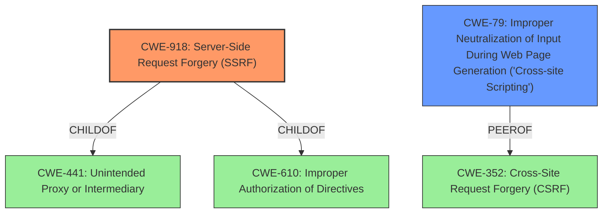

# Raw Analyzer Response for CVE-2021-26715

# Summary
| CWE ID | CWE Name | Confidence | CWE Abstraction Level | CWE Vulnerability Mapping Label | CWE-Vulnerability Mapping Notes |
|---|---|---|---|---|---|
| CWE-918 | Server-Side Request Forgery (SSRF) | 1.0 | Base | Allowed | Primary CWE |
| CWE-79 | Improper Neutralization of Input During Web Page Generation ('Cross-site Scripting') | 0.8 | Base | Allowed | Secondary Candidate |

## Evidence and Confidence

*   **Confidence Score:** 0.9
*   **Evidence Strength:** HIGH

## Relationship Analysis
The primary CWE is CWE-918 **Server-Side Request Forgery (SSRF)**, which is a base-level CWE. It has child relationships to CWE-441 and CWE-610, which represent related weaknesses involving information exposure and improper access control. The secondary CWE is CWE-79 **Improper Neutralization of Input During Web Page Generation ('Cross-site Scripting')**, which is also a base-level CWE. It has a peer relationship with CWE-352, **Cross-Site Request Forgery (CSRF)**, indicating that these vulnerabilities can sometimes be related or occur together. These relationships help to provide context for the vulnerability and suggest potential areas for further investigation.

## Vulnerability Chain
The vulnerability chain starts with the **unsafe usage of the logo_uri parameter**, leading to a **Server-Side Request Forgery (SSRF)**. This allows an attacker to make HTTP requests from the vulnerable server to any address in the internal network. The response from the server, if not properly handled, can lead to **Cross-Site Scripting (XSS)**.

## Summary of Analysis
The analysis identified two key weaknesses: **Server-Side Request Forgery (SSRF)** and **Cross-Site Scripting (XSS)**. The primary weakness is CWE-918 **Server-Side Request Forgery (SSRF)**, which stems from the **unsafe usage of the logo_uri parameter** in the Dynamic Client Registration request. The vulnerability description states, "An unauthenticated attacker can make a HTTP request from the vulnerable server to any address in the internal network and obtain its response." This aligns directly with the description of CWE-918, where the server retrieves the contents of a URL without sufficiently ensuring the request is sent to the expected destination.

The secondary weakness is CWE-79 **Improper Neutralization of Input During Web Page Generation ('Cross-site Scripting')**. The vulnerability description mentions that the server response "might, for example, have a JavaScript payload for resultant XSS." The "CVE Reference Links Content Summary" section states, "Because the server does not enforce any image "Content-Type" header, the attacker can provide a URL that returns HTML containing malicious JavaScript code, which will be executed within the context of the authorization server's domain." This indicates that the server is not properly neutralizing input before using it in a web page, leading to XSS.

The selection of CWE-918 as the primary CWE is supported by the "CVE Reference Links Content Summary," which identifies SSRF as a core vulnerability. The selection of CWE-79 as a secondary CWE is supported by the "CVE Reference Links Content Summary" section, which details how an attacker can inject malicious JavaScript code. Both CWEs are at the base level of abstraction, providing appropriate specificity.

The retriever results identified CWE-918, CWE-79, and other potential CWEs. The analysis considered CWE-611 **Improper Restriction of XML External Entity Reference**, but it was deemed less relevant because the vulnerability does not specifically involve XML processing. Similarly, CWE-306 **Missing Authentication for Critical Function** was considered, but it was not selected because the primary issue is the improper handling of the `logo_uri` parameter, not a complete lack of authentication.

The final assessment is based on the provided evidence and the CWE specifications, and the selected CWEs are at the optimal level of specificity.

Relevant CWE Information:

# Enhanced Context (25 CWEs)

## CWE-184: Incomplete List of Disallowed Inputs
**Abstraction Level**: Base
**Similarity Score**: 0.77
**Source**: dense

**Description**:
The product implements a protection mechanism that relies on a list of inputs (or properties of inputs) that are not allowed by policy or otherwise require other action to neutralize before additional processing takes place, but the list is incomplete.

**Mapping Guidance**:
- Usage: Allowed
- Rationale: This CWE entry is at the Base level of abstraction, which is a preferred level of abstraction for mapping to the root causes of vulnerabilities.

## CWE-941: Incorrectly Specified Destination in a Communication Channel
**Abstraction Level**: Base
**Similarity Score**: 0.76
**Source**: dense

**Description**:
The product creates a communication channel to initiate an outgoing request to an actor, but it does not correctly specify the intended destination for that actor.

**Mapping Guidance**:
- Usage: Allowed
- Rationale: This CWE entry is at the Base level of abstraction, which is a preferred level of abstraction for mapping to the root causes of vulnerabilities.

## CWE-74: Improper Neutralization of Special Elements in Output Used by a Downstream Component ('Injection')
**Abstraction Level**: Class
**Similarity Score**: 0.76
**Source**: dense

**Description**:
The product constructs all or part of a command, data structure, or record using externally-influenced input from an upstream component, but it does not neutralize or incorrectly neutralizes special elements that could modify how it is parsed or interpreted when it is sent to a downstream component.

**Mapping Guidance**:
- Usage: Discouraged
- Rationale: CWE-74 is high-level and often misused when lower-level weaknesses are more appropriate.

## CWE-807: Reliance on Untrusted Inputs in a Security Decision
**Abstraction Level**: Base
**Similarity Score**: 0.76
**Source**: dense

**Description**:
The product uses a protection mechanism that relies on the existence or values of an input, but the input can be modified by an untrusted actor in a way that bypasses the protection mechanism.

**Mapping Guidance**:
- Usage: Allowed
- Rationale: This CWE entry is at the Base level of abstraction, which is a preferred level of abstraction for mapping to the root causes of vulnerabilities.

## CWE-1289: Improper Validation of Unsafe Equivalence in Input
**Abstraction Level**: Base
**Similarity Score**: 0.76
**Source**: dense

**Description**:
The product receives an input value that is used as a resource identifier or other type of reference, but it does not validate or incorrectly validates that the input is equivalent to a potentially-unsafe value.

**Mapping Guidance**:
- Usage: Allowed
- Rationale: This CWE entry is at the Base level of abstraction, which is a preferred level of abstraction for mapping to the root causes of vulnerabilities.

## CWE-41: Improper Resolution of Path Equivalence
**Abstraction Level**: Base
**Similarity Score**: 0.76
**Source**: dense

**Description**:
The product is vulnerable to file system contents disclosure through path equivalence. Path equivalence involves the use of special characters in file and directory names. The associated manipulations are intended to generate multiple names for the same object.

**Mapping Guidance**:
- Usage: Allowed
- Rationale: This CWE entry is at the Base level of abstraction, which is a preferred level of abstraction for mapping to the root causes of vulnerabilities.

## CWE-451: User Interface (UI) Misrepresentation of Critical Information
**Abstraction Level**: Class
**Similarity Score**: 0.75
**Source**: dense

**Description**:
The user interface (UI) does not properly represent critical information to the user, allowing the information - or its source - to be obscured or spoofed. This is often a component in phishing attacks.

**Mapping Guidance**:
- Usage: Allowed-with-Review
- Rationale: This CWE entry is a Class and might have Base-level children that would be more appropriate

## CWE-923: Improper Restriction of Communication Channel to Intended Endpoints
**Abstraction Level**: Class
**Similarity Score**: 0.7