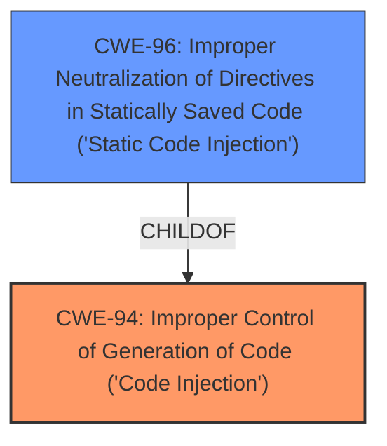

# Analysis Report for CVE-2021-26753

# Vulnerability Analysis Report: CVE-2021-26753

## Description


## Analysis (with Relationship Data)

# Summary
| CWE ID | CWE Name | Confidence | CWE Abstraction Level | CWE Vulnerability Mapping Label | CWE-Vulnerability Mapping Notes |
|---|---|---|---|---|---|
| CWE-94 | Improper Control of Generation of Code ('Code Injection') | 1.0 | Base | Allowed-with-Review | Primary CWE |
| CWE-96 | Improper Neutralization of Directives in Statically Saved Code ('Static Code Injection') | 0.7 | Base | Allowed | Secondary Candidate |

## Evidence and Confidence

*   **Confidence Score:** 0.9
*   **Evidence Strength:** HIGH

## Relationship Analysis
The primary relationship that influenced my decision was the parent-child relationship between CWE-94 (Improper Control of Generation of Code) and its child CWE-96 (Improper Neutralization of Directives in Statically Saved Code). While the initial assessment pointed towards CWE-94 due to the **code injection** nature of the vulnerability, a closer examination revealed that the injected code is being inserted into a system file, aligning it more closely with the characteristics of CWE-96.



## Vulnerability Chain
The vulnerability chain begins with an authenticated user providing input via the `txt` HTTP POST parameter. The NeDi application fails to properly neutralize or sanitize this input, leading to the **injection** of PHP code into a system file. This results in arbitrary code execution, potentially leading to full system compromise and data breach.

## Summary of Analysis
Initially, I considered CWE-94 (Improper Control of Generation of Code) as the primary candidate because the vulnerability description explicitly mentions **PHP code injection**. The CVE Reference Links Content Summary confirms this by stating, "The primary vulnerability is the ability to inject and execute arbitrary PHP code."

However, after reviewing the details and the CWE specifications, I recognized that the injected code is not simply being executed dynamically but is being inserted into a system file. This aligns more precisely with CWE-96 (Improper Neutralization of Directives in Statically Saved Code). This distinction is important because CWE-96 specifically addresses scenarios where the injected code becomes part of a static resource like a configuration file or template.

The evidence for this includes the vulnerability description mentioning the **injection** occurring in the "System Files function on the endpoint /System-Files.php" and the CVE reference summary noting that "the NeDi application allows authenticated users to inject PHP code into a system file via the `txt` POST parameter."

The CWE-94 is still the primary CWE because the code is being generated based on the input, but CWE-96 is a relevant secondary CWE because the code ends up saved in a file.

I selected CWE-94 at the Base level because it accurately represents the **code injection** aspect of the vulnerability. While CWE-96 is considered, the primary issue is the **improper control of code generation** itself.

Relevant CWE Information:

# Enhanced Context (25 CWEs)
The following CWEs were identified as potentially relevant to this vulnerability:

## CWE-184: Incomplete List of Disallowed Inputs
**Abstraction Level**: Base
**Similarity Score**: 0.79

**Description**:
The product implements a protection mechanism that relies on a list of inputs (or properties of inputs) that are not allowed by policy or otherwise require other action to neutralize before additional processing takes place, but the list is incomplete.
## CWE-23: Relative Path Traversal
**Abstraction Level**: Base
**Similarity Score**: 0.78

**Description**:
The product uses external input to construct a pathname that should be within a restricted directory, but it does not properly neutralize sequences such as ".." that can resolve to a location that is outside of that directory.
## CWE-74: Improper Neutralization of Special Elements in Output Used by a Downstream Component ('Injection')
**Abstraction Level**: Class
**Similarity Score**: 0.78

**Description**:
The product constructs all or part of a command, data structure, or record using externally-influenced input from an upstream component, but it does not neutralize or incorrectly neutralizes special elements that could modify how it is parsed or interpreted when it is sent to a downstream component.
## CWE-41: Improper Resolution of Path Equivalence
**Abstraction Level**: Base
**Similarity Score**: 0.77

**Description**:
The product is vulnerable to file system contents disclosure through path equivalence. Path equivalence involves the use of special characters in file and directory names. The associated manipulations are intended to generate multiple names for the same object.
## CWE-73: External Control of File Name or Path
**Abstraction Level**: Base
**Similarity Score**: 0.76

**Description**:
The product allows user input to control or influence paths or file names that are used in filesystem operations.
## CWE-425: Direct Request ('Forced Browsing')
**Abstraction Level**: Base
**Similarity Score**: 0.76

**Description**:
The web application does not adequately enforce appropriate authorization on all restricted URLs, scripts, or files.
## CWE-639: Authorization Bypass Through User-Controlled Key
**Abstraction Level**: Base
**Similarity Score**: 0.76

**Description**:
The system's authorization functionality does not prevent one user from gaining access to another user's data or record by modifying the key value identifying the data.
## CWE-183: Permissive List of Allowed Inputs
**Abstraction Level**: Base
**Similarity Score**: 0.76

**Description**:
The product implements a protection mechanism that relies on a list of inputs (or properties of inputs) that are explicitly allowed by policy because the inputs are assumed to be safe, but the list is too permissive - that is, it allows an input that is unsafe, leading to resultant weaknesses.
## CWE-552: Files or Directories Accessible to External Parties
**Abstraction Level**: Base
**Similarity Score**: 0.75

**Description**:
The product makes files or directories accessible to unauthorized actors, even though they should not be.
## CWE-138: Improper Neutralization of Special Elements
**Abstraction Level**: Class
**Similarity Score**: 0.75

**Description**:
The product receives input from an upstream component, but it does not neutralize or incorrectly neutralizes special elements that could be interpreted as control elements or syntactic markers when they are sent to a downstream component.
## CWE-22: Improper Limitation of a Pathname to a Restricted Directory ('Path Traversal')
**Abstraction Level**: Base
**Similarity Score**: 7660.34

**Description**:
The product uses external input to construct a pathname that is intended to identify a file or directory that is located underneath a restricted parent directory, but the product does not properly neutralize special elements within the pathname that can cause the pathname to resolve to a location that is outside of the restricted directory.
## CWE-184: Incomplete List of Disallowed Inputs
**Abstraction Level**: Base
**Similarity Score**: 7537.66

**Description**:
The product implements a protection mechanism that relies on a list of inputs (or properties of inputs) that are not allowed by policy or otherwise require other action to neutralize before additional processing takes place, but the list is incomplete.
## CWE-23: Relative Path Traversal
**Abstraction Level**: Base
**Similarity Score**: 7367.07

**Description**:
The product uses external input to construct a pathname that should be within a restricted directory, but it does not properly neutralize sequences such as ".." that can resolve to a location that is outside of that directory.
## CWE-88: Improper Neutralization of Argument Delimiters in a Command ('Argument Injection')
**Abstraction Level**: Base
**Similarity Score**: 7106.18

**Description**:
The product constructs a string for a command to be executed by a separate component
in another control sphere, but it does not properly delimit the
intended arguments, options, or switches within that command string.
## CWE-95: Improper Neutralization of Directives in Dynamically Evaluated Code ('Eval Injection')
**Abstraction Level**: Variant
**Similarity Score**: 7076.44

**Description**:
The product receives input from an upstream component, but it does not neutralize or incorrectly neutralizes code syntax before using the input in a dynamic evaluation call (e.g. "eval").
## CWE-78: Improper Neutralization of Special Elements used in an OS Command ('OS Command Injection')
**Abstraction Level**: base
**Similarity Score**: 5.03

**Description**:
CWE-78: Improper Neutralization of Special Elements used in an OS Command ('OS Command Injection')
## CWE-98: Improper Control of Filename for Include/Require Statement in PHP Program ('PHP Remote File Inclusion')
**Abstraction Level**: variant
**Similarity Score**: 4.53

**Description**:
CWE-98


## CWE Relationship Analysis

Current CWEs represent these abstraction levels: .


### Vulnerability Chain Analysis

**Chain starting from CWE-98:**
- 98 (Improper Control of Filename for Include/Require Statement in PHP Program ('PHP Remote File Inclusion')) - ROOT


**Chain starting from CWE-88:**
- 88 (Improper Neutralization of Argument Delimiters in a Command ('Argument Injection')) - ROOT


### CWE Relationship Diagram

```mermaid
graph TD
    classDef primary fill:#f96,stroke:#333,stroke-width:2px
    classDef secondary fill:#69f,stroke:#333
    classDef tertiary fill:#9e9,stroke:#333
```


*Report generated on 2025-04-02 08:22:36*
