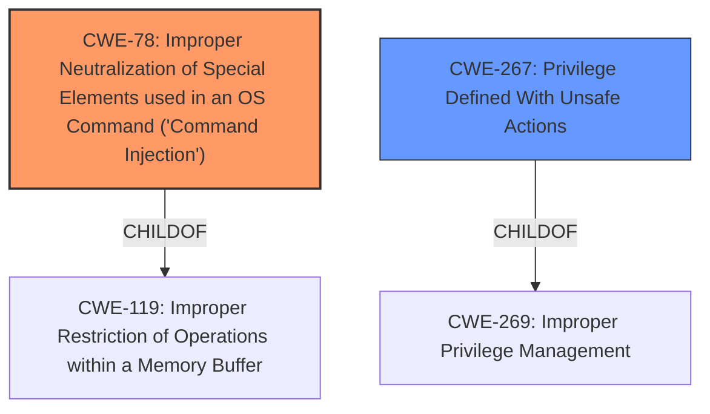

# Enhanced Analysis for CVE-2021-26758

# Summary
| CWE ID | CWE Name | Confidence | CWE Abstraction Level | CWE Vulnerability Mapping Label | CWE-Vulnerability Mapping Notes |
|---|---|---|---|---|---|
| CWE-78 | Improper Neutralization of Special Elements used in an OS Command ('Command Injection') | 1 | Base | Primary | Allowed |
| CWE-267 | Privilege Defined With Unsafe Actions | 0.8 | Base | Secondary | Allowed |

## Evidence and Confidence

*   **Confidence Score:** 0.9
*   **Evidence Strength:** HIGH

## Relationship Analysis
The primary CWE is CWE-78, which is a Base level CWE and a child of CWE-119. CWE-78 directly addresses the command injection vulnerability described. CWE-267 is a child of CWE-269, and while privilege escalation is part of the impact, it is a consequence of the command injection, not the root cause.



## Vulnerability Chain
The vulnerability chain starts with the **improper neutralization** of input, leading to command injection. The ability to control the user and group under which the command is executed then leads to **privilege escalation**.

## Summary of Analysis
The primary weakness is the command injection vulnerability. The vulnerability description and the CVE Reference Links Content Summary clearly support this. The `path` parameter is vulnerable to command injection due to the **lack of proper sanitization** of user-supplied input.
> *"The vulnerability stems from a command injection flaw in the `path` parameter within the OpenLiteSpeed web server's configuration management interface. This allows an authenticated attacker to inject arbitrary commands."*

The ability to control the `extUser` and `extGroup` parameters allows an attacker to execute commands with elevated privileges.
> *"Furthermore, the `extUser` and `extGroup` parameters allow the attacker to specify the user and group under which the injected command is executed, leading to potential privilege escalation."*

The `extUser` and `extGroup` parameters controlling privilege is a secondary weakness because the command injection is the enabler.

CWE-78 is the most specific and appropriate classification for the primary vulnerability. CWE-267 captures the essence of the privilege escalation aspect, although it's a consequence of the command injection.

Other CWEs Considered:

*   CWE-269: Improper Privilege Management - While privilege escalation is an impact, it is not the root cause. The root cause is the command injection.
*   CWE-250: Execution with Unnecessary Privileges - Similar to CWE-269, this is a consequence, not the root cause.
*   CWE-732: Incorrect Permission Assignment for Critical Resource - This CWE is more about misconfigured permissions, which is not the primary issue here.
*   CWE-20: Improper Input Validation - This is too broad. CWE-78 is more specific to command injection.
* CWE-427: Uncontrolled Search Path Element - This is a more specific case where the search path can be controlled.
* CWE-22: Improper Limitation of a Pathname to a Restricted Directory ('Path Traversal') - This is a more specific case where the path name is not restricted to a directory.
* CWE-59: Improper Link Resolution Before File Access ('Link Following') - This is a more specific case where the link is not properly resolved before file access.
* CWE-73: External Control of File Name or Path - This is a more specific case where the filename or path is externally controlled.

Relevant CWE Information:

# Enhanced Context (25 CWEs)
The following CWEs were identified as potentially relevant to this vulnerability:

## CWE-78: Improper Neutralization of Special Elements used in an OS Command ('Command Injection')
**Abstraction Level**: Base

**Description**:
The product constructs all or part of an OS command using externally-influenced input from an upstream component, but it does not neutralize or incorrectly neutralizes special elements that could modify the intended OS command when it is executed.

**Extended Description**:
This weakness occurs when an application passes unsafe, unfiltered data to the operating system (OS) to be run as a command. This can happen when an application needs to execute a system command, but uses external input to help construct the command. An attacker can then construct commands that the application will execute with the privileges of the application itself. If the application runs with elevated privileges, then the attacker might be able to take complete control over the system.

Command injection is similar to, but distinct from, other injection vulnerabilities such as SQL injection (CWE-89) or LDAP injection (CWE-90). Command injection focuses on injecting into commands that are executed directly by the operating system, whereas the other injection types focus on injecting into interpreters for other languages.

### Alternative Terms
OS Command Injection
Shell Injection

### Relationships
ChildOf -> CWE-119
CanPrecede -> CWE-73
CanPrecede -> CWE-74
CanPrecede -> CWE-98
CanPrecede -> CWE-77

### Mapping Guidance
**Usage:** Allowed
**Rationale:** This CWE entry is at the Base level of abstraction, which is a preferred level of abstraction for mapping to the root causes of vulnerabilities.
**Comments:** Use caution when mapping high-level requirements to this CWE ID.
**Reasons:**
- Acceptable-Use

### Observed Examples
- **CVE-2024-23897:** Jenkins is vulnerable to command injection through the arguments parameter passed to the form-test endpoint.
- **CVE-2024-22246:** The node-red-node-ping node for Node-RED allows command injection because it does not validate the target host, allowing execution of arbitrary commands on the system running Node-RED.
- **CVE-2024-22235:** Improper neutralization of special elements in the 'address' argument of the 'arping' command in the 'ping' command handler allows command injection.

## CWE-267: Privilege Defined With Unsafe Actions
**Abstraction:** Base

**Description**:
A particular privilege, role, capability, or right can be used to perform unsafe actions that were not intended, even when it is assigned to the correct entity.

**Extended Description**:
Not provided

### Alternative Terms
None

### Relationships
ChildOf -> CWE-269

### Mapping Guidance
**Usage:** Allowed
**Rationale:** This CWE entry is at the Base level of abstraction, which is a preferred level of abstraction for mapping to the root causes of vulnerabilities.
**Comments:** Carefully read both the name and description to ensure that this mapping is an appropriate fit. Do not try to 'force' a mapping to a lower-level Base/Variant simply to comply with this preferred level of abstraction.
**Reasons:**
- Acceptable-Use

## CWE-119: Improper Restriction of Operations within a Memory Buffer
**Abstraction Level**: Class

**Description**:
The product performs operation on a memory buffer, but it does not correctly restrict the operation. This could result in read, write, or control access outside of the buffer.

**Extended Description**:
Not provided

### Alternative Terms
- Buffer Error
- Memory Buffer Error

### Relationships
ParentOf -> CWE-120
ParentOf -> CWE-121
ParentOf -> CWE-122
ParentOf -> CWE-123
ParentOf -> CWE-124
ParentOf -> CWE-125
ParentOf -> CWE-126
ParentOf -> CWE-127
ParentOf -> CWE-128
ParentOf -> CWE-129
ParentOf -> CWE-130
ParentOf -> CWE-131
ParentOf -> CWE-193
ParentOf -> CWE-194
ParentOf -> CWE-195
ParentOf -> CWE-196
ParentOf -> CWE-197
ParentOf -> CWE-198
ParentOf -> CWE-200
ParentOf -> CWE-467
ParentOf -> CWE-676
ParentOf -> CWE-691
ParentOf -> CWE-805
ParentOf -> CWE-823
ParentOf -> CWE-824
ParentOf -> CWE-825
ParentOf -> CWE-826
ParentOf -> CWE-838
ParentOf -> CWE-839
ParentOf -> CWE-840
ParentOf -> CWE-841
ParentOf -> CWE-842
ParentOf -> CWE-843
ParentOf -> CWE-844
ParentOf


## CWE Relationship Analysis

Current CWEs represent these abstraction levels: .


### Vulnerability Chain Analysis

**Chain starting from CWE-691:**
- 691 (Insufficient Control Flow Management) - ROOT


**Chain starting from CWE-839:**
- 839 (Numeric Range Comparison Without Minimum Check) - ROOT


### CWE Relationship Diagram

```mermaid
graph TD
    classDef primary fill:#f96,stroke:#333,stroke-width:2px
    classDef secondary fill:#69f,stroke:#333
    classDef tertiary fill:#9e9,stroke:#333
```