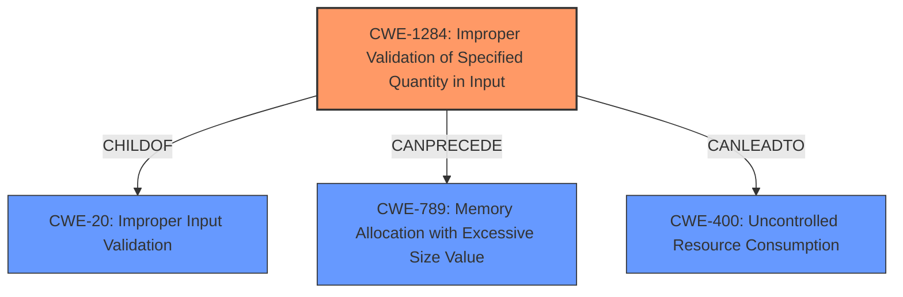

# Analysis for CVE-2021-26788

# Summary
| CWE ID    | CWE Name                                                       | Confidence | CWE Abstraction Level | CWE Vulnerability Mapping Label | CWE-Vulnerability Mapping Notes |
| --------- | ------------------------------------------------------------- | ---------- | ---------------------- | ------------------------------- | ----------------------------- |
| CWE-1284  | Improper Validation of Specified Quantity in Input            | 0.85       | Base                   | Allowed                         | Primary CWE                   |
| CWE-400   | Uncontrolled Resource Consumption                             | 0.60       | Class                  | Discouraged                     | Secondary Candidate           |
| CWE-1286  | Improper Validation of Syntactic Correctness of Input         | 0.50       | Base                   | Allowed                         | Secondary Candidate           |

## Evidence and Confidence

*   **Confidence Score:** 0.75
*   **Evidence Strength:** MEDIUM

## Relationship Analysis
The primary CWE identified is CWE-1284, which falls under the broader category of CWE-20 (Improper Input Validation). This indicates a hierarchical relationship where CWE-1284 is a more specific type of input validation issue. Additionally, CWE-1284 can precede CWE-789 (Memory Allocation with Excessive Size Value), suggesting a potential chain of events where **improper validation** leads to excessive memory allocation. CWE-400 (Uncontrolled Resource Consumption) is considered as a consequence of the **improper validation**.

## Vulnerability Chain
The vulnerability chain starts with **incorrect input validation** (CWE-1284), where the system fails to properly validate the quantity specified in the input. This can lead to uncontrolled resource consumption (CWE-400) and potentially memory allocation with excessive size value (CWE-789), ultimately causing a denial of service (DoS).

## Summary of Analysis
The initial analysis identified **incorrect input validation** as the root cause of the vulnerability, leading to a denial-of-service.

The vulnerability description states: "Oryx Embedded CycloneTCP 1.7.6 to 2.0.0, fixed in 2.0.2, is affected by **incorrect input validation**, which may cause a denial of service (DoS)."

The Retriever Results listed CWE-20 (Improper Input Validation) as the top result but marked it as Discouraged. The suggested alternative, CWE-1284 (Improper Validation of Specified Quantity in Input), is a more specific and appropriate choice, aligning with the description of **incorrect input validation** potentially leading to resource exhaustion and DoS. The graph relationships highlight how **improper validation** can lead to resource management issues. CWE-1284 is at the Base level of abstraction, which is preferred.

CWE-400 (Uncontrolled Resource Consumption) was considered because the vulnerability leads to a denial of service, which is often a result of resource exhaustion. However, CWE-400 is a Class-level CWE and is listed as Discouraged. The root cause is the **incorrect input validation** that allows for the resource exhaustion to occur.

CWE-1286 (Improper Validation of Syntactic Correctness of Input) was also considered, but the description focuses more on the quantity rather than the syntax of the input, making CWE-1284 a better fit.

Therefore, CWE-1284 is the most appropriate CWE because it directly addresses the **improper validation** of a specified quantity in the input, which leads to the denial-of-service vulnerability.

Relevant CWE Information:

# Enhanced Context (25 CWEs)
The following CWEs were identified as potentially relevant to this vulnerability:

## CWE-1289: Improper Validation of Unsafe Equivalence in Input
**Abstraction Level**: Base
**Similarity Score**: 0.76
**Source**: dense

**Description**:
The product receives an input value that is used as a resource identifier or other type of reference, but it does not validate or incorrectly validates that the input is equivalent to a potentially-unsafe value.

**Mapping Guidance**:
- Usage: Allowed
- Rationale: This CWE entry is at the Base level of abstraction, which is a preferred level of abstraction for mapping to the root causes of vulnerabilities.

## CWE-404: Improper Resource Shutdown or Release
**Abstraction Level**: Class
**Similarity Score**: 0.76
**Source**: dense

**Description**:
The product does not release or incorrectly releases a resource before it is made available for re-use.

**Mapping Guidance**:
- Usage: Allowed-with-Review
- Rationale: This CWE entry is a Class and might have Base-level children that would be more appropriate

## CWE-131: Incorrect Calculation of Buffer Size
**Abstraction Level**: Base
**Similarity Score**: 0.76
**Source**: dense

**Description**:
The product does not correctly calculate the size to be used when allocating a buffer, which could lead to a buffer overflow.

**Mapping Guidance**:
- Usage: Allowed
- Rationale: This CWE entry is at the Base level of abstraction, which is a preferred level of abstraction for mapping to the root causes of vulnerabilities.

## CWE-125: Out-of-bounds Read
**Abstraction Level**: Base
**Similarity Score**: 0.76
**Source**: dense

**Description**:
The product reads data past the end, or before the beginning, of the intended buffer.

**Mapping Guidance**:
- Usage: Allowed
- Rationale: This CWE entry is at the Base level of abstraction, which is a preferred level of abstraction for mapping to the root causes of vulnerabilities.

## CWE-191: Integer Underflow (Wrap or Wraparound)
**Abstraction Level**: Base
**Similarity Score**: 0.76
**Source**: dense

**Description**:
The product subtracts one value from another, such that the result is less than the minimum allowable integer value, which produces a value that is not equal to the correct result.

**Mapping Guidance**:
- Usage: Allowed
- Rationale: This CWE entry is at the Base level of abstraction, which is a preferred level of abstraction for mapping to the root causes of vulnerabilities.

## CWE-130: Improper Handling of Length Parameter Inconsistency
**Abstraction Level**: Base
**Similarity Score**: 0.75
**Source**: dense

**Description**:
The product parses a formatted message or structure, but it does not handle or incorrectly handles a length field that is inconsistent with the actual length of the associated data.

**Mapping Guidance**:
- Usage: Allowed
- Rationale: This CWE entry is at the Base level of abstraction, which is a preferred level of abstraction for mapping to the root causes of vulnerabilities.

## CWE-667: Improper Locking
**Abstraction Level**: Class
**Similarity Score**: 0.75
**Source**: dense

**Description**:
The product does not properly acquire or release a lock on a resource, leading to unexpected resource state changes and behaviors.

**Mapping Guidance**:
- Usage: Allowed-with-Review
- Rationale: This CWE entry is a Class and might have Base-level children that would be more appropriate

## CWE-606: Unchecked Input for Loop Condition
**Abstraction Level**: Base
**Similarity Score**: 0.75
**Source**: dense

**Description**:
The product does not properly check inputs that are used for loop conditions, potentially leading to a denial of service or other consequences because of excessive looping.

**Mapping Guidance**:
- Usage: Allowed
- Rationale: This CWE entry is at the Base level of abstraction, which is a preferred level of abstraction for mapping to the root causes of vulnerabilities.

## CWE-226: Sensitive Information in Resource Not Removed Before Reuse
**Abstraction Level**: Base
**Similarity Score**: 0.75
**Source**: dense

**Description**:
The product releases a resource such as memory or a file so that it can be made available for reuse, but it does not clear or "zeroize" the information contained in the resource before the product performs a critical state transition or makes the resource available for reuse by other entities.

**Mapping Guidance**:
- Usage: Allowed
- Rationale: This CWE entry is at the Base level of abstraction, which is a preferred level of abstraction for mapping to the root causes of vulnerabilities.

## CWE-805: Buffer Access with Incorrect Length Value
**Abstraction Level**: Base