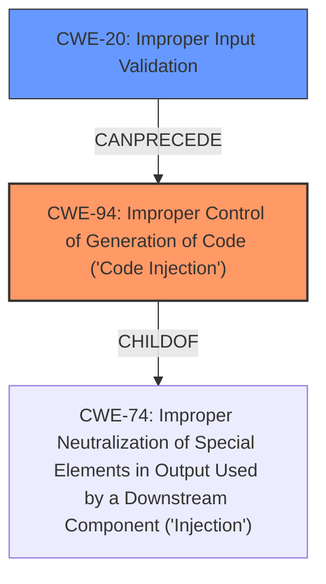

# Analysis Report for CVE-2021-26814

# Vulnerability Analysis Report: CVE-2021-26814

## Description


## Analysis (with Relationship Data)

# Summary

| CWE ID | CWE Name | Confidence | CWE Abstraction Level | CWE Vulnerability Mapping Label | CWE-Vulnerability Mapping Notes |
|---|---|---|---|---|---|
| CWE-94 | Improper Control of Generation of Code ('Code Injection') | 0.8 | Base | Allowed-with-Review | Primary CWE |
| CWE-20 | Improper Input Validation | 0.6 | Class | Discouraged | Secondary CWE |

## Evidence and Confidence

*   **Confidence Score:** 0.7
*   **Evidence Strength:** MEDIUM

## Relationship Analysis

The primary relationship that impacted the decision was the parent-child relationship between CWE-74 (Improper Neutralization of Special Elements in Output Used by a Downstream Component ('Injection')) and CWE-94 (Improper Control of Generation of Code ('Code Injection')). The vulnerability involves **code injection**, which is a form of injection, but CWE-94 is more specific. CWE-20 (Improper Input Validation) is related as it represents the **root cause**, but it's a high-level class and thus less specific.



## Vulnerability Chain

The vulnerability chain starts with **incomplete input validation** (CWE-20), which allows an attacker to inject arbitrary code. This leads to **improper control of generation of code** (CWE-94), resulting in arbitrary code execution with administrative privileges.

## Summary of Analysis

The initial analysis considered CWE-20 as the primary weakness due to the stated **root cause** of "**incomplete input validation**". However, the vulnerability description and the CVE Reference Links Content Summary also mention "**code injection**" and the ability to "execute arbitrary code". While CWE-20 is a contributing factor, the more specific CWE-94 (Improper Control of Generation of Code ('Code Injection')) better captures the nature of the vulnerability where an authenticated user can inject arbitrary code within the API service script.

The evidence supporting CWE-94 includes:

*   Vulnerability Description Key Phrases: "**weakness:** **code injection**"
*   Vulnerability Description: "...execute arbitrary code with administrative privileges..."
*   CVE Reference Links Content Summary: "...inject arbitrary code within the API service script."

While CWE-94 is under "Allowed-with-Review", it is appropriate because the product's functionality allows the construction of a code segment using external input, which is then executed.

CWE-20 is included as a secondary weakness because **incomplete input validation** is the stated **root cause**, but it is a high-level class and therefore less specific than CWE-94.

CWE-22 (Improper Limitation of a Pathname to a Restricted Directory ('Path Traversal')) was considered due to the CVE Reference Links Content Summary mentioning "Path Traversal", but the vulnerability description primarily focuses on code injection rather than path manipulation. The path traversal is more of an attack vector rather than the root cause of the vulnerability in this specific case.

CWE-78 (Improper Neutralization of Special Elements used in an OS Command ('OS Command Injection')) was considered but is less applicable than CWE-94 because the injection occurs within the API service script rather than directly into an OS command.

CWE-96 (Improper Neutralization of Directives in Statically Saved Code ('Static Code Injection')) was considered but is less appropriate because the code is not directly injected into a statically saved code file.

The selected CWEs are at the optimal level of specificity because CWE-94 accurately describes the code injection aspect of the vulnerability, and CWE-20 highlights the **root cause** of **incomplete input validation**, without being overly broad.


## CWE Relationship Analysis

Current CWEs represent these abstraction levels: .


### Vulnerability Chain Analysis

**Chain starting from CWE-96:**
- 96 (Improper Neutralization of Directives in Statically Saved Code ('Static Code Injection')) - ROOT


**Chain starting from CWE-78:**
- 78 (Improper Neutralization of Special Elements used in an OS Command ('OS Command Injection')) - ROOT


### CWE Relationship Diagram

```mermaid
graph TD
    classDef primary fill:#f96,stroke:#333,stroke-width:2px
    classDef secondary fill:#69f,stroke:#333
    classDef tertiary fill:#9e9,stroke:#333
```


*Report generated on 2025-04-02 09:33:43*
