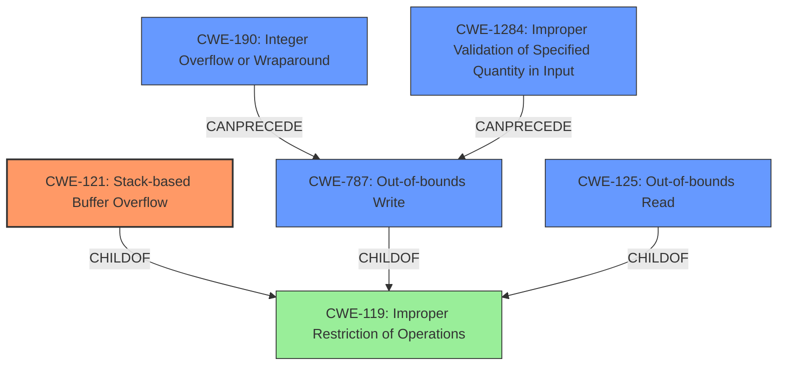

# Raw Analyzer Response for CVE-2021-26826

# Summary
| CWE ID | CWE Name | Confidence | CWE Abstraction Level | CWE Vulnerability Mapping Label | CWE-Vulnerability Mapping Notes |
|---|---|---|---|---|---|
| CWE-121 | Stack-based Buffer Overflow | 1.0 | Variant | Allowed | Primary CWE |
| CWE-125 | Out-of-bounds Read | 0.7 | Base | Allowed | Secondary Candidate |
| CWE-787 | Out-of-bounds Write | 0.7 | Base | Allowed | Secondary Candidate |
| CWE-190 | Integer Overflow or Wraparound | 0.6 | Base | Allowed | Secondary Candidate |
| CWE-1284 | Improper Validation of Specified Quantity in Input | 0.6 | Base | Allowed | Secondary Candidate |

## Evidence and Confidence

*   **Confidence Score:** 0.8
*   **Evidence Strength:** HIGH

## Relationship Analysis
The primary weakness is a **stack overflow** (CWE-121), which is a type of buffer overflow that occurs on the stack. This is often caused by **improper boundary checks**. The vulnerability description indicates a potential out-of-bounds read/write situation, especially in the `decode_tga_rle` and `convert_to_image` functions, which aligns with CWE-125 and CWE-787 respectively. The integer overflow aspect in `convert_to_image` relates to CWE-190, contributing to the out-of-bounds write. Finally, the lack of validation on the RLE chunk sizes connects to CWE-1284.

## Vulnerability Chain
The vulnerability chain starts with **improper input validation** (CWE-1284) of the RLE chunk sizes in the TGA image file. This leads to a potential **integer overflow** (CWE-190) when calculating image buffer offsets, resulting in out-of-bounds memory access, specifically both **out-of-bounds read** (CWE-125) and **out-of-bounds write** (CWE-787). Since the buffer is on the stack, the ultimate impact is a **stack-based buffer overflow** (CWE-121), which can lead to code execution or a system crash.

## Summary of Analysis
The initial analysis identified a **stack overflow** due to **improper boundary checks**. The detailed information in the CVE Reference Links Content Summary confirmed this and provided more specific details about the root cause and weaknesses. The vulnerability stems from **improper boundary checks** when loading .TGA image files, specifically within the `decode_tga_rle` and `convert_to_image` functions.

The primary CWE is CWE-121 (Stack-based Buffer Overflow) because the vulnerability description explicitly mentions a stack overflow. The evidence from the CVE Reference Links Content Summary further supports this by detailing how the **improper boundary checks** in the TGA image loader lead to out-of-bounds memory access on the stack.

The other CWEs (CWE-125, CWE-787, CWE-190, CWE-1284) are secondary candidates because they represent contributing factors to the overall vulnerability. CWE-125 (Out-of-bounds Read) and CWE-787 (Out-of-bounds Write) describe the specific types of memory access violations that occur due to the **improper boundary checks**. CWE-190 (Integer Overflow or Wraparound) explains how an integer overflow can contribute to the out-of-bounds write. CWE-1284 (Improper Validation of Specified Quantity in Input) highlights the lack of validation on the RLE chunk sizes, which is the initial flaw that triggers the subsequent issues.

The selected CWEs are at the optimal level of specificity because they accurately represent the different aspects of the vulnerability, from the initial flaw (CWE-1284) to the final impact (CWE-121). The relationships between the CWEs (e.g., CWE-1284 leading to CWE-190, which then leads to CWE-787 and CWE-121) further support this analysis and provide a comprehensive understanding of the vulnerability chain.

Relevant CWE Information:

# Enhanced Context (25 CWEs)
The following CWEs were identified as potentially relevant to this vulnerability:

## CWE-191: Integer Underflow (Wrap or Wraparound)
**Abstraction Level**: Base
**Similarity Score**: 0.76
**Source**: dense

**Description**:
The product subtracts one value from another, such that the result is less than the minimum allowable integer value, which produces a value that is not equal to the correct result.

**Mapping Guidance**:
- Usage: Allowed
- Rationale: This CWE entry is at the Base level of abstraction, which is a preferred level of abstraction for mapping to the root causes of vulnerabilities.

## CWE-131: Incorrect Calculation of Buffer Size
**Abstraction Level**: Base
**Similarity Score**: 0.76
**Source**: dense

**Description**:
The product does not correctly calculate the size to be used when allocating a buffer, which could lead to a buffer overflow.

**Mapping Guidance**:
- Usage: Allowed
- Rationale: This CWE entry is at the Base level of abstraction, which is a preferred level of abstraction for mapping to the root causes of vulnerabilities.

## CWE-125: Out-of-bounds Read
**Abstraction Level**: Base
**Similarity Score**: 0.75
**Source**: dense

**Description**:
The product reads data past the end, or before the beginning, of the intended buffer.

**Mapping Guidance**:
- Usage: Allowed
- Rationale: This CWE entry is at the Base level of abstraction, which is a preferred level of abstraction for mapping to the root causes of vulnerabilities.

## CWE-190: Integer Overflow or Wraparound
**Abstraction Level**: Base
**Similarity Score**: 0.75
**Source**: dense

**Description**:
The product performs a calculation that can
         produce an integer overflow or wraparound when the logic
         assumes that the resulting value will always be larger than
         the original value. This occurs when an integer value is
         incremented to a value that is too large to store in the
         associated representation. When this occurs, the value may
         become a very small or negative number.

**Mapping Guidance**:
- Usage: Allowed
- Rationale: This CWE entry is at the Base level of abstraction, which is a preferred level of abstraction for mapping to the root causes of vulnerabilities.

## CWE-1325: Improperly Controlled Sequential Memory Allocation
**Abstraction Level**: Base
**Similarity Score**: 0.75
**Source**: dense

**Description**:
The product manages a group of objects or resources and performs a separate memory allocation for each object, but it does not properly limit the total amount of memory that is consumed by all of the combined objects.

**Mapping Guidance**:
- Usage: Allowed
- Rationale: This CWE entry is at the Base level of abstraction, which is a preferred level of abstraction for mapping to the root causes of vulnerabilities.

## CWE-805: Buffer Access with Incorrect Length Value
**Abstraction Level**: Base
**Similarity Score**: 0.75
**Source**: dense

**Description**:
The product uses a sequential operation to read or write a buffer, but it uses an incorrect length value that causes it to access memory that is outside of the bounds of the buffer.

**Mapping Guidance**:
- Usage: Allowed
- Rationale: This CWE entry is at the Base level of abstraction, which is a preferred level of abstraction for mapping to the root causes of vulnerabilities.

## CWE-789: Memory Allocation with Excessive Size Value
**Abstraction Level**: Variant
**Similarity Score**: 0.75
**Source**: dense

**Description**:
The product allocates memory based