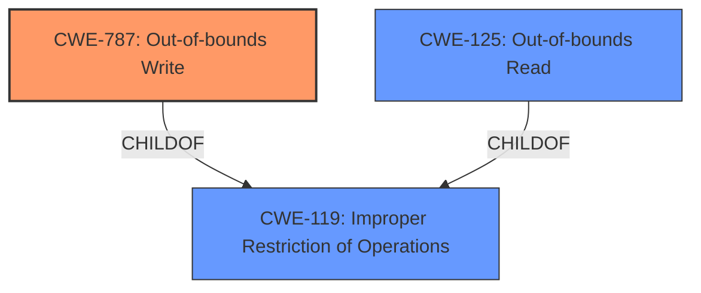

# Analysis Report for CVE-2021-26843

# Vulnerability Analysis Report: CVE-2021-26843

## Description


## Analysis (with Relationship Data)

# Summary
| CWE ID | CWE Name | Confidence | CWE Abstraction Level | CWE Vulnerability Mapping Label | CWE-Vulnerability Mapping Notes |
|---|---|---|---|---|---|
| CWE-787 | Out-of-bounds Write | 0.9 | Base | Allowed | Primary CWE |
| CWE-125 | Out-of-bounds Read | 0.6 | Base | Allowed | Secondary CWE |

## Evidence and Confidence

*   **Confidence Score:** 0.8
*   **Evidence Strength:** HIGH

## Relationship Analysis
The primary CWE is CWE-787 (**Out-of-bounds Write**), which directly reflects the **memory corruption** and potential for a daemon crash due to `memcpy` operating on overlapping memory ranges. It is a base-level CWE and a child of CWE-119 (**Improper Restriction of Operations Within the Bounds of a Memory Buffer**). CWE-125 (**Out-of-bounds Read**) is considered as a secondary CWE because while the primary issue is writing out of bounds, reading out of bounds could be related to this vulnerability.



## Vulnerability Chain
The vulnerability chain starts with the **improper use of `strcpy`** when implemented with `memcpy`, leading to overlapping memory ranges and a subsequent **out-of-bounds write** (CWE-787). This results in **memory corruption** and a **Denial-of-Service** (daemon crash).

## Summary of Analysis
The analysis strongly points to CWE-787 (**Out-of-bounds Write**) as the primary CWE. The vulnerability description and the CVE reference summary highlight the issue of `strcpy` being implemented with `memcpy` causing overlapping memory ranges and leading to memory corruption. This directly aligns with the description of CWE-787.

The choice of CWE-787 is further supported by the following evidence:

*   **Vulnerability Description Key Phrases:** "strcpy function implemented with memcpy"
*   **CVE Reference Links Content Summary:** "The vulnerability stems from the use of `strcpy` within the `de_dotdot` function of `libhttpd.c` in `sthttpd`. Specifically, when `strcpy` is implemented using `memcpy` (as is the case on GLIBC and macOS), it can lead to memory corruption or a crash due to overlapping memory ranges being passed to `memcpy`."

CWE-125 (**Out-of-bounds Read**) was considered because memory corruption could potentially lead to reading data from unintended memory locations.

The selected CWEs are at the optimal level of specificity, providing a clear and accurate representation of the vulnerability.

Relevant CWE Information:

# Enhanced Context (25 CWEs)
The following CWEs were identified as potentially relevant to this vulnerability:

## CWE-191: Integer Underflow (Wrap or Wraparound)
**Abstraction Level**: Base
**Similarity Score**: 0.80
**Source**: dense

**Description**:
The product subtracts one value from another, such that the result is less than the minimum allowable integer value, which produces a value that is not equal to the correct result.

**Mapping Guidance**:
- Usage: Allowed
- Rationale: This CWE entry is at the Base level of abstraction, which is a preferred level of abstraction for mapping to the root causes of vulnerabilities.

CWE-191 was considered but deemed less relevant because the core issue is not related to integer underflow but rather memory corruption due to overlapping memory operations.

## CWE-131: Incorrect Calculation of Buffer Size
**Abstraction Level**: Base
**Similarity Score**: 0.79
**Source**: dense

**Description**:
The product does not correctly calculate the size to be used when allocating a buffer, which could lead to a buffer overflow.

**Mapping Guidance**:
- Usage: Allowed
- Rationale: This CWE entry is at the Base level of abstraction, which is a preferred level of abstraction for mapping to the root causes of vulnerabilities.

CWE-131 was not selected because the vulnerability is not caused by an incorrect buffer size calculation, but rather by the use of `strcpy` with potentially overlapping memory regions when implemented with `memcpy`.

## CWE-126: Buffer Over-read
**Abstraction Level**: Variant
**Similarity Score**: 0.79
**Source**: dense

**Description**:
The product reads from a buffer using buffer access mechanisms such as indexes or pointers that reference memory locations after the targeted buffer.

**Mapping Guidance**:
- Usage: Allowed
- Rationale: This CWE entry is at the Variant level of abstraction, which is a preferred level of abstraction for mapping to the root causes of vulnerabilities.

CWE-126 was considered as a secondary candidate because the primary impact is writing to an out-of-bounds memory location, but it is possible that this could lead to out-of-bounds reads as well.

## CWE-125: Out-of-bounds Read
**Abstraction Level**: Base
**Similarity Score**: 0.79
**Source**: dense

**Description**:
The product reads data past the end, or before the beginning, of the intended buffer.

**Mapping Guidance**:
- Usage: Allowed
- Rationale: This CWE entry is at the Base level of abstraction, which is a preferred level of abstraction for mapping to the root causes of vulnerabilities.

CWE-125 was considered as a secondary candidate. This is related to the primary impact of writing to an out-of-bounds memory location, but it is possible that this could lead to out-of-bounds reads as well.

## CWE-805: Buffer Access with Incorrect Length Value
**Abstraction Level**: Base
**Similarity Score**: 0.78
**Source**: dense

**Description**:
The product uses a sequential operation to read or write a buffer, but it uses an incorrect length value that causes it to access memory that is outside of the bounds of the buffer.

**Mapping Guidance**:
- Usage: Allowed
- Rationale: This CWE entry is at the Base level of abstraction, which is a preferred level of abstraction for mapping to the root causes of vulnerabilities.

CWE-805 was not selected as there's no clear evidence that the length value is incorrect, but it is the overlapping memory regions that cause the issue.

## CWE-789: Memory Allocation with Excessive Size Value
**Abstraction Level**: Variant
**Similarity Score**: 0.78
**Source**: dense

**Description**:
The product allocates memory based on an untrusted, large size value, but it does not ensure that the size is within expected limits, allowing arbitrary amounts of memory to be allocated.

**Mapping Guidance**:
- Usage: Allowed
- Rationale: This CWE entry is at the Variant level of abstraction, which is a preferred level of abstraction for mapping to the root causes of vulnerabilities.

CWE-789 was not selected because the vulnerability does not involve allocating excessive memory.

## CWE-193: Off-by-one Error
**Abstraction Level**: Base
**Similarity Score**: 0.77
**Source**: dense

**Description**:
A product calculates or uses an incorrect maximum or minimum value that is 1 more, or 1 less, than the correct value.

**Mapping Guidance**:
- Usage: Allowed
- Rationale: This CWE entry is at the Base level of abstraction, which is a preferred level of abstraction for mapping to the root causes of vulnerabilities.

CWE-193 was not selected because the issue is not related to an off-by-one error, but rather memory corruption due to overlapping memory regions.

## CWE-190: Integer Overflow or Wraparound
**Abstraction Level**: Base
**Similarity Score**: 0.77
**Source**: dense

**Description**:
The product performs a calculation that can
         produce an integer overflow or wraparound when the logic
         assumes that the resulting value will always be larger than
         the original value. This occurs when an integer value is
         incremented to a value that is too large to store in the
         associated representation. When this occurs, the value may
         become a very small or negative number.

**Mapping Guidance**:
- Usage: Allowed
- Rationale: This CWE entry is at the Base level of abstraction, which is a preferred level of abstraction for mapping to the root causes of vulnerabilities.

CWE-190 was not selected because the vulnerability does not involve integer overflow or wraparound.

## CWE-197: Numeric Truncation Error
**Abstraction Level**: Base
**Similarity Score**: 0.77
**Source**: dense

**Description**:
Truncation errors occur when a primitive


## CWE Relationship Analysis

Current CWEs represent these abstraction levels: .


### Vulnerability Chain Analysis

**Chain starting from CWE-787:**
- 787 (Out-of-bounds Write) - ROOT


**Chain starting from CWE-805:**
- 805 (Buffer Access with Incorrect Length Value) - ROOT


### CWE Relationship Diagram

```mermaid
graph TD
    classDef primary fill:#f96,stroke:#333,stroke-width:2px
    classDef secondary fill:#69f,stroke:#333
    classDef tertiary fill:#9e9,stroke:#333
```


*Report generated on 2025-04-02 00:18:42*
