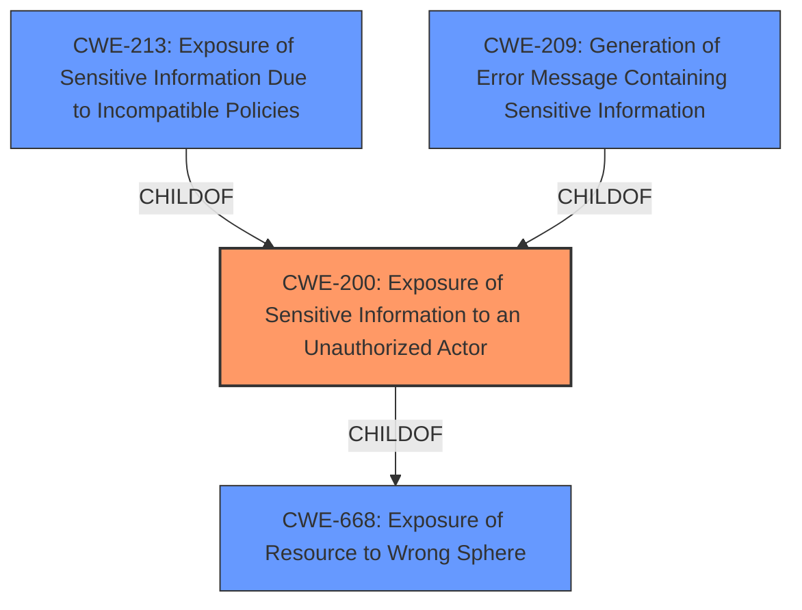

# Raw Analyzer Response for CVE-2021-26845

# Summary
| CWE ID | CWE Name | Confidence | CWE Abstraction Level | CWE Vulnerability Mapping Label | CWE-Vulnerability Mapping Notes |
|---|---|---|---|---|---|
| CWE-200 | Exposure of Sensitive Information to an Unauthorized Actor | 0.8 | Class | Primary | Discouraged because it is a high-level class, but appropriate given the limited information. |

## Evidence and Confidence

*   **Confidence Score:** 0.8
*   **Evidence Strength:** MEDIUM

## Relationship Analysis
The primary CWE, CWE-200, is a class-level CWE. The retriever results also listed several children of CWE-200. Without further information about the specific mechanism of **information exposure**, a more specific CWE cannot be selected.

## Vulnerability Chain
The vulnerability chain starts with the **information exposure** and leads to the unauthorized user gaining access to report data. The vulnerability is triggered by the discovery of the URL.

## Summary of Analysis
The vulnerability description indicates an **Information Exposure** vulnerability. The description states that an unauthorized user can gain access to report data if the URL used to access the report is discovered.

The primary CWE is CWE-200 **Exposure of Sensitive Information to an Unauthorized Actor**. The vulnerability description explicitly states "**Information Exposure** vulnerability...allows unauthorized user to gain access to report data". While CWE-200 is a class-level CWE and discouraged for use, the provided information is insufficient to identify a more specific base or variant CWE. The retriever results contained multiple more specific children of CWE-200, including CWE-213 **Exposure of Sensitive Information Due to Incompatible Policies** and CWE-209 **Generation of Error Message Containing Sensitive Information**, but there is no evidence in the description to support the selection of any of these more specific CWEs.

Relevant CWE Information: