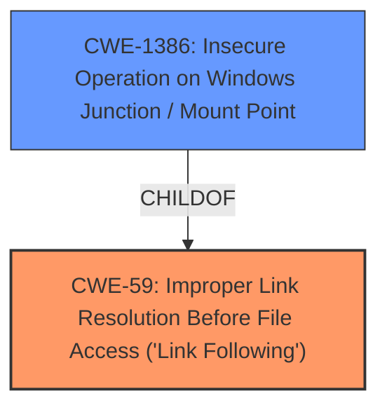

# Enhanced Analysis for CVE-2021-26866

# Summary
| CWE ID | CWE Name | Confidence | CWE Abstraction Level | CWE Vulnerability Mapping Label | CWE-Vulnerability Mapping Notes |
|---|---|---|---|---|---|
| CWE-59 | Improper Link Resolution Before File Access ('Link Following') | 0.9 | Base | Allowed | Primary CWE |
| CWE-1386 | Insecure Operation on Windows Junction / Mount Point | 0.7 | Base | Allowed | Secondary Candidate |

## Evidence and Confidence

*   **Confidence Score:** 0.8
*   **Evidence Strength:** HIGH

## Relationship Analysis
The primary relationship influencing the choice of CWE-59 [Improper Link Resolution Before File Access ('Link Following')] is its direct relevance to the vulnerability description, which explicitly mentions "improper handling of directory junctions." CWE-1386 [Insecure Operation on Windows Junction / Mount Point] is a child of CWE-59, making it a more specific potential match. However, the description for CWE-1386 mentions "mount points" in addition to junctions, whereas the vulnerability focuses solely on directory junctions, making CWE-59 a slightly better fit as the primary CWE.



## Vulnerability Chain
The vulnerability chain starts with the **improper handling of directory junctions** by the Windows Update Agent (root cause). This leads to the ability to **abuse Windows Update Agent functionality to delete directories**. The final impact is the creation of a denial-of-service condition on the system.

## Summary of Analysis
The initial analysis focused on the **improper handling of directory junctions** by the Windows Update Agent, as highlighted in the "CVE Reference Links Content Summary." The description directly states: "The vulnerability is caused by the Windows Update Agent's **improper handling of directory junctions**." This clearly points to a weakness related to how the agent resolves or handles links and junctions.

The retriever results strongly suggest CWE-59 [Improper Link Resolution Before File Access ('Link Following')] and CWE-1386 [Insecure Operation on Windows Junction / Mount Point]. Both CWEs are at the Base level of abstraction and are ALLOWED for mapping. CWE-1386 is a child of CWE-59. While CWE-1386 is more specific to Windows, the vulnerability description doesn't explicitly mention mount points, only directory junctions. Therefore, CWE-59 is chosen as the primary CWE, with CWE-1386 as a secondary candidate because the **weakness** specifically refers to directory junctions and the fact the attack takes place on Windows.

The selected CWEs are at the optimal level of specificity, as they accurately capture the root cause of the vulnerability without being overly broad or narrow.

Relevant CWE Information:

# Enhanced Context (25 CWEs)
The following CWEs were identified as potentially relevant to this vulnerability:

## CWE-59: Improper Link Resolution Before File Access ('Link Following')
**Abstraction Level**: Base
**Similarity Score**: 0.80
**Source**: dense

**Description**:
The product attempts to access a file based on the filename, but it does not properly prevent that filename from identifying a link or shortcut that resolves to an unintended resource.

**Mapping Guidance**:
- Usage: Allowed
- Rationale: This CWE entry is at the Base level of abstraction, which is a preferred level of abstraction for mapping to the root causes of vulnerabilities.


## CWE-1386: Insecure Operation on Windows Junction / Mount Point
**Abstraction Level**: Base
**Similarity Score**: 5801.88
**Source**: sparse

**Description**:
The product opens a file or directory, but it does not properly prevent the name from being associated with a junction or mount point to a destination that is outside of the intended control sphere.

**Mapping Guidance**:
- Usage: Allowed
- Rationale: This CWE entry is at the Base level of abstraction, which is a preferred level of abstraction for mapping to the root causes of vulnerabilities.


## CWE Relationship Analysis

Current CWEs represent these abstraction levels: .


### Vulnerability Chain Analysis

**Chain starting from CWE-1386:**
- 1386 (Insecure Operation on Windows Junction / Mount Point) - ROOT


**Chain starting from CWE-59:**
- 59 (Improper Link Resolution Before File Access ('Link Following')) - ROOT


### CWE Relationship Diagram

```mermaid
graph TD
    classDef primary fill:#f96,stroke:#333,stroke-width:2px
    classDef secondary fill:#69f,stroke:#333
    classDef tertiary fill:#9e9,stroke:#333
```