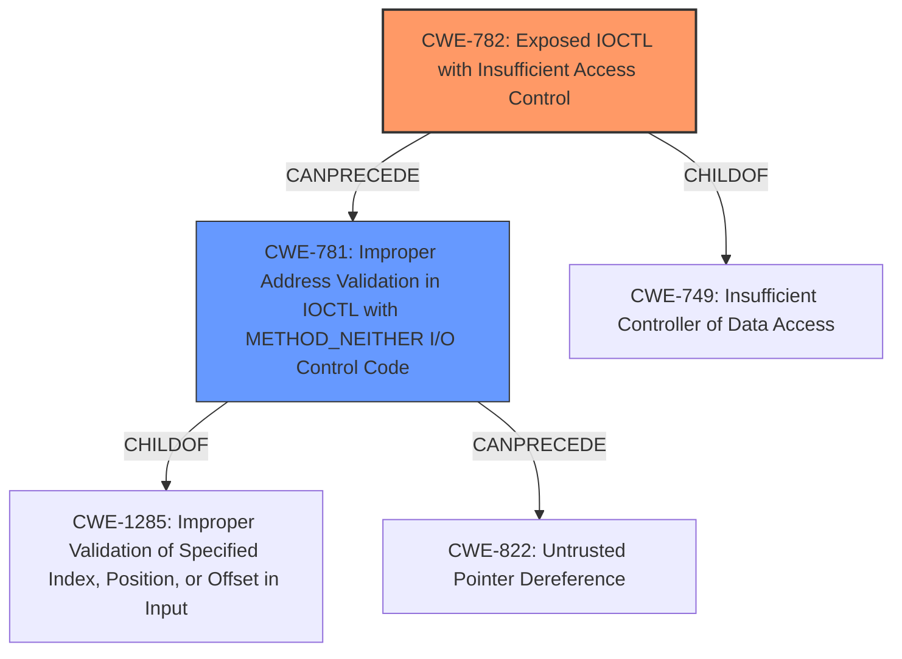

# Analysis Report for CVE-2021-26868

# Vulnerability Analysis Report: CVE-2021-26868

## Description


## Analysis (with Relationship Data)

# Summary
| CWE ID | CWE Name | Confidence | CWE Abstraction Level | CWE Vulnerability Mapping Label | CWE-Vulnerability Mapping Notes |
|---|---|---|---|---|---|
| CWE-782 | Exposed IOCTL with Insufficient Access Control | 0.7 | Variant | Allowed | Primary CWE |
| CWE-781 | Improper Address Validation in IOCTL with METHOD_NEITHER I/O Control Code | 0.6 | Variant | Allowed | Secondary Candidate |

## Evidence and Confidence

*   **Confidence Score:** 0.7
*   **Evidence Strength:** MEDIUM

## Relationship Analysis
The primary CWE identified is CWE-782, which is a child of CWE-749 (Insufficient Controller of Data Access) and can precede CWE-781. CWE-781 is a child of CWE-1285 and can precede CWE-822 (Untrusted Pointer Dereference). These relationships show a potential chain of vulnerabilities stemming from insufficient access control and leading to improper address validation and ultimately untrusted pointer dereference. The abstraction levels are at Variant and Base, offering a specific view of the vulnerability.



## Vulnerability Chain
The vulnerability chain begins with the Windows Graphics Component exposing an IOCTL (Input/Output Control) without sufficient access control (CWE-782). This can lead to improper address validation in IOCTL with METHOD_NEITHER I/O control code (CWE-781), and potentially an untrusted pointer dereference (CWE-822), ultimately leading to an elevation of privilege.

## Summary of Analysis
The initial assessment, based on the provided evidence, points towards a vulnerability involving the Windows Graphics Component that leads to an elevation of privilege. The key phrase "elevation of privilege" and the component being "Graphics Component" suggest a potential issue with how the graphics component handles privileges.

The retriever results highlight CWE-782 (Exposed IOCTL with Insufficient Access Control) as the most relevant CWE, supported by the "dense" retriever. This CWE fits because IOCTLs are often used in low-level system components like graphics drivers, and insufficient access control could lead to privilege escalation. The vulnerability description indicates that the component is Windows Graphics Component, which is a system component that can use IOCTLs to interact with the kernel.

The relationship analysis and chain construction support this selection. CWE-782 can lead to CWE-781 (Improper Address Validation in IOCTL with METHOD_NEITHER I/O Control Code) and ultimately an untrusted pointer dereference, which could result in the elevation of privilege.

Other CWEs considered, such as CWE-59, CWE-1386, CWE-266, CWE-1285, CWE-825, CWE-123, CWE-732, and CWE-40, were rejected because they didn't directly address the root cause related to exposed IOCTLs with insufficient access control. The provided description does not have explicit evidence to support those other CWEs.

The selection of CWE-782 and CWE-781 is at the optimal level of specificity (Variant), as it accurately represents the specific vulnerability scenario involving IOCTLs in the Windows Graphics Component. The confidence level is at 0.7 due to the lack of explicit IOCTL mentions in the Vulnerability Description section. However, given the nature of the graphics component and the elevation of privilege impact, the IOCTL-related CWEs are the most appropriate.

Relevant CWE Information:

# Enhanced Context (25 CWEs)

## CWE-59: Improper Link Resolution Before File Access ('Link Following')
**Abstraction Level**: Base
**Similarity Score**: 0.81
**Source**: dense

**Description**:
The product attempts to access a file based on the filename, but it does not properly prevent that filename from identifying a link or shortcut that resolves to an unintended resource.

**Mapping Guidance**:
- Usage: Allowed
- Rationale: This CWE entry is at the Base level of abstraction, which is a preferred level of abstraction for mapping to the root causes of vulnerabilities.

## CWE-41: Improper Resolution of Path Equivalence
**Abstraction Level**: Base
**Similarity Score**: 0.80
**Source**: dense

**Description**:
The product is vulnerable to file system contents disclosure through path equivalence. Path equivalence involves the use of special characters in file and directory names. The associated manipulations are intended to generate multiple names for the same object.

**Mapping Guidance**:
- Usage: Allowed
- Rationale: This CWE entry is at the Base level of abstraction, which is a preferred level of abstraction for mapping to the root causes of vulnerabilities.

## CWE-73: External Control of File Name or Path
**Abstraction Level**: Base
**Similarity Score**: 0.79
**Source**: dense

**Description**:
The product allows user input to control or influence paths or file names that are used in filesystem operations.

**Mapping Guidance**:
- Usage: Allowed
- Rationale: This CWE entry is at the Base level of abstraction, which is a preferred level of abstraction for mapping to the root causes of vulnerabilities.

## CWE-23: Relative Path Traversal
**Abstraction Level**: Base
**Similarity Score**: 0.79
**Source**: dense

**Description**:
The product uses external input to construct a pathname that should be within a restricted directory, but it does not properly neutralize sequences such as ".." that can resolve to a location that is outside of that directory.

**Mapping Guidance**:
- Usage: Allowed
- Rationale: This CWE entry is at the Base level of abstraction, which is a preferred level of abstraction for mapping to the root causes of vulnerabilities.

## CWE-668: Exposure of Resource to Wrong Sphere
**Abstraction Level**: Class
**Similarity Score**: 0.77
**Source**: dense

**Description**:
The product exposes a resource to the wrong control sphere, providing unintended actors with inappropriate access to the resource.

**Mapping Guidance**:
- Usage: Discouraged
- Rationale: CWE-668 is high-level and is often misused as a catch-all when lower-level CWE IDs might be applicable. It is sometimes used for low-information vulnerability reports [REF-1287]. It is a level-1 Class (i.e., a child of a Pillar). It is not useful for trend analysis.

## CWE-427: Uncontrolled Search Path Element
**Abstraction Level**: Base
**Similarity Score**: 0.77
**Source**: dense

**Description**:
The product uses a fixed or controlled search path to find resources, but one or more locations in that path can be under the control of unintended actors.

**Mapping Guidance**:
- Usage: Allowed
- Rationale: This CWE entry is at the Base level of abstraction, which is a preferred level of abstraction for mapping to the root causes of vulnerabilities.

## CWE-782: Exposed IOCTL with Insufficient Access Control
**Abstraction Level**: Variant
**Similarity Score**: 0.77
**Source**: dense

**Description**:
The product implements an IOCTL with functionality that should be restricted, but it does not properly enforce access control for the IOCTL.

**Mapping Guidance**:
- Usage: Allowed
- Rationale: This CWE entry is at the Variant level of abstraction, which is a preferred level of abstraction for mapping to the root causes of vulnerabilities.

## CWE-552: Files or Directories Accessible to External Parties
**Abstraction Level**: Base
**Similarity Score**: 0.76
**Source**: dense

**Description**:
The product makes files or directories accessible to unauthorized actors, even though they should not be.

**Mapping Guidance**:
- Usage: Allowed
- Rationale: This CWE entry is at the Base level of abstraction, which is a preferred level of abstraction for mapping to the root causes of vulnerabilities.

## CWE-1386: Insecure Operation on Windows Junction / Mount Point
**Abstraction Level**: Base
**Similarity Score**: 0.76
**Source**: dense

**Description**:
The product opens a file or directory, but it does not properly prevent the name from being associated with a junction or mount point to


## CWE Relationship Analysis

Current CWEs represent these abstraction levels: .


### Vulnerability Chain Analysis

**Chain starting from CWE-732:**
- 732 (Incorrect Permission Assignment for Critical Resource) - ROOT


**Chain starting from CWE-123:**
- 123 (Write-what-where Condition) - ROOT


### CWE Relationship Diagram

```mermaid
graph TD
    classDef primary fill:#f96,stroke:#333,stroke-width:2px
    classDef secondary fill:#69f,stroke:#333
    classDef tertiary fill:#9e9,stroke:#333
```


*Report generated on 2025-04-02 03:25:42*
