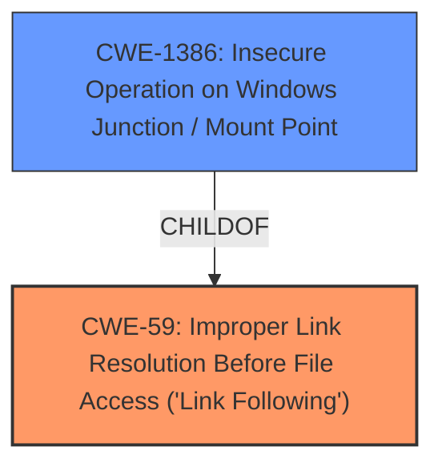

# Raw Analyzer Response for CVE-2021-26887

# Summary
| CWE ID | CWE Name | Confidence | CWE Abstraction Level | CWE Vulnerability Mapping Label | CWE-Vulnerability Mapping Notes |
|---|---|---|---|---|---|
| CWE-59 | Improper Link Resolution Before File Access ('Link Following') | 0.8 | Base | Allowed | Primary CWE |
| CWE-1386 | Insecure Operation on Windows Junction / Mount Point | 0.7 | Base | Allowed | Secondary Candidate |

## Evidence and Confidence

*   **Confidence Score:** 0.75
*   **Evidence Strength:** MEDIUM

## Relationship Analysis
The primary CWE identified is CWE-59, which describes the **improper link resolution** that allows unintended resource access. CWE-1386, a child of CWE-59, specifies this weakness in the context of Windows Junctions/Mount Points, making it a more specific but still relevant secondary candidate. The hierarchical relationship influenced the selection of CWE-59 as the primary due to its broader applicability, while CWE-1386 highlights the Windows-specific nature of the vulnerability.

## Vulnerability Chain
The vulnerability chain starts with the **attacker's ability to create a new folder and a junction** on a newly created user folder. This leads to **folder redirection starting to redirect to the attacker-controlled folder**, resulting in the **copying of personal data** to that folder. The **root cause is the improper handling of junctions/symlinks** during folder redirection.

## Summary of Analysis
The initial analysis identified CWE-59 as the primary weakness due to the **improper link resolution** allowing unauthorized access. This is supported by the vulnerability description stating that an attacker can create a junction, leading to folder redirection to an attacker-controlled location and data copying. The retriever results also list CWE-59 as the top combined result.

The criticism is that CWE-59 is general, and the vulnerability description explicitly mentions junctions on Windows. This led to considering CWE-1386, "Insecure Operation on Windows Junction / Mount Point", which is a child of CWE-59, as a secondary candidate. The final decision is to list CWE-59 as the primary CWE due to its more general description of the weakness.

The selection of CWE-59 and CWE-1386 are based on the evidence provided in the vulnerability description, specifically the mention of folder redirection, junction creation, and data copying. The graph relationships show that CWE-1386 is a more specific instance of CWE-59, justifying its inclusion as a secondary candidate.

Relevant CWE Information:

# Enhanced Context (25 CWEs)

## CWE-59: Improper Link Resolution Before File Access ('Link Following')
**Abstraction Level**: Base
**Similarity Score**: 0.84
**Source**: dense

**Description**:
The product attempts to access a file based on the filename, but it does not properly prevent that filename from identifying a link or shortcut that resolves to an unintended resource.

**Mapping Guidance**:
- Usage: Allowed
- Rationale: This CWE entry is at the Base level of abstraction, which is a preferred level of abstraction for mapping to the root causes of vulnerabilities.

## CWE-1386: Insecure Operation on Windows Junction / Mount Point
**Abstraction Level**: Base
**Similarity Score**: 6562.67
**Source**: sparse

**Description**:
The product opens a file or directory, but it does not properly prevent the name from being associated with a junction or mount point to a destination that is outside of the intended control sphere.

**Mapping Guidance**:
- Usage: Allowed
- Rationale: This CWE entry is at the Base level of abstraction, which is a preferred level of abstraction for mapping to the root causes of vulnerabilities.