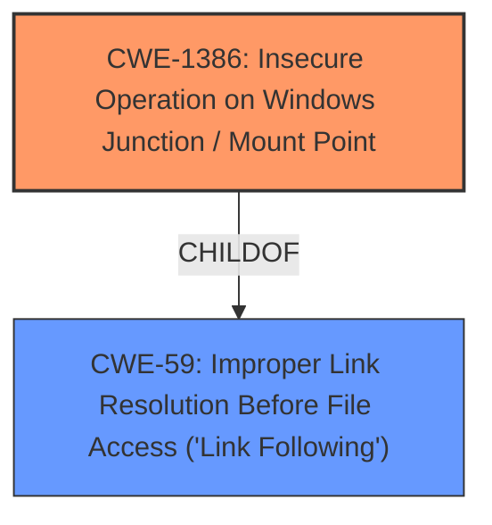

# Enhanced Analysis for CVE-2021-26889

# Summary
| CWE ID    | CWE Name                                                        | Confidence | CWE Abstraction Level | CWE Vulnerability Mapping Label | CWE-Vulnerability Mapping Notes |
| :-------- | :-------------------------------------------------------------- | :--------- | :---------------------- | :------------------------------ | :------------------------------ |
| CWE-1386 | Insecure Operation on Windows Junction / Mount Point           | 0.9        | Base                    | Allowed                         | Primary CWE                     |
| CWE-59    | Improper Link Resolution Before File Access ('Link Following') | 0.7        | Base                    | Allowed                         | Secondary Candidate            |

## Evidence and Confidence

*   **Confidence Score:** 0.8
*   **Evidence Strength:** HIGH

## Relationship Analysis
The primary CWE selected is CWE-1386 (Insecure Operation on Windows Junction / Mount Point). This CWE is a child of CWE-59 (Improper Link Resolution Before File Access ('Link Following')), which means it's a more specific type of link following issue that occurs on Windows systems using junctions or mount points.



## Vulnerability Chain
The vulnerability chain involves the attacker's ability to create a directory junction, leading to the **insecure operation** on that junction, and resulting in privilege escalation.

## Summary of Analysis
The initial analysis focused on the description of the vulnerability, which highlights the abuse of Windows Setup through directory junction creation. This directly points to CWE-1386, which describes **insecure operations** on Windows junctions/mount points. The "CVE Reference Links Content Summary" confirms this, stating that "The **vulnerability lies in the Windows Setup process, which can be manipulated by creating a directory junction to create a file in an arbitrary location**."

The relationship graph shows how CWE-1386 is a specific instance of CWE-59. While CWE-59 is relevant, CWE-1386 provides a more accurate representation of the vulnerability because it explicitly mentions Windows junctions and mount points.

The selection of CWE-1386 is at the optimal level of specificity because it directly addresses the **root cause** described in the vulnerability: the **insecure operation** on Windows junctions/mount points leading to privilege escalation.

Relevant CWE Information:

# Enhanced Context (25 CWEs)
The following CWEs were identified as potentially relevant to this vulnerability:

## CWE-59: Improper Link Resolution Before File Access ('Link Following')
**Abstraction Level**: Base
**Similarity Score**: 0.81
**Source**: dense

**Description**:
The product attempts to access a file based on the filename, but it does not properly prevent that filename from identifying a link or shortcut that resolves to an unintended resource.

**Mapping Guidance**:
- Usage: Allowed
- Rationale: This CWE entry is at the Base level of abstraction, which is a preferred level of abstraction for mapping to the root causes of vulnerabilities.

**Analysis:**
CWE-59 is a parent of CWE-1386. While relevant, it's less specific than CWE-1386, which focuses on Windows junctions and mount points. Therefore, CWE-1386 is a better fit.

## CWE-1386: Insecure Operation on Windows Junction / Mount Point
**Abstraction Level**: Base
**Similarity Score**: 0.77
**Source**: dense

**Description**:
The product opens a file or directory, but it does not properly prevent the name from being associated with a junction or mount point to a destination that is outside of the intended control sphere.

**Mapping Guidance**:
- Usage: Allowed
- Rationale: This CWE entry is at the Base level of abstraction, which is a preferred level of abstraction for mapping to the root causes of vulnerabilities.

**Analysis:**
CWE-1386 is the most accurate representation of the vulnerability, as it directly addresses the **root cause**: manipulating Windows Setup through directory junction creation. The "CVE Reference Links Content Summary" provides clear evidence for this mapping.

## CWE-363: Race Condition Enabling Link Following
**Abstraction Level**: base
**Similarity Score**: 4.33
**Source**: graph

**Description**:
CWE-363: Race Condition Enabling Link Following

**Mapping Guidance**:
- Usage: Allowed
- Rationale: This CWE entry is at the Base level of abstraction, which is a preferred level of abstraction for mapping to the root causes of vulnerabilities.

**Relationships**:
- CANPRECEDE -> CWE-59
- CHILDOF -> CWE-367
- CANFOLLOW -> CWE-363
- PARENTOF -> CWE-363

**Analysis:**
While a race condition might be present, the primary **weakness** lies in the ability to create and exploit the directory junction. Therefore, CWE-1386 is a more direct and accurate mapping.

## CWE-266: Incorrect Privilege Assignment
**Abstraction Level**: Base
**Similarity Score**: 0.80
**Source**: dense

**Description**:
A product incorrectly assigns a privilege to a particular actor, creating an unintended sphere of control for that actor.

**Mapping Guidance**:
- Usage: Allowed
- Rationale: This CWE entry is at the Base level of abstraction, which is a preferred level of abstraction for mapping to the root causes of vulnerabilities.

**Analysis:**
This is related to the impact of the vulnerability, where the attacker is able to escalate privileges. However, it does not reflect the **root cause** of the **vulnerability** which is the improper handling of junction points.

## CWE-59: Improper Link Resolution Before File Access ('Link Following')
**Abstraction Level**: Base
**Similarity Score**: 5050.25
**Source**: sparse

**Description**:
The product attempts to access a file based on the filename, but it does not properly prevent that filename from identifying a link or shortcut that resolves to an unintended resource.

**Mapping Guidance**:
- Usage: Allowed
- Rationale: This CWE entry is at the Base level of abstraction, which is a preferred level of abstraction for mapping to the root causes of vulnerabilities.

**Analysis:**
CWE-59 is considered as a secondary candidate since CWE-1386 is more specific.

Final Answer:
```
CWE-1386: Insecure Operation on Windows Junction / Mount Point - The vulnerability lies in the Windows Setup process, which can be manipulated by creating a directory junction to create a file in an arbitrary location.
CWE-59: Improper Link Resolution Before File Access ('Link Following') - is a secondary issue because CWE-1386 is more specific.
```


## CWE Relationship Analysis

Current CWEs represent these abstraction levels: .


### Vulnerability Chain Analysis

**Chain starting from CWE-367:**
- 367 (Time-of-check Time-of-use (TOCTOU) Race Condition) - ROOT


**Chain starting from CWE-1386:**
- 1386 (Insecure Operation on Windows Junction / Mount Point) - ROOT


### CWE Relationship Diagram

```mermaid
graph TD
    classDef primary fill:#f96,stroke:#333,stroke-width:2px
    classDef secondary fill:#69f,stroke:#333
    classDef tertiary fill:#9e9,stroke:#333
```