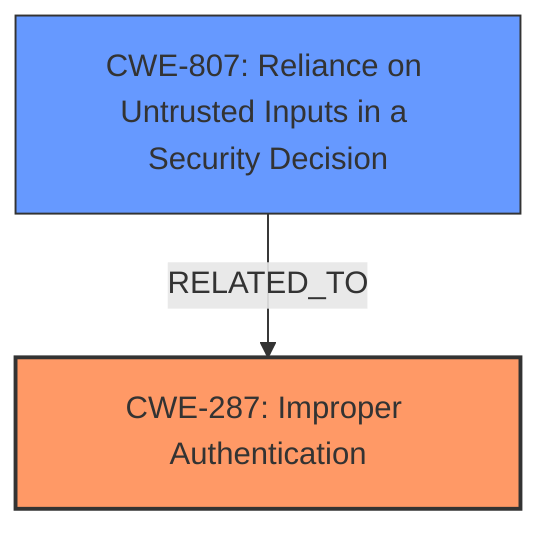

# Enhanced Analysis for CVE-2021-26905

# Summary
| CWE ID | CWE Name | Confidence | CWE Abstraction Level | CWE Vulnerability Mapping Label | CWE-Vulnerability Mapping Notes |
|---|---|---|---|---|---|
| CWE-287 | Improper Authentication | 0.75 | Class | Primary | Discouraged |
| CWE-807 | Reliance on Untrusted Inputs in a Security Decision | 0.7 | Base | Secondary | Allowed |

## Evidence and Confidence

*   **Confidence Score:** 0.75
*   **Evidence Strength:** MEDIUM

## Relationship Analysis
The primary relationship influencing the decision is the hierarchical relationship between CWE-287 (Improper Authentication) and its children. While CWE-287 is a class-level CWE and generally discouraged, the provided information doesn't give enough specifics to select a more precise base-level CWE. The analysis considered CWE-807 (Reliance on Untrusted Inputs in a Security Decision) since the **mishandling of validation** led to a security decision being made based on an untrusted input, however, the vulnerability description does not explicitly highlight the use of an untrusted input for a security decision, so this is marked as a secondary candidate.



## Vulnerability Chain
The vulnerability chain starts with the **mishandling of validation of authenticated requests** which then leads to the disclosure of TLS private key.

## Summary of Analysis
The initial assessment focused on the vulnerability description and key phrases, specifically the **root cause** "**mishandles validation of authenticated requests**". The CVE Reference Links Content Summary supported this root cause by stating that the 1Password SCIM bridge did not properly validate input received on the authenticated endpoint used to fetch log files. This suggests a flaw in the authentication process or in validating requests after authentication.

The Retriever Results highlighted several potential CWEs, including CWE-321 (Use of Hard-coded Cryptographic Key), CWE-287 (Improper Authentication), CWE-203 (Observable Discrepancy), and CWE-532 (Insertion of Sensitive Information into Log File). However, the description points towards a problem with authentication or post-authentication validation rather than a hard-coded key or logging issue.

CWE-287 (Improper Authentication) was considered as the primary candidate because the vulnerability involves **mishandling validation of authenticated requests**. Although CWE-287 is discouraged due to its high-level abstraction, there is not enough information to select a more specific base-level CWE. The **mishandling of validation** could refer to an authentication bypass, a weakness in the authentication algorithm, or insufficient checks after authentication. Without more details, CWE-287 is the most appropriate choice.

CWE-807 (Reliance on Untrusted Inputs in a Security Decision) was also considered, as the **mishandling of validation** could potentially lead to the system relying on untrusted inputs for security decisions. This is listed as a secondary candidate.

Relevant CWE Information:

# Enhanced Context (25 CWEs)
The following CWEs were identified as potentially relevant to this vulnerability:

## CWE-807: Reliance on Untrusted Inputs in a Security Decision
**Abstraction Level**: Base
**Similarity Score**: 0.78
**Source**: dense

**Description**:
The product uses a protection mechanism that relies on the existence or values of an input, but the input can be modified by an untrusted actor in a way that bypasses the protection mechanism.

**Mapping Guidance**:
- Usage: Allowed
- Rationale: This CWE entry is at the Base level of abstraction, which is a preferred level of abstraction for mapping to the root causes of vulnerabilities.

## CWE-287: Improper Authentication
**Abstraction:** Class
**Status:** Draft

### Description
When an actor claims to have a given identity, the product does not prove or insufficiently proves that the claim is correct.

### Extended Description
Not provided

### Alternative Terms
authentification: An alternate term is "authentification", which appears to be most commonly used by people from non-English-speaking countries.
AuthN: "AuthN" is typically used as an abbreviation of "authentication" within the web application security community. It is also distinct from "AuthZ," which is an abbreviation of "authorization." The use of "Auth" as an abbreviation is discouraged, since it could be used for either authentication or authorization.
AuthC: "AuthC" is used as an abbreviation of "authentication," but it appears to used less frequently than "AuthN."

### Relationships
ChildOf -> CWE-284
ChildOf -> CWE-284

### Mapping Guidance
**Usage:** Discouraged
**Rationale:** This CWE entry might be misused when lower-level CWE entries are likely to be applicable. It is a level-1 Class (i.e., a child of a Pillar).
**Comments:** Consider children or descendants, beginning with CWE-1390: Weak Authentication or CWE-306: Missing Authentication for Critical Function.
**Reasons:**
- Frequent Misuse
**Suggested Alternatives:**
- CWE-1390: Weak Authentication
- CWE-306: Missing Authentication for Critical Function

### Observed Examples
- **CVE-2022-35248:** Chat application skips validation when Central Authentication Service (CAS) is enabled, effectively removing the second factor from two-factor authentication
- **CVE-2022-36436:** Python-based authentication proxy does not enforce password authentication during the initial handshake, allowing the client to bypass authentication by specifying a 'None' authentication type.
- **CVE-2022-30034:** Chain: Web UI for a Python RPC framework does not use regex anchors to validate user login emails (CWE-777), potentially allowing bypass of OAuth (CWE-1390).


## CWE Relationship Analysis

Current CWEs represent these abstraction levels: .


### Vulnerability Chain Analysis

**Chain starting from CWE-306:**
- 306 (Missing Authentication for Critical Function) - ROOT


**Chain starting from CWE-284:**
- 284 (Improper Access Control) - ROOT


### CWE Relationship Diagram

```mermaid
graph TD
    classDef primary fill:#f96,stroke:#333,stroke-width:2px
    classDef secondary fill:#69f,stroke:#333
    classDef tertiary fill:#9e9,stroke:#333
```