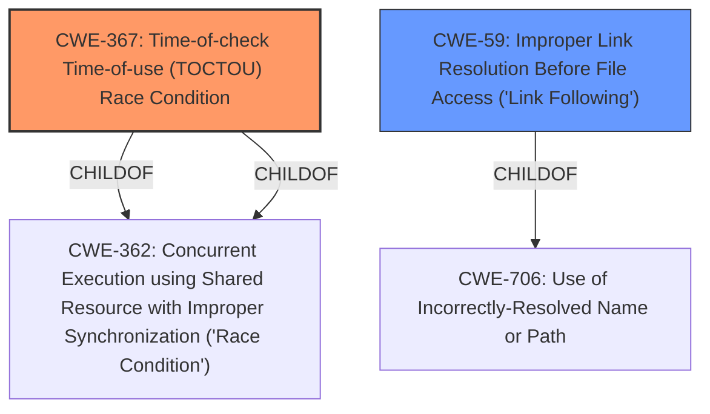

# Enhanced Analysis for CVE-2021-26910

# Summary
| CWE ID | CWE Name | Confidence | CWE Abstraction Level | CWE Vulnerability Mapping Label | CWE-Vulnerability Mapping Notes |
|---|---|---|---|---|---|
| CWE-367 | Time-of-check Time-of-use (TOCTOU) Race Condition | 1.0 | Base | Allowed | Primary CWE |
| CWE-59 | Improper Link Resolution Before File Access ('Link Following') | 0.7 | Base | Allowed | Secondary Candidate |

## Evidence and Confidence

*   **Confidence Score:** 0.9
*   **Evidence Strength:** HIGH

## Relationship Analysis
The primary CWE is CWE-367, a Base level weakness that describes a TOCTOU race condition. CWE-367 is a child of CWE-362 (Concurrent Execution using Shared Resource with Improper Synchronization ('Race Condition')). CWE-59 (Improper Link Resolution Before File Access) is a potential secondary weakness because the race condition can lead to symlink following. CWE-59 is a child of CWE-706 (Use of Incorrectly-Resolved Name or Path).



## Vulnerability Chain
The vulnerability chain starts with a **TOCTOU race condition** (CWE-367) which allows an attacker to bypass intended access restrictions. Specifically, the race condition occurs between a stat operation and an OverlayFS mount operation. This can potentially lead to **improper link resolution** (CWE-59) if the attacker manages to replace a directory with a symbolic link during the race condition.

## Summary of Analysis
The initial analysis identified a **TOCTOU race condition** in Firejail, which allows attackers to bypass intended access restrictions. The primary weakness is CWE-367, which accurately captures the **TOCTOU race condition** between the stat operation and the OverlayFS mount operation.

The secondary consideration was whether CWE-59 was also applicable. The "CVE Reference Links Content Summary" notes that the race condition allows replacing directories with symlinks, which could lead to unexpected path traversal. Thus, there's some support for including CWE-59 as a secondary weakness.

The final decision is to include CWE-367 as the primary weakness due to the presence of the **TOCTOU race condition**, and CWE-59 as a secondary weakness because the race can be exploited to cause **improper link resolution**. The selected CWEs are at the appropriate level of specificity (Base) and accurately represent the vulnerability based on the provided evidence.

Relevant CWE Information:

# Enhanced Context (25 CWEs)
The following CWEs were identified as potentially relevant to this vulnerability:

## CWE-367: Time-of-check Time-of-use (TOCTOU) Race Condition
**CWE-367: Time-of-check Time-of-use (TOCTOU) Race Condition** is the primary CWE because the vulnerability description and the CVE Reference Links Content Summary both explicitly mention a **TOCTOU race condition**. The vulnerability occurs because Firejail checks the state of a resource before using it, but the resource's state can change between the check and the use. This aligns perfectly with the description of CWE-367.
*   **How the vulnerability's details match the CWE's characteristics:** The vulnerability involves a check (stat operation) followed by a use (OverlayFS mount operation), with a race condition in between that allows an attacker to modify the directory structure.
*   **The security implications and potential impact:** The impact is bypassing intended access restrictions, potentially leading to privilege escalation and arbitrary file system access.
*   **Any parent-child relationships or chain patterns that influenced your mapping:** CWE-367 is a child of CWE-362 (Concurrent Execution using Shared Resource with Improper Synchronization).
*   **Whether the weakness is primary or secondary in the vulnerability:** Primary
*   **How the official MITRE mapping guidance influenced your decision:** The mapping guidance for CWE-367 recommends its use because it is at the Base level of abstraction, which is a preferred level.

## CWE-59: Improper Link Resolution Before File Access ('Link Following')
**CWE-59: Improper Link Resolution Before File Access ('Link Following')** is a possible secondary CWE. The "CVE Reference Links Content Summary" says that the race condition allows replacing directories with symlinks, which could lead to unexpected path traversal.
*   **How the vulnerability's details match the CWE's characteristics:** The vulnerability allows an attacker to potentially control the file that is accessed by exploiting the race condition to introduce a symbolic link.
*   **The security implications and potential impact:** The impact is arbitrary file system access.
*   **Any parent-child relationships or chain patterns that influenced your mapping:** CWE-59 is a child of CWE-706 (Use of Incorrectly-Resolved Name or Path).
*   **Whether the weakness is primary or secondary in the vulnerability:** Secondary
*   **How the official MITRE mapping guidance influenced your decision:** The mapping guidance for CWE-59 recommends its use because it is at the Base level of abstraction, which is a preferred level.

## CWE-362: Concurrent Execution using Shared Resource with Improper Synchronization ('Race Condition')
CWE-362 was considered but not chosen as the primary CWE because it is a Class-level CWE, and CWE-367 is a more specific Base-level CWE that better describes the **TOCTOU race condition**.

## CWE-667: Improper Locking
CWE-667 was considered but not chosen because the vulnerability description doesn't mention any specific locking issues. It's more about the timing window between check and use rather than improper locking mechanisms.

## CWE-662: Improper Synchronization
CWE-662 was considered but not chosen because it is a Class-level CWE. Also, CWE-367 is more specific and there isn't enough information about general synchronization issues beyond the **TOCTOU race condition**.


## CWE Relationship Analysis

Current CWEs represent these abstraction levels: .


### Vulnerability Chain Analysis

**Chain starting from CWE-667:**
- 667 (Improper Locking) - ROOT


**Chain starting from CWE-662:**
- 662 (Improper Synchronization) - ROOT


### CWE Relationship Diagram

```mermaid
graph TD
    classDef primary fill:#f96,stroke:#333,stroke-width:2px
    classDef secondary fill:#69f,stroke:#333
    classDef tertiary fill:#9e9,stroke:#333
```