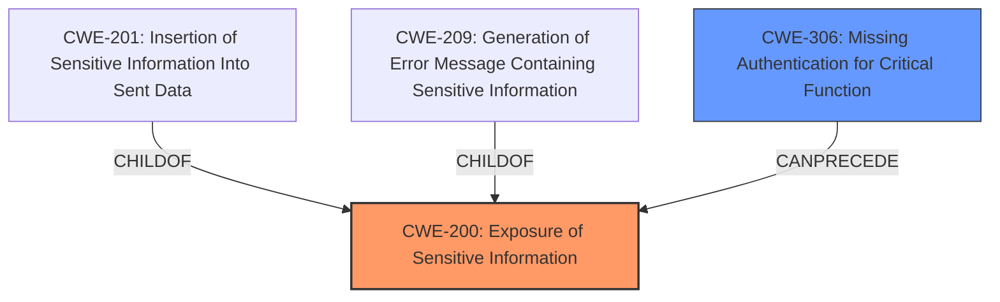

# Enhanced Analysis for CVE-2021-26923

# Summary
| CWE ID | CWE Name | Confidence | CWE Abstraction Level | CWE Vulnerability Mapping Label | CWE-Vulnerability Mapping Notes |
|---|---|---|---|---|---|
| CWE-200 | Exposure of Sensitive Information | 0.9 | Class | Primary | Allowed |
| CWE-306 | Missing Authentication for Critical Function | 0.8 | Base | Secondary | Allowed |

## Evidence and Confidence

*   **Confidence Score:** 0.85
*   **Evidence Strength:** HIGH

## Relationship Analysis
The primary relationship that impacted my decision was the parent-child relationship between CWE-200 and other more specific information exposure CWEs. While several base-level CWEs were considered, CWE-200 accurately captures the general nature of the vulnerability. CWE-306 was considered because the **missing authentication** is what directly allowed the information exposure.



## Vulnerability Chain
The chain of events starts with **missing authentication** (CWE-306) on the `/api/version` endpoint, which leads to the **exposure of sensitive information** (CWE-200), namely internal system details.

## Summary of Analysis
The analysis is based on the provided evidence, particularly the "CVE Reference Links Content Summary," which explicitly states that the `/version` endpoint in Argo CD was unauthenticated and resulted in information disclosure.

The vulnerability description states: "Accessing the endpoint /api/version leaks internal information for the system, and this endpoint is not protected with authentication."

The retriever results identified several candidate CWEs. CWE-200, CWE-306 and CWE-209 were considered. CWE-200 is selected as the primary because it accurately represents the high-level weakness. CWE-306 is selected as the secondary because it identifies the root cause. The other CWEs were not selected because they were not as specific to the root cause of this vulnerability.

CWE-200 is at the class level, which is appropriate in this case as the specific type of sensitive information exposed is not detailed enough to warrant a base-level CWE like CWE-201 or CWE-209. The missing authentication is a key factor leading to the exposure, making CWE-306 a relevant secondary CWE.

Relevant CWE Information:

# Enhanced Context (25 CWEs)

## CWE-201: Insertion of Sensitive Information Into Sent Data
**Abstraction:** Base
**Similarity Score**: 0.067

**Description**:
The code transmits data to another actor, but a portion of the data includes sensitive information that should not be accessible to that actor.

**Mapping Guidance**:
- Usage: Allowed

## CWE-306: Missing Authentication for Critical Function
**Abstraction:** Base
**Similarity Score**: 0.063

**Description**:
The product does not perform any authentication for functionality that requires a provable user identity or consumes a significant amount of resources.

**Mapping Guidance**:
- Usage: Allowed

## CWE-863: Incorrect Authorization
**Abstraction:** Class
**Similarity Score**: 0.061

**Description**:
The product performs an authorization check when an actor attempts to access a resource or perform an action, but it does not correctly perform the check.

**Mapping Guidance**:
- Usage: Allowed-with-Review

## CWE-209: Generation of Error Message Containing Sensitive Information
**Abstraction:** Base
**Similarity Score**: 0.061

**Description**:
The product generates an error message that includes sensitive information about its environment, users, or associated data.

**Mapping Guidance**:
- Usage: Allowed

## CWE-22: Improper Limitation of a Pathname to a Restricted Directory ('Path Traversal')
**Abstraction:** Base
**Similarity Score**: 0.060

**Description**:
The product uses external input to construct a pathname that is intended to identify a file or directory that is located underneath a restricted parent directory, but the product does not properly neutralize special elements within the pathname that can cause the pathname to resolve to a location that is outside of the restricted directory.

**Mapping Guidance**:
- Usage: Allowed


## CWE Relationship Analysis

Current CWEs represent these abstraction levels: .


### Vulnerability Chain Analysis

**Chain starting from CWE-306:**
- 306 (Missing Authentication for Critical Function) - ROOT


**Chain starting from CWE-201:**
- 201 (Insertion of Sensitive Information Into Sent Data) - ROOT


### CWE Relationship Diagram

```mermaid
graph TD
    classDef primary fill:#f96,stroke:#333,stroke-width:2px
    classDef secondary fill:#69f,stroke:#333
    classDef tertiary fill:#9e9,stroke:#333
```