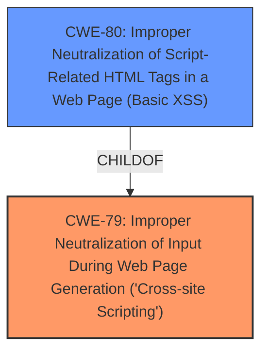

# Enhanced Analysis for CVE-2021-26929

# Summary
| CWE ID | CWE Name | Confidence | CWE Abstraction Level | CWE Vulnerability Mapping Label | CWE-Vulnerability Mapping Notes |
|---|---|---|---|---|---|
| CWE-79 | Improper Neutralization of Input During Web Page Generation ('Cross-site Scripting') | 1.0 | Base | ALLOWED | Primary CWE |
| CWE-80 | Improper Neutralization of Script-Related HTML Tags in a Web Page (Basic XSS) | 0.7 | Variant | ALLOWED | Secondary Candidate |

## Evidence and Confidence

*   **Confidence Score:** 0.9
*   **Evidence Strength:** HIGH

## Relationship Analysis
The primary CWE is CWE-79, which is a base-level CWE. CWE-80 is a variant of CWE-79 and represents a more specific case of XSS. The choice between CWE-79 and CWE-80 depends on the specificity of the vulnerability details. The vulnerability description mentions mishandling of JavaScript encoded links or emails and interference with XSS defenses. Given the focus on script-related HTML tags and encoding issues, CWE-80 becomes a strong candidate. However, since the description also notes that the mishandling interferes with XSS defenses generally, and doesn't exclusively focus on HTML tags, CWE-79 is the primary.



## Vulnerability Chain
The vulnerability chain starts with the **mishandling of JavaScript encoded links or emails** in the `preProcess` function of `Text2html.php`. This leads to the core weakness of **cross-site scripting**, allowing an attacker to inject and execute arbitrary JavaScript code within the context of the webmail application.

## Summary of Analysis
The analysis is based on the provided vulnerability description and CVE Reference Links Content Summary. The key evidence supporting the choice of CWE-79 is the description of the vulnerability as a "**cross-site scripting**" issue due to the "**mishandling of JavaScript encoded links or emails**". The CVE Reference Links Content Summary explicitly mentions XSS and the mishandling of special characters that interfere with XSS defenses.

The Retriever Results also support CWE-79 as the top match.

The choice of CWE-79 as the primary CWE and CWE-80 as a secondary candidate is based on the level of specificity in the vulnerability description. CWE-79 represents the general class of XSS vulnerabilities, while CWE-80 is a more specific variant that focuses on script-related HTML tags. Since the description refers to the mishandling of JavaScript and interference with general XSS defenses, CWE-79 is the more appropriate primary CWE.

Relevant CWE Information:

# Enhanced Context (25 CWEs)
The following CWEs were identified as potentially relevant to this vulnerability:

## CWE-80: Improper Neutralization of Script-Related HTML Tags in a Web Page (Basic XSS)
**Abstraction Level**: Variant
**Similarity Score**: 0.80
**Source**: dense

**Description**:
The product receives input from an upstream component, but it does not neutralize or incorrectly neutralizes special characters such as "<", ">", and "&" that could be interpreted as web-scripting elements when they are sent to a downstream component that processes web pages.

**Mapping Guidance**:
- Usage: Allowed
- Rationale: This CWE entry is at the Variant level of abstraction, which is a preferred level of abstraction for mapping to the root causes of vulnerabilities.

## CWE-79: Improper Neutralization of Input During Web Page Generation ('Cross-site Scripting')
**Abstraction Level**: Base
**Similarity Score**: 0.73
**Source**: dense

**Description**:
The product does not neutralize or incorrectly neutralizes user-controllable input before it is placed in output that is used as a web page that is served to other users.

**Mapping Guidance**:
- Usage: Allowed
- Rationale: This CWE entry is at the Base level of abstraction, which is a preferred level of abstraction for mapping to the root causes of vulnerabilities.

### CWEs Considered but Not Used

*   **CWE-116: Improper Encoding or Escaping of Output**: While encoding/escaping is related to neutralization, the core issue is the **mishandling** that leads directly to XSS, not necessarily a general encoding problem. The description focuses more on the XSS vulnerability itself.
*   **CWE-1336: Improper Neutralization of Special Elements Used in a Template Engine**: The vulnerability occurs during the `preProcess` function. There is no mention of a template engine being used, so this is not the best fit.
*   **CWE-352: Cross-Site Request Forgery (CSRF)**: CSRF is not mentioned or implied in the description. CSRF involves tricking a user into performing actions on a website without their knowledge, which is distinct from XSS.
*   **CWE-74: Improper Neutralization of Special Elements in Output Used by a Downstream Component ('Injection')**: Although XSS is a type of injection, CWE-79 is more specific and better suited to describe the vulnerability. CWE-74 is too high-level.
*   **CWE-184: Incomplete List of Disallowed Inputs**: While it's possible an incomplete list is a factor, the provided information is more directly related to improper or missing neutralization, making CWE-79 a better fit.
*   **CWE-94: Improper Control of Generation of Code ('Code Injection')**: This is a more general code injection issue. The specific context is XSS.
*   **CWE-502: Deserialization of Untrusted Data**: Deserialization is not mentioned or implied in the description.

CWE-79 is at the optimal level of specificity because it directly addresses the XSS vulnerability described in the vulnerability report. The evidence clearly indicates that the application does not properly neutralize user-controllable input, leading to the execution of malicious scripts in the user's browser.


## CWE Relationship Analysis

Current CWEs represent these abstraction levels: .


### Vulnerability Chain Analysis

**Chain starting from CWE-502:**
- 502 (Deserialization of Untrusted Data) - ROOT


**Chain starting from CWE-1336:**
- 1336 (Improper Neutralization of Special Elements Used in a Template Engine) - ROOT


### CWE Relationship Diagram

```mermaid
graph TD
    classDef primary fill:#f96,stroke:#333,stroke-width:2px
    classDef secondary fill:#69f,stroke:#333
    classDef tertiary fill:#9e9,stroke:#333
```