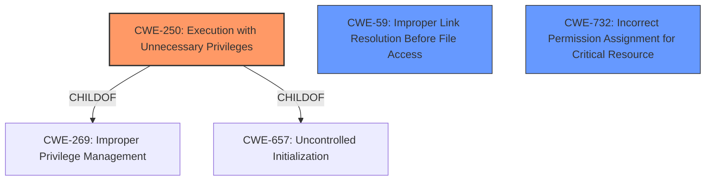

# Raw Analyzer Response for CVE-2021-26936

# Summary
| CWE ID | CWE Name | Confidence | CWE Abstraction Level | CWE Vulnerability Mapping Label | CWE-Vulnerability Mapping Notes |
|---|---|---|---|---|---|
| CWE-250 | Execution with Unnecessary Privileges | 0.9 | Base | Allowed | Primary CWE |
| CWE-59 | Improper Link Resolution Before File Access ('Link Following') | 0.7 | Base | Allowed | Secondary Candidate |
| CWE-732 | Incorrect Permission Assignment for Critical Resource | 0.6 | Class | Allowed-with-Review | Secondary Candidate |

## Evidence and Confidence

*   **Confidence Score:** 0.8
*   **Evidence Strength:** HIGH

## Relationship Analysis
The primary CWE selected is CWE-250, which is a Base level CWE and a child of both CWE-269 (Improper Privilege Management) and CWE-657. While CWE-269 is a broader class, CWE-250 specifically addresses the root cause of the vulnerability: the program running with unnecessary privileges. The secondary CWEs, CWE-59 and CWE-732, represent related weaknesses that contribute to the overall vulnerability. CWE-59 is related to the symlink following issue, and CWE-732 addresses the incorrect permission assignment. These CWEs are related but not as direct a root cause as the unnecessary privileges.

## Vulnerability Chain
The vulnerability chain starts with the `replay-sorcery` program being installed with setuid-root, leading to **CWE-250 (Execution with Unnecessary Privileges)**. This then allows for several weaknesses to be exploited:
1.  Unsafe environment variable handling.
2.  **CWE-59 (Improper Link Resolution Before File Access ('Link Following'))** when reading configuration files and writing output files.
3.  **CWE-732 (Incorrect Permission Assignment for Critical Resource)** when creating a video file in an attacker-specified path.

The final impact is privilege escalation to root.

## Summary of Analysis
The initial analysis identified several potential CWEs, including CWE-269, CWE-250, CWE-367, CWE-73, CWE-427, CWE-732, CWE-98 and CWE-59. After reviewing the vulnerability description and the provided evidence, the primary focus shifted to **CWE-250 (Execution with Unnecessary Privileges)** because the program runs with root privileges unnecessarily. The CVE Reference Links Content Summary states that the program lacks the necessary security precautions to handle elevated privileges safely. This is the root cause that enables the other weaknesses. The program being installed with setuid-root and setgid-root bits, granting it unnecessary root privileges.

Secondary candidates are:
*   **CWE-59 (Improper Link Resolution Before File Access ('Link Following'))** since the program follows symlinks, leading to arbitrary file overwrite. The CVE Reference Links Content Summary states: When writing video output files, symlinks are followed, allowing an attacker to overwrite arbitrary files, leading to local denial of service.
*   **CWE-732 (Incorrect Permission Assignment for Critical Resource)** because the program can create files with incorrect permissions. The CVE Reference Links Content Summary states: a video file could be created in an attacker-specified path (e.g., `/etc/ld.so.conf.d/mylib.conf`). If `umask 0` is set before running, the created file will have mode 0666 and owner root:root, making it editable by anyone and leading to a potential full local root exploit via multiple vectors.

The CWE relationships and mapping guidance were considered to ensure that the selected CWEs were at the appropriate level of abstraction and accurately reflected the vulnerability. The final selection of CWE-250, CWE-59 and CWE-732 provides a comprehensive representation of the vulnerability, capturing both the root cause and the contributing weaknesses.