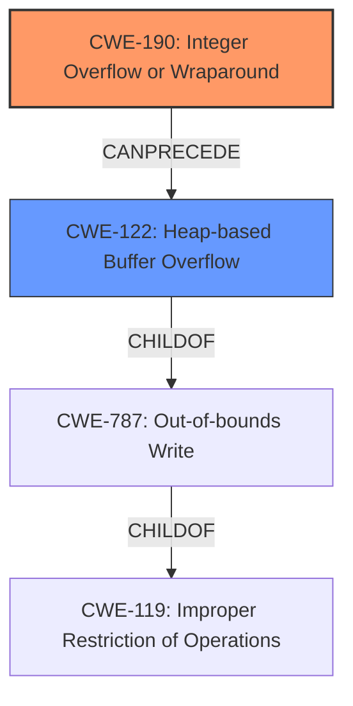

# Analysis for CVE-2021-26945

# Summary
| CWE ID  | CWE Name                                                       | Confidence | CWE Abstraction Level | CWE Vulnerability Mapping Label | CWE-Vulnerability Mapping Notes |
| :-------- | :------------------------------------------------------------- | :--------- | :-------------------- | :------------------------------ | :------------------------------ |
| CWE-190   | Integer Overflow or Wraparound                               | 1          | Base                  | Primary CWE                      | Allowed                       |
| CWE-122   | Heap-based Buffer Overflow                                   | 1          | Variant               | Secondary CWE                    | Allowed                       |

## Evidence and Confidence

*   **Confidence Score:** 1
*   **Evidence Strength:** HIGH

## Relationship Analysis
The primary weakness is an **Integer Overflow or Wraparound (CWE-190)**. This can **CanPrecede** a **Heap-based Buffer Overflow (CWE-122)**. **CWE-122** is a variant of **CWE-787: Out-of-bounds Write**, which in turn is a child of **CWE-119: Improper Restriction of Operations within the Bounds of a Memory Buffer**. The analysis focuses on the root cause (**CWE-190**) and its direct consequence (**CWE-122**).

## Vulnerability Chain
The vulnerability chain starts with an **Integer Overflow (CWE-190)**, which results in a **Heap-based Buffer Overflow (CWE-122)**.

## Summary of Analysis
The vulnerability description clearly states that the root cause is an **integer overflow** that leads to a **heap-buffer overflow**. The "CVE Reference Links Content Summary" provides further evidence that the vulnerability is caused by an integer overflow when calculating the offset into an array, leading to heap-buffer overflows and out-of-bounds memory access.

*   **CWE-190 Integer Overflow or Wraparound:** The vulnerability description explicitly mentions an **integer overflow**, and the CVE description confirms that the overflow leads to out-of-bounds memory access. The description of **CWE-190** matches this scenario.
*   **CWE-122 Heap-based Buffer Overflow:** The vulnerability description explicitly mentions a **heap-buffer overflow**. The CVE description confirms that the **integer overflow** leads to a **heap-buffer overflow**. The description of **CWE-122** matches this scenario.
*   **CWE-119 Improper Restriction of Operations within the Bounds of a Memory Buffer:** While this is a parent of **CWE-122**, it is a more general category and less descriptive of the specific vulnerability. The mapping guidance discourages the use of **CWE-119** when more specific CWEs are available.
*   **CWE-125 Out-of-bounds Read:** The CVE description mentions "out-of-bounds memory access," but it's the write (overflow) that is the more precise weakness.

The selection of **CWE-190** and **CWE-122** is based on the direct evidence provided in the vulnerability description and the CVE reference. These CWEs are at the optimal level of specificity, accurately representing the root cause and its direct consequence.

Relevant CWE Information:

# Enhanced Context (25 CWEs)
The following CWEs were identified as potentially relevant to this vulnerability:

## CWE-191: Integer Underflow (Wrap or Wraparound)
**Abstraction Level**: Base
**Similarity Score**: 0.80
**Source**: dense

**Description**:
The product subtracts one value from another, such that the result is less than the minimum allowable integer value, which produces a value that is not equal to the correct result.

**Mapping Guidance**:
- Usage: Allowed
- Rationale: This CWE entry is at the Base level of abstraction, which is a preferred level of abstraction for mapping to the root causes of vulnerabilities.

## CWE-681: Incorrect Conversion between Numeric Types
**Abstraction Level**: Base
**Similarity Score**: 0.77
**Source**: dense

**Description**:
When converting from one data type to another, such as long to integer, data can be omitted or translated in a way that produces unexpected values. If the resulting values are used in a sensitive context, then dangerous behaviors may occur.

**Mapping Guidance**:
- Usage: Allowed
- Rationale: This CWE entry is at the Base level of abstraction, which is a preferred level of abstraction for mapping to the root causes of vulnerabilities.

## CWE-131: Incorrect Calculation of Buffer Size
**Abstraction Level**: Base
**Similarity Score**: 0.77
**Source**: dense

**Description**:
The product does not correctly calculate the size to be used when allocating a buffer, which could lead to a buffer overflow.

**Mapping Guidance**:
- Usage: Allowed
- Rationale: This CWE entry is at the Base level of abstraction, which is a preferred level of abstraction for mapping to the root causes of vulnerabilities.

## CWE-197: Numeric Truncation Error
**Abstraction Level**: Base
**Similarity Score**: 0.77
**Source**: dense

**Description**:
Truncation errors occur when a primitive is cast to a primitive of a smaller size and data is lost in the conversion.

**Mapping Guidance**:
- Usage: Allowed
- Rationale: This CWE entry is at the Base level of abstraction, which is a preferred level of abstraction for mapping to the root causes of vulnerabilities.

## CWE-124: Buffer Underwrite ('Buffer Underflow')
**Abstraction Level**: Base
**Similarity Score**: 0.76
**Source**: dense

**Description**:
The product writes to a buffer using an index or pointer that references a memory location prior to the beginning of the buffer.

**Mapping Guidance**:
- Usage: Allowed
- Rationale: This CWE entry is at the Base level of abstraction, which is a preferred level of abstraction for mapping to the root causes of vulnerabilities.

## CWE-680: Integer Overflow to Buffer Overflow
**Abstraction Level**: Compound
**Similarity Score**: 0.75
**Source**: dense

**Description**:
The product performs a calculation to determine how much memory to allocate, but an integer overflow can occur that causes less memory to be allocated than expected, leading to a buffer overflow.

**Mapping Guidance**:
- Usage: Discouraged
- Rationale: This CWE entry is a named chain, which combines multiple weaknesses.

## CWE-190: Integer Overflow or Wraparound
**Abstraction Level**: Base
**Similarity Score**: 0.75
**Source**: dense

**Description**:
The product performs a calculation that can
         produce an integer overflow or wraparound when the logic
         assumes that the resulting value will always be larger than
         the original value. This occurs when an integer value is
         incremented to a value that is too large to store in the
         associated representation. When this occurs, the value may
         become a very small or negative number.

**Mapping Guidance**:
- Usage: Allowed
- Rationale: This CWE entry is at the Base level of abstraction, which is a preferred level of abstraction for mapping to the root causes of vulnerabilities.

## CWE-805: Buffer Access with Incorrect Length Value
**Abstraction Level**: Base
**Similarity Score**: 0.75
**Source**: dense

**Description**:
The product uses a sequential operation to read or write a buffer, but it uses an incorrect length value that causes it to access memory that is outside of the bounds of the buffer.

**Mapping Guidance**:
- Usage: Allowed
- Rationale: This CWE entry is at the Base level of abstraction, which is a preferred level of abstraction for mapping to the root causes of vulnerabilities.

## CWE-125: Out-of-bounds Read
**Abstraction Level**: Base
**Similarity Score**: 0.75
**Source**: dense

**Description**:
The product reads data past the end, or before the beginning, of the intended buffer.

**Mapping Guidance**:
- Usage: Allowed
- Rationale: This CWE entry is at the Base level of abstraction, which is a preferred level of abstraction for mapping to the root causes of vulnerabilities.

## CWE-193: Off-by-one Error
**Abstraction Level**: Base
**Similarity Score**: 0.74
**Source**: dense

**Description**:
A product calculates or uses an incorrect maximum or minimum value that is 1 more, or 1 less, than the correct value.

**Mapping Guidance**:
-