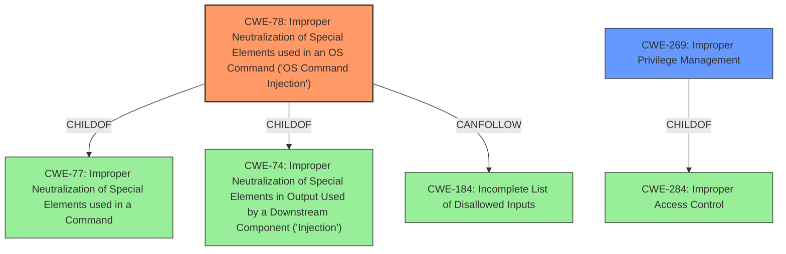

# Enhanced Analysis for CVE-2021-26962

# Summary
| CWE ID | CWE Name | Confidence | CWE Abstraction Level | CWE Vulnerability Mapping Label | CWE-Vulnerability Mapping Notes |
|---|---|---|---|---|---|
| CWE-78 | Improper Neutralization of Special Elements used in an OS Command ('OS Command Injection') | 1.0 | Base | Allowed | Primary CWE. Matches the **improper access control** leading to arbitrary command execution. |
| CWE-269 | Improper Privilege Management | 0.6 | Class | Discouraged | Secondary CWE. The vulnerability allows remote authenticated users to run arbitrary commands, suggesting a problem with privilege management. However, it is a less specific root cause than command injection. |

## Evidence and Confidence

*   **Confidence Score:** 0.8
*   **Evidence Strength:** MEDIUM

## Relationship Analysis
The primary CWE is CWE-78, which is a base-level CWE and a child of CWE-77 and CWE-74. CWE-78 can follow CWE-184, indicating a potential chain where an incomplete list of disallowed inputs leads to OS command injection. CWE-269 is a class-level CWE and a child of CWE-284.



## Vulnerability Chain
The vulnerability chain starts with **improper access control** that leads to the ability to inject commands into the OS, resulting in arbitrary command execution.
  - The root cause is the **improper access control** and the weakness is the ability to inject OS commands.
  - The impact is arbitrary command execution as root.

## Summary of Analysis
The initial analysis focused on the **improper access control** that allows remote authenticated users to execute arbitrary commands. The primary CWE match, based on the description and retriever results, is CWE-78. The vulnerability description states, "Vulnerabilities in the AirWave CLI could allow remote authenticated users to run arbitrary commands on the underlying host," which directly aligns with the description of CWE-78: "The product constructs all or part of an OS command using externally-influenced input from an upstream component, but it does not neutralize or incorrectly neutralizes special elements that could modify the intended OS command when it is sent to a downstream component."

CWE-269 was considered because the description mentions "remote authenticated users," suggesting a privilege management issue. However, CWE-269 is discouraged because it is often misused when more specific CWEs are applicable.

The selection of CWE-78 is at the optimal level of specificity because it directly addresses the root cause of the vulnerability: the ability to inject OS commands due to **improper access control**. The retriever results also support this choice, with CWE-78 having the highest relevance score.

The evidence supporting this decision comes directly from the vulnerability description and the retriever results. The description clearly states the ability to execute arbitrary commands, and the retriever results confirm that CWE-78 is the most relevant CWE for this type of vulnerability.

Other CWEs Considered:

*   CWE-22: Improper Limitation of a Pathname to a Restricted Directory ('Path Traversal'): While path traversal could be a potential attack vector, it is not the primary issue in this vulnerability. The core problem is the ability to execute arbitrary commands, not necessarily to access unauthorized files.
*   CWE-20: Improper Input Validation: Although input validation might be missing or insufficient, the primary issue is that the system allows execution of arbitrary commands. Input validation would be a mitigating factor, but not the root cause.


## CWE Relationship Analysis

Current CWEs represent these abstraction levels: .


### Vulnerability Chain Analysis

**Chain starting from CWE-284:**
- 284 (Improper Access Control) - ROOT


**Chain starting from CWE-78:**
- 78 (Improper Neutralization of Special Elements used in an OS Command ('OS Command Injection')) - ROOT


### CWE Relationship Diagram

```mermaid
graph TD
    classDef primary fill:#f96,stroke:#333,stroke-width:2px
    classDef secondary fill:#69f,stroke:#333
    classDef tertiary fill:#9e9,stroke:#333
```