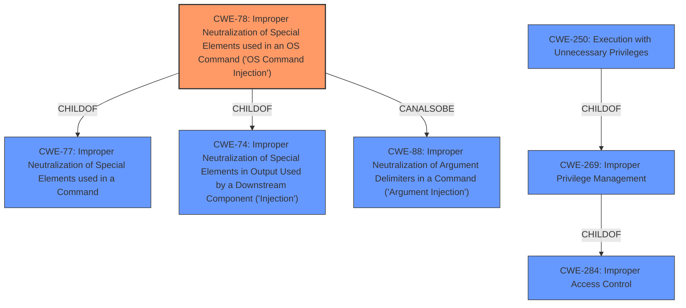

# Analysis for CVE-2021-26970

# Summary
| CWE ID | CWE Name | Confidence | CWE Abstraction Level | CWE Vulnerability Mapping Label | CWE-Vulnerability Mapping Notes |
|---|---|---|---|---|---|
| CWE-78 | Improper Neutralization of Special Elements used in an OS Command ('OS Command Injection') | 0.9 | Base | Primary | Allowed |
| CWE-269 | Improper Privilege Management | 0.6 | Class | Secondary | Discouraged |

## Evidence and Confidence

*   **Confidence Score:** 0.75
*   **Evidence Strength:** MEDIUM

## Relationship Analysis
The primary CWE is CWE-78, which is a base-level CWE and a child of CWE-77 (Improper Neutralization of Special Elements used in a Command) and CWE-74 (Improper Neutralization of Special Elements in Output Used by a Downstream Component ('Injection')). CWE-78 can also be related to CWE-88 (Improper Neutralization of Argument Delimiters in a Command ('Argument Injection')). CWE-269 is a class-level CWE and a parent of CWE-250 (Execution with Unnecessary Privileges) and a child of CWE-284 (Improper Access Control). The relationship between CWE-78 and CWE-269 is not direct, but the **improper access control** can lead to the ability to inject OS commands.

## Vulnerability Chain
The vulnerability chain starts with **improper access control**, which allows an attacker to then inject OS commands. The successful exploitation leads to arbitrary command execution as a lower-privileged user, resulting in partial system compromise.
  - **Root Cause:** **Improper Access Control**
  - **Weakness:** Improper Neutralization of Special Elements used in an OS Command
  - **Impact:** Arbitrary command execution as a lower-privileged user, partial system compromise.

## Summary of Analysis
The primary weakness is CWE-78 (Improper Neutralization of Special Elements used in an OS Command ('OS Command Injection')), as it directly relates to the ability to execute arbitrary commands on the underlying host. The vulnerability description states that "Vulnerabilities in the AirWave web-base management interface could allow remote authenticated users to run arbitrary commands on the underlying host." This aligns with the description of CWE-78, which states, "The product constructs all or part of an OS command using externally-influenced input from an upstream component, but it does not neutralize or incorrectly neutralizes special elements that could modify the intended OS command when it is sent to a downstream component."

The "Vulnerability Description Key Phrases" also points to "**rootcause:** **improper access control**" as a root cause. CWE-269 (Improper Privilege Management) is considered as a secondary CWE, as the **improper access control** leads to the command injection vulnerability. However, CWE-269 is discouraged for being commonly misused and conflated with "privilege escalation". The provided description mentions that the attacker can "execute arbitrary commands as a lower privileged user", which doesn't necessarily indicate that the **improper privilege management** is the root cause.

The final decision to focus on CWE-78 is based on the primary impact of arbitrary command execution. The evidence supports the conclusion that the system fails to properly neutralize special elements in the OS command, allowing for injection. The abstraction level is appropriate, as CWE-78 is a base-level CWE. The retriever results also supports CWE-78 as the top combined result.