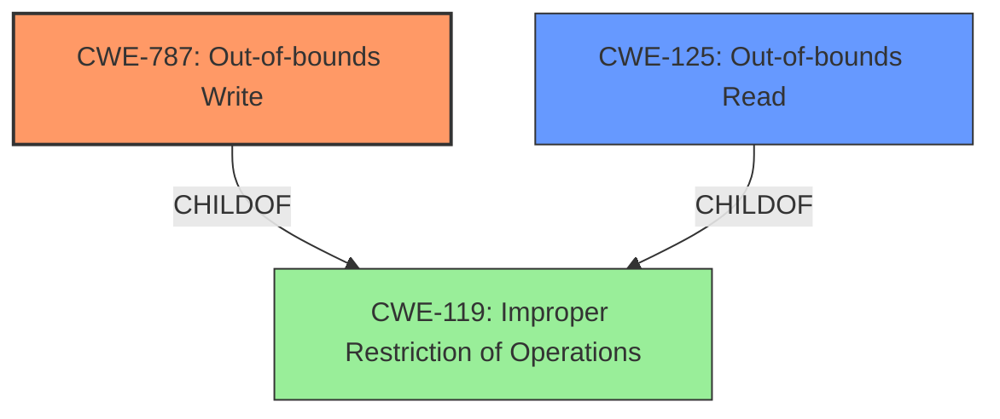

# Analysis for CVE-2021-27044

# Summary
| CWE ID  | CWE Name  | Confidence | CWE Abstraction Level | CWE Vulnerability Mapping Label | CWE-Vulnerability Mapping Notes |
|---|---|---|---|---|---|
| CWE-787 | Out-of-bounds Write | 1.0  | Base  | Allowed | Primary CWE |
| CWE-125 | Out-of-bounds Read | 0.75 | Base  | Allowed | Secondary CWE |

## Evidence and Confidence

*   **Confidence Score:** 0.9
*   **Evidence Strength:** HIGH

## Relationship Analysis
The primary relationship that impacted my decision was the ChildOf relationship between CWE-787 and CWE-119, and between CWE-125 and CWE-119. CWE-119 is a Class-level CWE that is often misused, and the guidance recommends selecting more specific child CWEs when available. The vulnerability description explicitly mentions "Out-of-bounds Read/Write", so selecting CWE-787 and CWE-125, both Base-level CWEs and children of CWE-119, provides a more precise classification.

## Vulnerability Chain
The vulnerability chain starts with a **maliciously crafted DLL file** (or FBX file), leading to an **out-of-bounds read/write**, which then results in **remote code execution** or **information disclosure**.

## Summary of Analysis
The initial analysis identified CWE-787 and CWE-125 as the primary candidates due to the explicit mention of "Out-of-bounds Read/Write" in the vulnerability description. The "CVE Reference Links Content Summary" section confirms the presence of an **Out-Of-Bounds Write vulnerability**.

> **Vulnerability Description Key Phrases**
> -   **weakness:** **Out-Of-Bounds Read/Write**

> **CVE Reference Links Content Summary**
> **Root cause of vulnerability:**
> -   An Out-Of-Bounds Write vulnerability in Autodesk FBX Review.
> **Weaknesses/vulnerabilities present:**
> -   Out-Of-Bounds Write

The retriever results also support this, listing CWE-125 and CWE-787 high in the results. The final decision is based on the evidence provided in the vulnerability description and the supporting information in the CVE reference, making CWE-787 a primary CWE and CWE-125 a secondary CWE. These selections are at the optimal level of specificity, as they directly describe the type of memory error (**out-of-bounds write/read**).

Relevant CWE Information:

# Enhanced Context (25 CWEs)

## CWE-1289: Improper Validation of Unsafe Equivalence in Input
**Abstraction Level**: Base
**Similarity Score**: 0.77
**Source**: dense

**Description**:
The product receives an input value that is used as a resource identifier or other type of reference, but it does not validate or incorrectly validates that the input is equivalent to a potentially-unsafe value.
**Rationale for not selecting:** This CWE is about improper validation, but the root cause here is out-of-bounds read/write, not necessarily a validation issue.

## CWE-226: Sensitive Information in Resource Not Removed Before Reuse
**Abstraction Level**: Base
**Similarity Score**: 0.76
**Source**: dense

**Description**:
The product releases a resource such as memory or a file so that it can be made available for reuse, but it does not clear or "zeroize" the information contained in the resource before the product performs a critical state transition or makes the resource available for reuse by other entities.
**Rationale for not selecting:** This CWE doesn't fit the vulnerability description.

## CWE-665: Improper Initialization
**Abstraction Level**: Class
**Similarity Score**: 0.75
**Source**: dense

**Description**:
The product does not initialize or incorrectly initializes a resource, which might leave the resource in an unexpected state when it is accessed or used.
**Rationale for not selecting:** Improper Initialization is not the root cause of this vulnerability.

## CWE-404: Improper Resource Shutdown or Release
**Abstraction Level**: Class
**Similarity Score**: 0.75
**Source**: dense

**Description**:
The product does not release or incorrectly releases a resource before it is made available for re-use.
**Rationale for not selecting:** This CWE doesn't fit the vulnerability description.

## CWE-125: Out-of-bounds Read
**Abstraction Level**: Base
**Similarity Score**: 0.75
**Source**: dense

**Description**:
The product reads data past the end, or before the beginning, of the intended buffer.
**Rationale for selecting:** The description directly matches the vulnerability description of "Out-Of-Bounds Read/Write"

## CWE-824: Access of Uninitialized Pointer
**Abstraction Level**: Base
**Similarity Score**: 0.75
**Source**: dense

**Description**:
The product accesses or uses a pointer that has not been initialized.
**Rationale for not selecting:** There is no mention of uninitialized pointers.

## CWE-667: Improper Locking
**Abstraction Level**: Class
**Similarity Score**: 0.75
**Source**: dense

**Description**:
The product does not properly acquire or release a lock on a resource, leading to unexpected resource state changes and behaviors.
**Rationale for not selecting:** This CWE doesn't fit the vulnerability description.

## CWE-457: Use of Uninitialized Variable
**Abstraction Level**: Variant
**Similarity Score**: 0.75
**Source**: dense

**Description**:
The code uses a variable that has not been initialized, leading to unpredictable or unintended results.
**Rationale for not selecting:** There is no mention of uninitialized variables.

## CWE-908: Use of Uninitialized Resource
**Abstraction Level**: Base
**Similarity Score**: 0.75
**Source**: dense

**Description**:
The product uses or accesses a resource that has not been initialized.
**Rationale for not selecting:** There is no mention of uninitialized resources.

## CWE-252: Unchecked Return Value
**Abstraction Level**: Base
**Similarity Score**: 0.74
**Source**: dense

**Description**:
The product does not check the return value from a method or function, which can prevent it from detecting unexpected states and conditions.
**Rationale for not selecting:** This CWE doesn't fit the vulnerability description.

## CWE-190: Integer Overflow or Wraparound
**Abstraction Level**: Base
**Similarity Score**: 7662.25
**Source**: sparse

**Description**:
The product performs a calculation that can
         produce an integer overflow or wraparound when the logic
         assumes that the resulting value will always be larger than
         the original value. This occurs when an integer value is
         incremented to a value that is too large to store in the
         associated representation. When this occurs, the value may
         become a very small or negative number.
**Rationale for not selecting:** This CWE doesn't fit the vulnerability description.

## CWE-125: Out-of-bounds Read
**Abstraction Level**: Base
**Similarity Score**: 7419.55
**Source**: sparse

**Description**:
The product reads data past the end, or before the beginning, of the intended buffer.
**Rationale for selecting:** The description directly matches the vulnerability description of "Out-Of-Bounds Read/Write".

## CWE-119: Improper Restriction of Operations within the Bounds of a Memory Buffer
**Abstraction Level**: Class
**Similarity Score**: 7156.84
**Source**: sparse

**Description**:
The product performs operations on a memory buffer, but it reads from or writes to a memory location outside the buffer's intended boundary. This may result in read or write operations on unexpected memory locations that could be linked to other variables, data structures, or internal program data.
**Rationale for not selecting:** This CWE is too high-level. The description explicitly states out-of-bounds read/write.

## CWE-1284: Improper Validation of Specified Quantity in Input
**Abstraction Level**: Base
**Similarity Score**: 7097.65
**Source**: sparse

**Description**:
The product receives input that is expected to specify a quantity (such as size or length), but it does not validate or incorrectly validates that the quantity has the required properties.
**Rationale for not selecting:** This CWE doesn't fit the vulnerability description.

## CWE-193