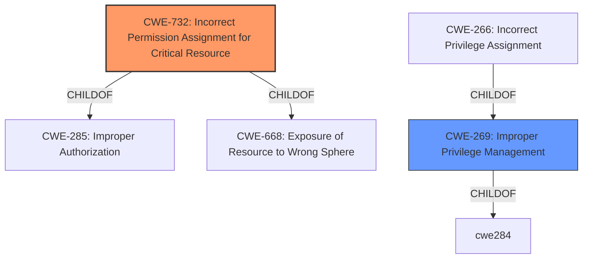

# Enhanced Analysis for CVE-2021-27070

# Summary
| CWE ID | CWE Name | Confidence | CWE Abstraction Level | CWE Vulnerability Mapping Label | CWE-Vulnerability Mapping Notes |
|---|---|---|---|---|---|
| CWE-732 | Incorrect Permission Assignment for Critical Resource | 0.9 | Class | Primary | Allowed-with-Review |
| CWE-269 | Improper Privilege Management | 0.6 | Class | Secondary | Discouraged |

## Evidence and Confidence

*   **Confidence Score:** 0.75
*   **Evidence Strength:** MEDIUM

## Relationship Analysis
The primary relationship that influenced my decision was the hierarchical relationship between CWE-732 and its parent CWE-285, which deals with improper authorization. While CWE-732 is a Class-level CWE, it directly addresses the root cause described in the vulnerability: **incorrect permissions** on a critical resource.

CWE-269, Improper Privilege Management, is a more general class that covers various privilege-related issues. It was considered due to the "elevation of privilege" impact but was deemed less specific than CWE-732. The relationship between CWE-269 and CWE-266 was also considered since CWE-266 is "Incorrect Privilege Assignment" and a child of CWE-269, but this also was determined to be less accurate.



## Vulnerability Chain
The vulnerability chain starts with the **incorrect permission assignment** on a directory used by the Windows Update Assistant (CWE-732). This leads to unauthorized access, allowing a local attacker to escalate their privileges to Administrator level. Successful exploitation results in arbitrary code execution with elevated privileges.

## Summary of Analysis
The analysis is based on the provided vulnerability description and the associated CVE reference links content summary. The key phrase from the summary is "**incorrect permissions** on a directory". This directly aligns with the description of CWE-732, "Incorrect Permission Assignment for Critical Resource."

The retriever results also suggest CWE-732 as a potential candidate. While it's a Class-level CWE, the mapping guidance suggests reviewing its children for more specific mappings, but none of the children were a more accurate fit.

The primary reason for selecting CWE-732 is its direct relationship to the root cause of the vulnerability, as stated in the CVE Reference Links Content Summary: "**The vulnerability stems from incorrect permissions on a directory used by the Windows Update Assistant.**"

CWE-269 was considered because the impact of the vulnerability is "elevation of privilege". However, CWE-269 is a more general category, and the summary identifies the specific weakness as an incorrect permission assignment. The MITRE mapping guidance for CWE-269 discourages its use when more specific CWEs are available.

Other CWEs considered but not used:

*   CWE-59 (Improper Link Resolution Before File Access ('Link Following')): This was considered due to the possibility of symlink attacks, but the description doesn't explicitly mention symlinks.
*   CWE-266 (Incorrect Privilege Assignment): This is a child of CWE-269 and relates to privilege assignment, but CWE-732 is more specific to resource permissions.

I've opted for CWE-732 as the primary CWE because it directly addresses the **incorrect permission assignment**, which is the root cause of the vulnerability.


## CWE Relationship Analysis

Current CWEs represent these abstraction levels: .


### Vulnerability Chain Analysis

**Chain starting from CWE-732:**
- 732 (Incorrect Permission Assignment for Critical Resource) - ROOT


**Chain starting from CWE-285:**
- 285 (Improper Authorization) - ROOT


### CWE Relationship Diagram

```mermaid
graph TD
    classDef primary fill:#f96,stroke:#333,stroke-width:2px
    classDef secondary fill:#69f,stroke:#333
    classDef tertiary fill:#9e9,stroke:#333
```