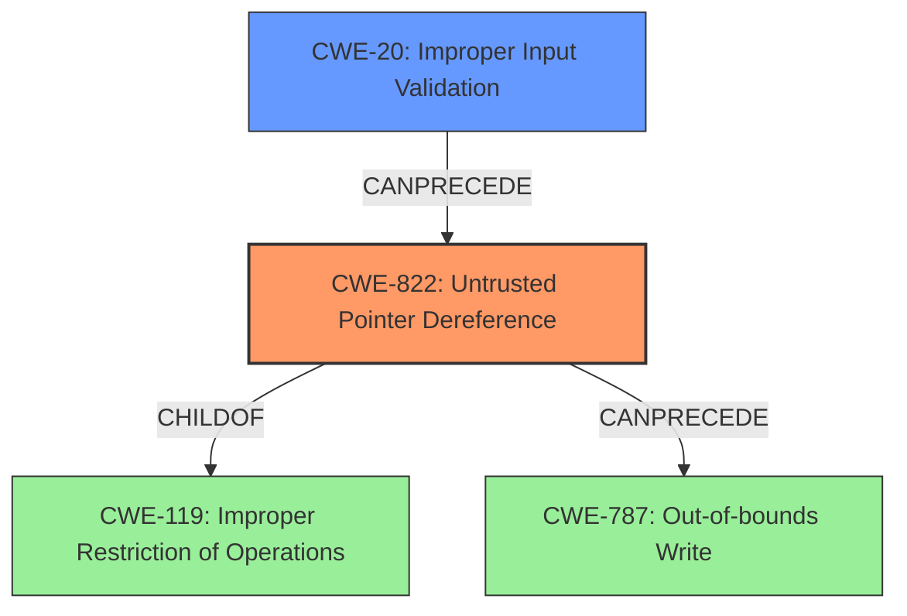

# Enhanced Analysis for CVE-2021-27077

# Summary
| CWE ID  | CWE Name                                                                      | Confidence | CWE Abstraction Level | CWE Vulnerability Mapping Label | CWE-Vulnerability Mapping Notes |
| ------- | ----------------------------------------------------------------------------- | ---------- | ----------------------- | ------------------------------- | ------------------------------- |
| CWE-822 | Untrusted Pointer Dereference                                                 | 0.9        | Base                    | Primary                         | Allowed                       |
| CWE-20  | Improper Input Validation                                                       | 0.8        | Class                   | Secondary                       | Allowed                       |

## Evidence and Confidence

*   **Confidence Score:** 0.85
*   **Evidence Strength:** HIGH

## Relationship Analysis
The primary CWE is CWE-822, representing the untrusted pointer dereference. CWE-822 is a child of CWE-119 (Improper Restriction of Operations within the Bounds of a Memory Buffer). CWE-20 is a class level weakness that can result in CWE-822. The relationships highlight the flow from **improper input validation** to the eventual **untrusted pointer dereference**.



## Vulnerability Chain
The vulnerability chain starts with **improper input validation** (CWE-20) that leads to an **untrusted pointer dereference** (CWE-822). This dereference can result in an elevation of privilege.

## Summary of Analysis
The analysis is based on the provided evidence, specifically from the "CVE Reference Links Content Summary" section. The key statement is: "The root cause of the vulnerability is the lack of proper validation of a user-supplied value before it is dereferenced as a pointer within the `win32kfull.sys` driver." This directly supports the mapping to CWE-822 (Untrusted Pointer Dereference), which is caused by CWE-20.

The graph relationships further emphasize this connection. CWE-822 can precede CWE-787 (Out-of-bounds Write), indicating a potential path for exploitation after the pointer dereference.

The selection of CWE-822 is at the optimal level of specificity because it precisely describes the core issue: the dereferencing of an untrusted pointer. While other CWEs like CWE-119 (Improper Restriction of Operations within the Bounds of a Memory Buffer) are related, CWE-822 is a more specific and accurate representation of the vulnerability.

Relevant CWE Information:

# Enhanced Context (25 CWEs)
The following CWEs were identified as potentially relevant to this vulnerability:

## CWE-59: Improper Link Resolution Before File Access ('Link Following')
**Abstraction Level**: Base
**Similarity Score**: 0.80
**Source**: dense
## CWE-41: Improper Resolution of Path Equivalence
**Abstraction Level**: Base
**Similarity Score**: 0.79
**Source**: dense
## CWE-131: Incorrect Calculation of Buffer Size
**Abstraction Level**: Base
**Similarity Score**: 0.78
**Source**: dense
## CWE-667: Improper Locking
**Abstraction Level**: Class
**Similarity Score**: 0.78
**Source**: dense
## CWE-73: External Control of File Name or Path
**Abstraction Level**: Base
**Similarity Score**: 0.78
**Source**: dense
## CWE-23: Relative Path Traversal
**Abstraction Level**: Base
**Similarity Score**: 0.78
**Source**: dense
## CWE-125: Out-of-bounds Read
**Abstraction Level**: Base
**Similarity Score**: 0.77
**Source**: dense
## CWE-191: Integer Underflow (Wrap or Wraparound)
**Abstraction Level**: Base
**Similarity Score**: 0.77
**Source**: dense
## CWE-427: Uncontrolled Search Path Element
**Abstraction Level**: Base
**Similarity Score**: 0.77
**Source**: dense
## CWE-119: Improper Restriction of Operations within the Bounds of a Memory Buffer
**Abstraction Level**: Class
**Similarity Score**: 0.77
**Source**: dense
## CWE-59: Improper Link Resolution Before File Access ('Link Following')
**Abstraction Level**: Base
**Similarity Score**: 5151.52
**Source**: sparse
## CWE-1386: Insecure Operation on Windows Junction / Mount Point
**Abstraction Level**: Base
**Similarity Score**: 4906.97
**Source**: sparse
## CWE-367: Time-of-check Time-of-use (TOCTOU) Race Condition
**Abstraction Level**: Base
**Similarity Score**: 4768.35
**Source**: sparse
## CWE-61: UNIX Symbolic Link (Symlink) Following
**Abstraction Level**: Compound
**Similarity Score**: 4731.63
**Source**: sparse
## CWE-22: Improper Limitation of a Pathname to a Restricted Directory ('Path Traversal')
**Abstraction Level**: Base
**Similarity Score**: 4679.97
**Source**: sparse
## CWE-787: Out-of-bounds Write
**Abstraction Level**: base
**Similarity Score**: 4.33
**Source**: graph
## CWE-1284: Improper Validation of Specified Quantity in Input
**Abstraction Level**: base
**Similarity Score**: 4.33
**Source**: graph
## CWE-22: Improper Limitation of a Pathname to a Restricted Directory ('Path Traversal')
**Abstraction Level**: base
**Similarity Score**: 4.33
**Source**: graph
## CWE-190: Integer Overflow or Wraparound
**Abstraction Level**: base
**Similarity Score**: 4.33
**Source**: graph
## CWE-822: Untrusted Pointer Dereference
**Abstraction Level**: base
**Similarity Score**: 4.33
**Source**: graph
## CWE-123: Write-what-where Condition
**Abstraction Level**: base
**Similarity Score**: 3.89
**Source**: graph
## CWE-781: Improper Address Validation in IOCTL with METHOD_NEITHER I/O Control Code
**Abstraction Level**: variant
**Similarity Score**: 3.88
**Source**: graph
## CWE-266: Incorrect Privilege Assignment
**Abstraction Level**: base
**Similarity Score**: 3.64
**Source**: graph
## CWE-454: External Initialization of Trusted Variables or Data Stores
**Abstraction Level**: base
**Similarity Score**: 3.64
**Source**: graph
## CWE-456: Missing Initialization of a Variable
**Abstraction Level**: variant
**Similarity Score**: 3.48
**Source**: graph

**CWE-822: Untrusted Pointer Dereference:** This is the primary CWE because the vulnerability is caused by dereferencing a pointer without proper validation. The "CVE Reference Links Content Summary" states that "The root cause of the vulnerability is the lack of proper validation of a user-supplied value before it is dereferenced as a pointer." This aligns directly with the description of CWE-822.

**CWE-20: Improper Input Validation:** This is a secondary CWE because the **lack of proper validation** of the user-supplied value leads to the untrusted pointer dereference. The "CVE Reference Links Content Summary" confirms this by stating "Improper input validation".

**CWE-119: Improper Restriction of Operations within the Bounds of a Memory Buffer:** While related as a parent of CWE-822, it is too general. The vulnerability is more specifically about the dereferencing of an untrusted pointer, not just any out-of-bounds memory operation.

**CWE-787: Out-of-bounds Write:** This is a potential consequence of the untrusted pointer dereference but is not the root cause. The primary issue is the **untrusted pointer dereference** itself.

**CWE-1285: Improper Validation of Specified Index, Position, or Offset in Input:** This is similar to CWE-20, but less general. Since the description doesn't specify index/position/offset, CWE-20 is a better fit.

**CWE-272: Least Privilege Violation:** While the impact of the vulnerability is privilege escalation, the root cause is not a violation of least privilege but the


## CWE Relationship Analysis

Current CWEs represent these abstraction levels: .


### Vulnerability Chain Analysis

**Chain starting from CWE-787:**
- 787 (Out-of-bounds Write) - ROOT


**Chain starting from CWE-123:**
- 123 (Write-what-where Condition) - ROOT


### CWE Relationship Diagram

```mermaid
graph TD
    classDef primary fill:#f96,stroke:#333,stroke-width:2px
    classDef secondary fill:#69f,stroke:#333
    classDef tertiary fill:#9e9,stroke:#333
```