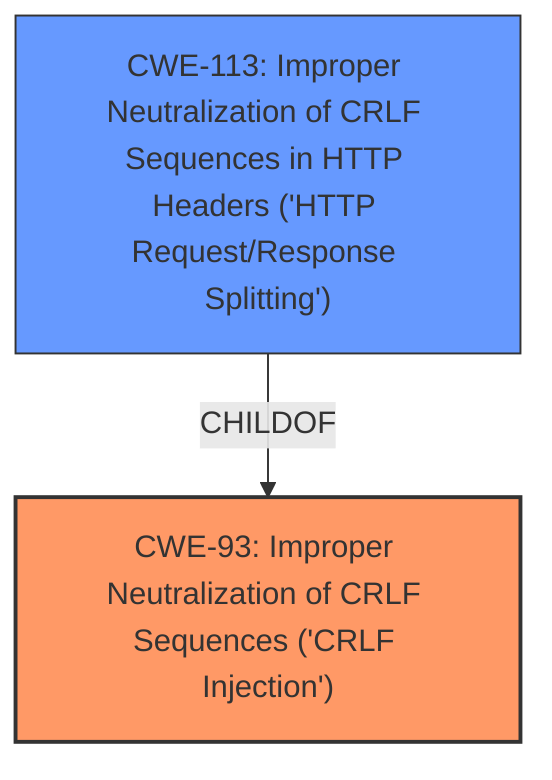

# Analysis Report for CVE-2021-27132

# Vulnerability Analysis Report: CVE-2021-27132

## Description


## Analysis (with Relationship Data)

# Summary
| CWE ID | CWE Name | Confidence | CWE Abstraction Level | CWE Vulnerability Mapping Label | CWE-Vulnerability Mapping Notes |
|---|---|---|---|---|---|
| CWE-93 | Improper Neutralization of CRLF Sequences ('CRLF Injection') | 1.0 | Base | Allowed | Primary CWE |
| CWE-113 | Improper Neutralization of CRLF Sequences in HTTP Headers ('HTTP Request/Response Splitting') | 0.8 | Variant | Allowed | Secondary Candidate |

## Evidence and Confidence

*   **Confidence Score:** 0.9
*   **Evidence Strength:** HIGH

## Relationship Analysis
The primary CWE is CWE-93, which describes the general **improper neutralization of CRLF sequences**. CWE-113 is a Variant of CWE-93 that is specific to HTTP Headers. The vulnerability is clearly a **CRLF Injection** issue. The vulnerability occurs within the context of HTTP Headers, making CWE-113 a relevant but less specific candidate.



## Vulnerability Chain
The vulnerability chain is as follows:
1.  **Root Cause:** **CRLF Injection** (CWE-93) due to **improper sanitization** of input in the download function via the Content-Disposition header.
2.  **Impact:** HTTP header injection, potentially leading to XSS or other attacks.

## Summary of Analysis
Initially, both CWE-93 and CWE-113 seemed like good candidates. However, after analyzing the descriptions, relationships, and the provided vulnerability details, I concluded that CWE-93 is the most appropriate primary CWE. The vulnerability description explicitly mentions **CRLF injection**, which aligns directly with CWE-93. While the injection occurs in HTTP headers, making CWE-113 a relevant variant, CWE-93 captures the fundamental weakness more accurately.
The "CVE Reference Links Content Summary" section provides strong evidence: "The web interface of the Sercomm AGCOMBO VD625-Smart Modem **does not properly sanitize** the input provided in the URL...It takes the provided URL and places it directly into the "Content-Disposition" header...The lack of proper sanitization allows an attacker to inject CRLF characters (`\r\n` or `%0d%0a`) into the "Content-Disposition" header field." This clearly indicates a failure to neutralize CRLF sequences.
The retriever results also indicate CWE-93 as the top candidate.
CWE-74, CWE-79, CWE-89 and CWE-1336 were considered, but deemed less relevant as they represent broader injection categories or different specific injection types (SQL, XSS, Template).

Relevant CWE Information:

# Enhanced Context (25 CWEs)

## CWE-1336: Improper Neutralization of Special Elements Used in a Template Engine
**Abstraction Level**: Base
**Similarity Score**: 0.76
**Source**: dense

**Description**:
The product uses a template engine to insert or process externally-influenced input, but it does not neutralize or incorrectly neutralizes special elements or syntax that can be interpreted as template expressions or other code directives when processed by the engine.
**Not Used:** The vulnerability does not involve a template engine.

## CWE-80: Improper Neutralization of Script-Related HTML Tags in a Web Page (Basic XSS)
**Abstraction Level**: Variant
**Similarity Score**: 0.76
**Source**: dense

**Description**:
The product receives input from an upstream component, but it does not neutralize or incorrectly neutralizes special characters such as "<", ">", and "&" that could be interpreted as web-scripting elements when they are sent to a downstream component that processes web pages.
**Not Used:** While XSS is mentioned as a possible impact, the root cause is **CRLF injection**, not direct injection of script-related HTML tags.

## CWE-74: Improper Neutralization of Special Elements in Output Used by a Downstream Component ('Injection')
**Abstraction Level**: Class
**Similarity Score**: 0.75
**Source**: dense

**Description**:
The product constructs all or part of a command, data structure, or record using externally-influenced input from an upstream component, but it does not neutralize or incorrectly neutralizes special elements that could modify how it is parsed or interpreted when it is sent to a downstream component.
**Not Used:** This is a high-level class. CWE-93 is more specific.

## CWE-917: Improper Neutralization of Special Elements used in an Expression Language Statement ('Expression Language Injection')
**Abstraction Level**: Base
**Similarity Score**: 0.75
**Source**: dense

**Description**:
The product constructs all or part of an expression language (EL) statement in a framework such as a Java Server Page (JSP) using externally-influenced input from an upstream component, but it does not neutralize or incorrectly neutralizes special elements that could modify the intended EL statement before it is executed.
**Not Used:** The vulnerability does not involve an expression language statement.

## CWE-943: Improper Neutralization of Special Elements in Data Query Logic
**Abstraction Level**: Class
**Similarity Score**: 0.73
**Source**: dense

**Description**:
The product generates a query intended to access or manipulate data in a data store such as a database, but it does not neutralize or incorrectly neutralizes special elements that can modify the intended logic of the query.
**Not Used:** The vulnerability does not involve data query logic.

## CWE-184: Incomplete List of Disallowed Inputs
**Abstraction Level**: Base
**Similarity Score**: 0.72
**Source**: dense

**Description**:
The product implements a protection mechanism that relies on a list of inputs (or properties of inputs) that are not allowed by policy or otherwise require other action to neutralize before additional processing takes place, but the list is incomplete.
**Not Used:** There is no evidence of an incomplete list of disallowed inputs being the root cause.

## CWE-113: Improper Neutralization of CRLF Sequences in HTTP Headers ('HTTP Request/Response Splitting')
**Abstraction Level**: Variant
**Similarity Score**: 0.72
**Source**: dense

**Description**:
The product receives data from an HTTP agent/component (e.g., web server, proxy, browser, etc.), but it does not neutralize or incorrectly neutralizes CR and LF characters before the data is included in outgoing HTTP headers.
**Considered:** It is a variant of CWE-93. It is relevant because the **CRLF Injection** occurs in the HTTP Headers. It is marked as a secondary candidate.

## CWE-138: Improper Neutralization of Special Elements
**Abstraction Level**: Class
**Similarity Score**: 0.72
**Source**: dense

**Description**:
The product receives input from an upstream component, but it does not neutralize or incorrectly neutralizes special elements that could be interpreted as control elements or syntactic markers when they are sent to a downstream component.
**Not Used:** CWE-93 is more specific.

## CWE-116: Improper Encoding or Escaping of Output
**Abstraction Level**: Class
**Similarity Score**: 0.72
**Source**: dense

**Description**:
The product prepares a structured message for communication with another component, but encoding or escaping of the data is either missing or done incorrectly. As a result, the intended structure of the message is not preserved.
**Not Used:** Although the injection occurs in the output, this is not about encoding/escaping, it is about the neutralization of CRLF sequences.

## CWE-1236: Improper Neutralization of Formula Elements in a CSV File
**Abstraction Level**: Base
**Similarity Score**: 0.72
**Source**: dense

**Description**:
The product saves user-provided information into a Comma-Separated Value (CSV) file, but it does not neutralize or incorrectly neutralizes special elements that could be interpreted as a command when the file is opened by a spreadsheet product.
**Not Used:** The vulnerability does not involve CSV files.

## CWE-78: Improper Neutralization of Special Elements used in an OS Command ('OS Command Injection')
**Abstraction Level**: base
**Similarity Score**: 4.59
**Source**: graph

**Description**:
CWE-78: Improper Neutralization of Special Elements used in an OS Command ('OS Command Injection')
**Not Used:** This is OS Command Injection.

## CWE-117: Improper Output Neutralization for Logs
**Abstraction Level**: base
**Similarity Score**: 4.33
**Source**: graph

**Description**:
CWE-117: Improper Output Neutralization for Logs
**Not Used:** This is specific to logs.

## CWE-494: Download of Code Without Integrity Check
**Abstraction Level**: base
**Similarity Score**: 4.


## CWE Relationship Analysis

Current CWEs represent these abstraction levels: .


### Vulnerability Chain Analysis

**Chain starting from CWE-113:**
- 113 (Improper Neutralization of CRLF Sequences in HTTP Headers ('HTTP Request/Response Splitting')) - ROOT


**Chain starting from CWE-494:**
- 494 (Download of Code Without Integrity Check) - ROOT


### CWE Relationship Diagram

```mermaid
graph TD
    classDef primary fill:#f96,stroke:#333,stroke-width:2px
    classDef secondary fill:#69f,stroke:#333
    classDef tertiary fill:#9e9,stroke:#333
```


*Report generated on 2025-04-01 19:21:29*
