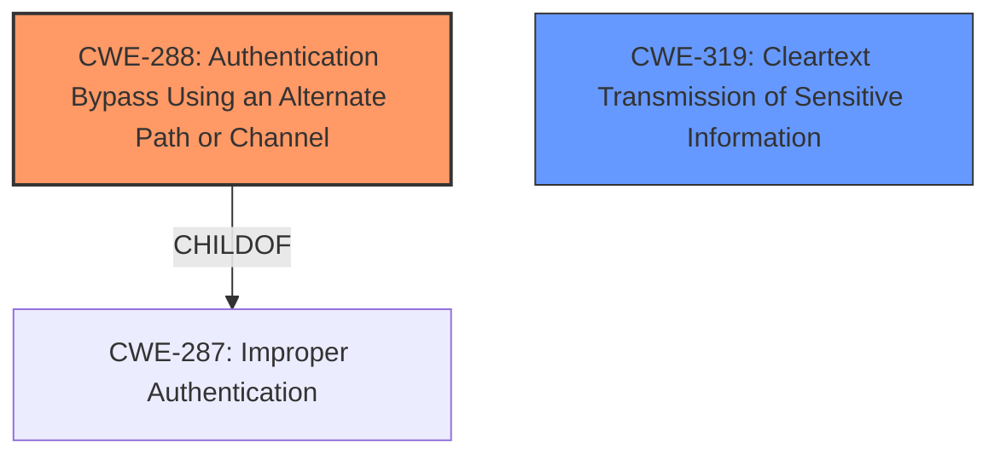

# Raw Analyzer Response for CVE-2021-27177

# Summary
| CWE ID | CWE Name | Confidence | CWE Abstraction Level | CWE Vulnerability Mapping Label | CWE-Vulnerability Mapping Notes |
|---|---|---|---|---|---|
| CWE-288 | Authentication Bypass Using an Alternate Path or Channel | 0.9 | Base | Allowed | Primary CWE. The vulnerability allows bypassing authentication by sending a specific string to the telnet server, which represents an alternate path that does not require authentication. |
| CWE-319 | Cleartext Transmission of Sensitive Information | 0.6 | Base | Allowed | Secondary CWE. Telnet typically transmits data in cleartext, which, while not the primary vulnerability, contributes to the overall risk by exposing the bypassed session to potential eavesdropping. |

## Evidence and Confidence

*   **Confidence Score:** 0.9
*   **Evidence Strength:** HIGH

## Relationship Analysis
The primary CWE is CWE-288, which accurately reflects the authentication bypass using an alternate path. CWE-319 is considered as a secondary weakness, as it relates to the common practice of telnet transmitting data in cleartext, exacerbating the security risk associated with the authentication bypass. There's no direct parent-child or chain relationship strongly influencing the primary mapping decision, though CWE-288 is a child of the broader CWE-287 (Improper Authentication), which was considered but found too general.

## Vulnerability Chain
The vulnerability chain involves the following:
1.  **Root Cause:** **Improper authentication** mechanism allowing bypass via crafted string.
2.  **Weakness:** Authentication bypass (CWE-288).
3.  **Contributing Factor:** Cleartext transmission of telnet (CWE-319).
4.  **Impact:** Unauthorized access to the telnet CLI interface, potentially leading to a root shell on the device.

## Summary of Analysis
The initial assessment focused on the **authentication bypass** vulnerability in the FiberHome HG6245D device. The core issue lies in the device's failure to properly authenticate telnet CLI connections, allowing an attacker to bypass the login prompt by sending a specific string. The provided evidence from the "CVE Reference Links Content Summary" clearly indicates that the **root cause** is a telnet CLI **authentication bypass**.

The primary CWE selection, CWE-288, is strongly supported by the vulnerability description, which states that "It is possible to **bypass authentication** by sending the decoded value of the GgpoZWxwCmxpc3QKd2hvCg== string to the telnet server." This aligns directly with CWE-288's definition of **authentication bypass using an alternate path or channel**.

The secondary CWE, CWE-319, is relevant because telnet connections typically transmit data in cleartext. While the primary vulnerability is the **authentication bypass**, the use of cleartext transmission exacerbates the risk by allowing an attacker to potentially sniff sensitive information transmitted during the compromised session.

The retriever results suggested CWE-259 (Use of Hard-coded Password) and CWE-798 (Use of Hard-coded Credentials), but these were deemed less appropriate because the vulnerability isn't due to a **hard-coded password** or credential but rather the ability to **completely bypass authentication**. Also, CWE-291 (Reliance on IP Address for Authentication) was considered, but the vulnerability does not involve IP address-based authentication.

CWE-288 is at the appropriate level of specificity (Base) because it directly describes the **authentication bypass** issue. CWE-319 is also at the Base level and relevant because it highlights the risk associated with the cleartext transmission typically used by the telnet protocol. These choices are optimal because they accurately represent the **root cause** and a contributing risk factor.

Relevant CWE Information:

## CWE-798: Use of Hard-coded Credentials
**Abstraction Level**: Base
**Similarity Score**: 0.79
**Source**: dense

**Description**:
The product contains **hard-coded credentials**, such as a password or cryptographic key.
**Justification for not using**: Although this CWE was considered due to the similar authentication context, the vulnerability is not due to **hard-coded credentials**, but due to the ability to bypass authentication altogether.

## CWE-303: Incorrect Implementation of Authentication Algorithm
**Abstraction Level**: Base
**Similarity Score**: 0.79
**Source**: dense

**Description**:
The requirements for the product dictate the use of an established authentication algorithm, but the implementation of the algorithm is incorrect.
**Justification for not using**: This CWE doesn't fit, as the issue isn't about the algorithm being implemented incorrectly, but about the ability to bypass authentication altogether.

## CWE-807: Reliance on Untrusted Inputs in a Security Decision
**Abstraction Level**: Base
**Similarity Score**: 0.78
**Source**: dense

**Description**:
The product uses a protection mechanism that relies on the existence or values of an input, but the input can be modified by an untrusted actor in a way that bypasses the protection mechanism.
**Justification for not using**: While there is an untrusted input (the crafted string), the core issue is that sending the crafted string **bypasses the authentication mechanism** rather than modifying a security decision.

## CWE-1391: Use of Weak Credentials
**Abstraction Level**: Class
**Similarity Score**: 0.77
**Source**: dense

**Description**:
The product uses **weak credentials** (such as a default key or **hard-coded password**) that can be calculated, derived, reused, or guessed by an attacker.
**Justification for not using**: The vulnerability doesn't involve **weak credentials** being used, but rather an **authentication bypass**.

## CWE-288: Authentication Bypass Using an Alternate Path or Channel
**Abstraction Level**: Base
**Similarity Score**: 0.77
**Source**: dense

**Description**:
The product requires authentication, but the product has an alternate path or channel that does not require authentication.
**Justification for using**: This CWE perfectly describes the vulnerability, as the crafted string acts as an alternate path **bypassing authentication**.

## CWE-345: Insufficient Verification of Data Authenticity
**Abstraction Level**: Class
**Similarity Score**: 0.76
**Source**: dense

**Description**:
The product does not sufficiently verify the origin or authenticity of data, in a way that causes it to accept invalid data.
**Justification for not using**: The issue isn't about data authenticity verification, but a complete **authentication bypass**.

## CWE-291: Reliance on IP Address for Authentication
**Abstraction Level**: Variant
**Similarity Score**: 0.76
**Source**: dense

**Description**:
The product uses an IP address for authentication.
**Justification for not using**: This CWE is not relevant as the vulnerability does not involve IP-based authentication.

## CWE-294: Authentication Bypass by Capture-replay
**Abstraction Level**: Base
**Similarity Score**: 0.76
**Source**: dense

**Description**:
A capture-replay flaw exists when the design of the product makes it possible for a malicious user to sniff network traffic and bypass authentication by replaying it to the server in question to the same effect as the original message (or with minor changes).
**Justification for not using**: The vulnerability is not about replaying captured traffic, but about sending a specific crafted string.

## CWE-319: Cleartext Transmission of Sensitive Information
**Abstraction Level**: Base
**Similarity Score**: 0.76
**Source**: dense

**Description**:
The product transmits sensitive or security-critical data in cleartext in a communication channel that can be sniffed by unauthorized actors.
**Justification for using**: Telnet typically uses cleartext transmission, which exacerbates the risk associated with the **authentication bypass**, allowing sensitive information to be sniffed.

## CWE-1392: Use of Default Credentials
**Abstraction Level**: Base
**Similarity Score**: 0.76
**Source**: dense

**Description**:
The product uses **default credentials** (such as passwords or cryptographic keys) for potentially critical functionality.
**Justification for not using**: The vulnerability isn't about the use of **default credentials**, but rather an **authentication bypass**.

## CWE-259: Use of Hard-coded Password
**Abstraction Level**: Variant
**Similarity Score**: 6928.85
**Source**: sparse

**Description**:
The product contains a **hard-coded password**, which it uses for its own inbound authentication or for outbound communication to external components.
**Justification for not using**: The vulnerability is not caused by a **hard-coded password**, but by the ability to **bypass authentication** using a crafted string.