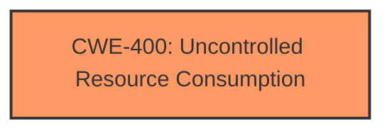

# Raw Analyzer Response for CVE-2021-27179

# Summary
| CWE ID | CWE Name | Confidence | CWE Abstraction Level | CWE Vulnerability Mapping Label | CWE-Vulnerability Mapping Notes |
|---|---|---|---|---|---|
| CWE-400 | Uncontrolled Resource Consumption | 0.7 | Class | Primary | Discouraged |

## Evidence and Confidence

*   **Confidence Score:** 0.7
*   **Evidence Strength:** MEDIUM

## Relationship Analysis
The primary relationship considered was the parent-child relationship, particularly how CWE-400 relates to more specific children like CWE-405, CWE-410, and others. The chain relationship was also considered, but the information was insufficient to accurately trace the chain. The abstraction level influenced the decision to stay at the Class level due to lack of precise details about the resource consumption method.

## Vulnerability Chain
The provided information suggests a simple chain:
1.  Crafted input leads to
2.  **Uncontrolled Resource Consumption**, resulting in
3.  Denial of Service (Impact)

The chain is incomplete because the specific method of resource consumption isn't detailed.

## Summary of Analysis
The initial analysis identified that a specifically crafted string leads to a crash of the telnet daemon, indicating a denial-of-service vulnerability. The **root cause** seems to be in how the `/fh/extend/load_cli` binary handles this malformed input, leading to **uncontrolled resource consumption**.

The selection of CWE-400 is based on the CVE description indicating the telnet daemon crashes due to a specific input string, leading to a denial of service. The **Vulnerability Description Key Phrases** highlights "crash telnet daemon" as the **impact**. The **CVE Reference Links Content Summary** also states that the **root cause** is "sending a specific crafted string to the telnet CLI server causes a crash of the telnet daemon" and mentions a "denial-of-service vulnerability."

The graph relationships, particularly the parent-child relationships, were considered to determine if a more specific CWE could be assigned. However, the lack of details about the exact mechanism of resource consumption makes CWE-400 the most appropriate choice, even though it is a Class-level CWE and discouraged.

Relevant CWE Information:

# Enhanced Context (25 CWEs)
The following CWEs were identified as potentially relevant to this vulnerability:

## CWE-405: Asymmetric Resource Consumption (Amplification)
**Abstraction Level**: Class
**Similarity Score**: 0.77
**Source**: dense

**Description**:
The product does not properly control situations in which an adversary can cause the product to consume or produce excessive resources without requiring the adversary to invest equivalent work or otherwise prove authorization, i.e., the adversary's influence is "asymmetric."

**Mapping Guidance**:
- Usage: Allowed-with-Review
- Rationale: This CWE entry is a Class and might have Base-level children that would be more appropriate

## CWE-400: Uncontrolled Resource Consumption
**Abstraction Level**: Class
**Similarity Score**: 0.76
**Source**: dense

**Description**:
The product does not properly control the allocation and maintenance of a limited resource, thereby enabling an actor to influence the amount of resources consumed, eventually leading to the exhaustion of available resources.

**Mapping Guidance**:
- Usage: Discouraged
- Rationale: CWE-400 is intended for incorrect behaviors in which the product is expected to track and restrict how many resources it consumes, but CWE-400 is often misused because it is conflated with the "technical impact" of vulnerabilities in which resource consumption occurs. It is sometimes used for low-information vulnerability reports. It is a level-1 Class (i.e., a child of a Pillar).

### Considered and Rejected CWEs

*   **CWE-78: Improper Neutralization of Special Elements used in an OS Command ('OS Command Injection')**: While the telnet daemon is crashing, there is no clear evidence that this is due to command injection. The provided information is too vague.
*   **CWE-787: Out-of-bounds Write** and **CWE-125: Out-of-bounds Read**: These are memory corruption issues. There is no evidence of memory corruption. The telnet daemon crashing could be due to other reasons.
*   **CWE-20: Improper Input Validation**: Too generic. While improper input validation is likely occurring, the lack of specificity makes this less suitable than CWE-400.
*   **CWE-789: Memory Allocation with Excessive Size Value**: There's no explicit mention of memory allocation issues.
*   **CWE-405: Asymmetric Resource Consumption (Amplification)**: The information provided does not allow determining if the resource consumption is asymmetric.
*   **CWE-410: Insufficient Resource Pool**: This is about the size of the resource pool being insufficient. This does not seem to be the case here.
*   **CWE-799: Improper Control of Interaction Frequency**: While DoS can be caused by high frequency, the description does not mention frequency of interactions being the issue, but rather a specific string.

The decision to use CWE-400 is based on the **root cause** being a crafted string leading to a denial of service. While the mapping guidance discourages using CWE-400, the lack of more specific information about the nature of the resource consumption makes it the most appropriate choice. The confidence is 0.7 due to the generality of CWE-400 and the possibility of a more specific CWE being applicable with more information.