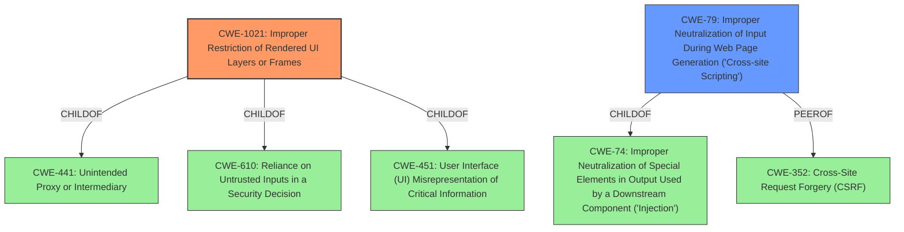

# Analysis Report for CVE-2021-27182

# Vulnerability Analysis Report: CVE-2021-27182

## Description


## Analysis (with Relationship Data)

# Summary
| CWE ID    | CWE Name                                                                       | Confidence | CWE Abstraction Level | CWE Vulnerability Mapping Label | CWE-Vulnerability Mapping Notes |
| :-------- | :----------------------------------------------------------------------------- | :--------- | :---------------------- | :------------------------------ | :------------------------------ |
| CWE-1021  | Improper Restriction of Rendered UI Layers or Frames                          | 0.80       | Base                    | Allowed                         | Primary CWE                     |
| CWE-79    | Improper Neutralization of Input During Web Page Generation ('Cross-site Scripting') | 0.60       | Base                    | Allowed                         | Secondary Candidate             |

## Evidence and Confidence

*   **Confidence Score:** 0.70
*   **Evidence Strength:** MEDIUM

## Relationship Analysis
The primary CWE, CWE-1021 (Improper Restriction of Rendered UI Layers or Frames), is a Base level CWE, focusing on the lack of restrictions on frame objects, aligning directly with the iframe injection described. It is related to CWE-441 (Unintended Proxy or Intermediary) and CWE-610 (Reliance on Untrusted Inputs in a Security Decision) as parent-child relationships and CWE-451 (User Interface (UI) Misrepresentation of Critical Information) as a parent-child relationship.

CWE-79 (Improper Neutralization of Input During Web Page Generation ('Cross-site Scripting')) is a Base level CWE. It is a ChildOf CWE-74 (Improper Neutralization of Special Elements in Output Used by a Downstream Component ('Injection')) and PeerOf CWE-352 (Cross-Site Request Forgery (CSRF)). The relationship with CWE-74 suggests that XSS vulnerabilities can arise from a broader failure to neutralize special elements.



## Vulnerability Chain
The chain starts with the **iframe injection** (**weakness**).
This can lead to an attacker performing actions with the privileges of the attacked user (**impact**).

## Summary of Analysis
Initially, the analysis focused on identifying the root cause of the vulnerability. The vulnerability description clearly states an **iframe injection** issue. The "CVE Reference Links Content Summary" section confirms this by highlighting the ability to inject an iframe.

The Retriever results point to CWE-1021 (Improper Restriction of Rendered UI Layers or Frames) as the top candidate. This CWE directly addresses the **weakness** of improper restrictions on frame objects, making it a precise match for the iframe injection vulnerability. The description of CWE-1021 clearly states, "The web application does not restrict or incorrectly restricts frame objects or UI layers that belong to another application or domain, which can lead to user confusion about which interface the user is interacting with." This aligns perfectly with the vulnerability description.

CWE-79 (Improper Neutralization of Input During Web Page Generation ('Cross-site Scripting')) was considered as a secondary candidate. While iframe injection could lead to XSS, the primary **weakness** is the lack of frame restriction, making CWE-1021 the more direct and appropriate classification.

The selection of CWE-1021 is at the optimal level of specificity because it is a Base level CWE that directly describes the **weakness**. The evidence from the vulnerability description and the CVE summary strongly supports this classification. The usage guidance for CWE-1021 allows its use and the rationale is that "This CWE entry is at the Base level of abstraction, which is a preferred level of abstraction for mapping to the root causes of vulnerabilities."

Other CWEs Considered but Not Used:

*   CWE-74, CWE-138, CWE-790: These are related to improper neutralization or filtering of special elements, which is a broader category. While iframe injection might involve special elements, the core issue is the lack of frame restriction.
*   CWE-93, CWE-113: These are related to CRLF injection, which is not directly relevant to the described vulnerability.
*   CWE-89: This is related to SQL injection, which is not relevant to the described vulnerability.
*   CWE-863: This is related to Incorrect Authorization, which is a consequence of the vulnerability but not the root cause.


## CWE Relationship Analysis

Current CWEs represent these abstraction levels: .


### Vulnerability Chain Analysis

**Chain starting from CWE-113:**
- 113 (Improper Neutralization of CRLF Sequences in HTTP Headers ('HTTP Request/Response Splitting')) - ROOT


**Chain starting from CWE-79:**
- 79 (Improper Neutralization of Input During Web Page Generation ('Cross-site Scripting')) - ROOT


### CWE Relationship Diagram

```mermaid
graph TD
    classDef primary fill:#f96,stroke:#333,stroke-width:2px
    classDef secondary fill:#69f,stroke:#333
    classDef tertiary fill:#9e9,stroke:#333
```


*Report generated on 2025-04-02 07:21:47*
