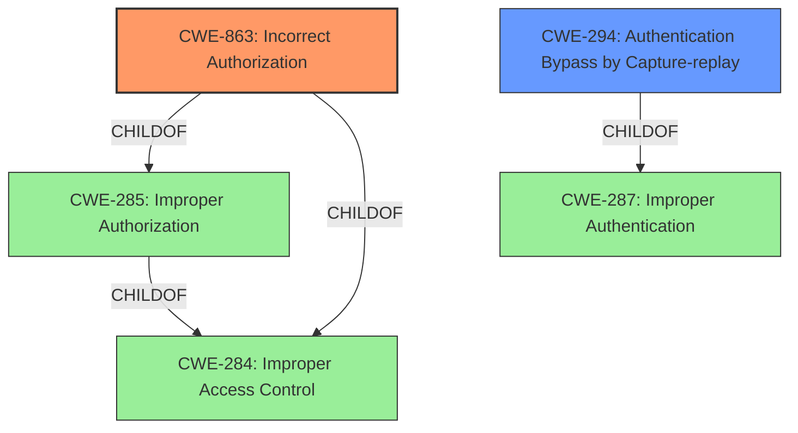

# Analysis for CVE-2021-27195

# Summary
| CWE ID | CWE Name | Confidence | CWE Abstraction Level | CWE Vulnerability Mapping Label | CWE-Vulnerability Mapping Notes |
|---|---|---|---|---|---|
| CWE-863 | Incorrect Authorization | 0.9 | Class | Primary | Allowed-with-Review |
| CWE-294 | Authentication Bypass by Capture-replay | 0.7 | Base | Secondary | Allowed |
| CWE-287 | Improper Authentication | 0.4 | Class | Candidate | Discouraged |

## Evidence and Confidence

*   **Confidence Score:** 0.8
*   **Evidence Strength:** HIGH

## Relationship Analysis
The primary CWE is CWE-863 (Incorrect Authorization), which is a child of CWE-285 (Improper Authorization) and CWE-284 (Improper Access Control). CWE-294 (Authentication Bypass by Capture-replay) is related as a potential method of exploiting the authorization flaw. CWE-287 (Improper Authentication) is a parent of CWE-306, and could be related, but is less specific than CWE-863.

## Vulnerability Chain
The vulnerability chain involves an **improper authorization** flaw, leading to the possibility of an attacker replaying network traffic to execute arbitrary commands on student machines.

## Summary of Analysis
The initial assessment, based on the provided evidence, indicates that the vulnerability is primarily due to **improper authorization**, as stated in both the vulnerability description and the CVE reference. The ability to replay network traffic is a consequence of this **improper authorization**.

The evidence supporting this includes:
*   **Vulnerability Description Key Phrases**: "**rootcause:** **Improper Authorization**"
*   **CVE Reference Links Content Summary**: "**root_cause**: Incorrect authorization and lack of proper access controls in the Netop Vision Pro software."; "**weaknesses**: [\"CWE-863: Incorrect Authorization\"]"; "**impact**: An attacker can emulate a teacher's connection and execute arbitrary commands on student machines, leading to remote code execution with the privileges of the logged-in user."

CWE-863 (Incorrect Authorization) aligns well with the described vulnerability. The CVE reference explicitly mentions CWE-863. While CWE-285 (Improper Authorization) is a parent, CWE-863 is more specific. CWE-294 (Authentication Bypass by Capture-replay) is a plausible attack vector given the **improper authorization**.

The relationship graph helped visualize the connections between authorization-related CWEs. The primary CWE, CWE-863, is at the Class level of abstraction, which is acceptable given the available information.

I am confident in this assessment due to the direct evidence from the vulnerability description and the CVE reference.

Relevant CWE Information:
# Enhanced Context (25 CWEs)
The following CWEs were identified as potentially relevant to this vulnerability:

## CWE-303: Incorrect Implementation of Authentication Algorithm
**Abstraction Level**: Base
**Similarity Score**: 0.77
**Source**: dense

**Description**:
The requirements for the product dictate the use of an established authentication algorithm, but the implementation of the algorithm is incorrect.
**Rationale for not selecting**: The vulnerability isn't about incorrect implementation, but more about incorrect authorization so this does not apply.

## CWE-807: Reliance on Untrusted Inputs in a Security Decision
**Abstraction Level**: Base
**Similarity Score**: 0.76
**Source**: dense

**Description**:
The product uses a protection mechanism that relies on the existence or values of an input, but the input can be modified by an untrusted actor in a way that bypasses the protection mechanism.
**Rationale for not selecting**: While related to security decisions, this isn't the central issue, which is about incorrect authorization.

## CWE-1390: Weak Authentication
**Abstraction Level**: Class
**Similarity Score**: 0.76
**Source**: dense

**Description**:
The product uses an authentication mechanism to restrict access to specific users or identities, but the mechanism does not sufficiently prove that the claimed identity is correct.
**Rationale for not selecting**: The vulnerability is related to authorization, not the strength of authentication.

## CWE-639: Authorization Bypass Through User-Controlled Key
**Abstraction Level**: Base
**Similarity Score**: 0.75
**Source**: dense

**Description**:
The system's authorization functionality does not prevent one user from gaining access to another user's data or record by modifying the key value identifying the data.
**Rationale for not selecting**: This is about modifying key values, which is not mentioned in the description.

## CWE-302: Authentication Bypass by Assumed-Immutable Data
**Abstraction Level**: Base
**Similarity Score**: 0.75
**Source**: dense

**Description**:
The authentication scheme or implementation uses key data elements that are assumed to be immutable, but can be controlled or modified by the attacker.
**Rationale for not selecting**: This is about assumed immutable data, which is not mentioned in the description.

## CWE-289: Authentication Bypass by Alternate Name
**Abstraction Level**: Base
**Similarity Score**: 0.75
**Source**: dense

**Description**:
The product performs authentication based on the name of a resource being accessed, or the name of the actor performing the access, but it does not properly check all possible names for that resource or actor.
**Rationale for not selecting**: The vulnerability is not based on an alternate name.

## CWE-288: Authentication Bypass Using an Alternate Path or Channel
**Abstraction Level**: Base
**Similarity Score**: 0.75
**Source**: dense

**Description**:
The product requires authentication, but the product has an alternate path or channel that does not require authentication.
**Rationale for not selecting**: There is no mention of an alternate channel or path.

## CWE-294: Authentication Bypass by Capture-replay
**Abstraction Level**: Base
**Similarity Score**: 0.75
**Source**: dense

**Description**:
A capture-replay flaw exists when the design of the product makes it possible for a malicious user to sniff network traffic and bypass authentication by replaying it to the server in question to the same effect as the original message (or with minor changes).
**Rationale for selecting**: Although the primary weakness is improper authorization, the impact is that an attacker can replay network traffic to bypass authentication. This can be a secondary CWE to consider.

## CWE-1391: Use of Weak Credentials
**Abstraction Level**: Class
**Similarity Score**: 0.75
**Source**: dense

**Description**:
The product uses weak credentials (such as a default key or hard-coded password) that can be calculated, derived, reused, or guessed by an attacker.
**Rationale for not selecting**: This is about weak credentials, which is not mentioned in the description.

## CWE-274: Improper Handling of Insufficient Privileges
**Abstraction Level**: Base
**Similarity Score**: 0.74
**Source**: dense

**Description**:
The product does not handle or incorrectly handles when it has insufficient privileges to perform an operation, leading to resultant weaknesses.
**Rationale for not selecting**: This is about handling insufficient privileges, which is not mentioned in the description.

## CWE-639: Authorization Bypass Through User-Controlled Key
**Abstraction Level**: Base
**Similarity Score**: 6331.95
**Source**: sparse

**Description**:
The system's authorization functionality does not prevent one user from gaining access to another user's data or record by modifying the key value identifying the data.
**Rationale for not selecting**: This is about modifying key values, which is not mentioned in the description.

## CWE-863: Incorrect Authorization
**Abstraction Level**: Class
**Similarity Score**: 6160.14
**Source**: sparse

**Description**:
The product performs an authorization check when an actor attempts to access a resource or perform an action, but it does not correctly perform the check.
**Rationale for selecting**: This is the primary weakness as described in the vulnerability description and the CVE reference.

## CWE-285: Improper Authorization
**Abstraction Level**: Class
**Similarity Score**: 6065