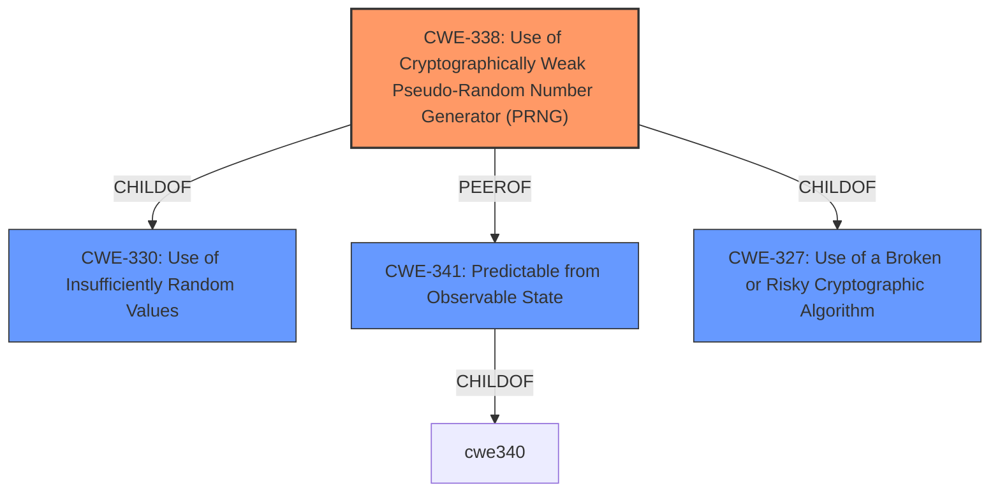

# Enhanced Analysis for CVE-2021-27200

# Summary
| CWE ID | CWE Name | Confidence | CWE Abstraction Level | CWE Vulnerability Mapping Label | CWE-Vulnerability Mapping Notes |
|---|---|---|---|---|---|
| CWE-338 | Use of Cryptographically Weak Pseudo-Random Number Generator (PRNG) | 0.85 | Base | Primary | Allowed |
| CWE-341 | Predictable from Observable State | 0.75 | Base | Secondary | Allowed |
| CWE-327 | Use of a Broken or Risky Cryptographic Algorithm | 0.65 | Class | Secondary | Allowed-with-Review |

## Evidence and Confidence

*   **Confidence Score:** 0.80
*   **Evidence Strength:** HIGH

## Relationship Analysis
The primary CWE is CWE-338, representing the use of a weak PRNG. This is related to CWE-330 (Use of Insufficiently Random Values) as a child. CWE-341 (Predictable from Observable State) is also relevant as the PRNG's output is predictable due to the weak algorithm. CWE-327 (Use of a Broken or Risky Cryptographic Algorithm) is a broader classification that could encompass the use of a weak PRNG.



## Vulnerability Chain
The vulnerability chain starts with the **weak cryptographic algorithm** used for generating the password reset code. This leads to a predictable code parameter in the password reset link, which allows remote attackers to take over any account.

## Summary of Analysis
The initial analysis focused on the **weak cryptographic algorithm** used in `recover.php`. The high retriever scores for CWE-338 (Use of Cryptographically Weak Pseudo-Random Number Generator (PRNG)), CWE-341 (Predictable from Observable State), and CWE-327 (Use of a Broken or Risky Cryptographic Algorithm) indicated these as good candidates.

The vulnerability description states: "remote attackers can take over any account due to the **weak cryptographic algorithm** in recover.php. The code parameter is easily predicted from the time of day." The CVE Reference Links Content Summary elaborates, "The vulnerability stems from a **weak cryptographic algorithm** used in the `recover.php` file of the WoWonder Social Network Platform. Specifically, the "code" parameter in the password reset link is predictable" and "The password reset code is not generated using a secure random process. It is derived by combining the password reset link time with a random number between 111 and 999. The time component is predictable, and the random value has a small range, making the code guessable."

CWE-338 is selected as the primary because the PRNG is specifically mentioned. CWE-341 is secondary because the predictability is a direct consequence of the PRNG's weakness, "A number or object is predictable based on observations that the attacker can make about the state of the system or network, such as time, process ID, etc." The vulnerability description specifically mentions that the code parameter is "easily predicted from the time of day." CWE-327 is considered a more general Class that describes the root cause.

The selected CWEs are at the optimal level of specificity. CWE-338 is more specific than its parent CWE-330, and CWE-341 provides a more specific weakness than a more general predictable value.

Relevant CWE Information:

# Enhanced Context (25 CWEs)

## CWE-1240: Use of a Cryptographic Primitive with a Risky Implementation
Was considered, but the root cause is more specifically a PRNG.

## CWE-1391: Use of Weak Credentials
Not applicable as the issue is in code generation, not credential storage.

## CWE-328: Use of Weak Hash
Not applicable as the vulnerability is not about a weak hash function.

## CWE-916: Use of Password Hash With Insufficient Computational Effort
Not applicable since the problem is not with password hashing.

## CWE-330: Use of Insufficiently Random Values
Considered, but CWE-338 is more specific since it concerns a PRNG.

## CWE-321: Use of Hard-coded Cryptographic Key
Not applicable since no hardcoded key is involved.

## CWE-798: Use of Hard-coded Credentials
Not applicable since no hardcoded credentials are used.

## CWE-331: Insufficient Entropy
Not specific enough. This is more directly related to a predictable PRNG.

## CWE-1204: Generation of Weak Initialization Vector (IV)
Not applicable since IVs are not relevant to the described vulnerability.

## CWE-335: Incorrect Usage of Seeds in Pseudo-Random Number Generator (PRNG)
The description does not mention incorrect usage of seeds, but the weak algorithm itself.

## CWE-804: Guessable CAPTCHA
Not applicable as the vulnerability doesn't involve CAPTCHAs.

## CWE-259: Use of Hard-coded Password
Not applicable since the vulnerability doesn't involve hard-coded passwords.

## CWE-341: Predictable from Observable State
Secondary candidate since the code parameter is predictable from the time of day due to the weak PRNG.

## CWE-640: Weak Password Recovery Mechanism for Forgotten Password
Password recovery is involved, but the root cause is the PRNG and resulting predictable code, not the recovery mechanism itself.

## CWE-208: Observable Timing Discrepancy
Not applicable to this vulnerability.

## CWE-613: Insufficient Session Expiration
Not applicable to this vulnerability.

## CWE-1291: Public Key Re-Use for Signing both Debug and Production Code
Not applicable to this vulnerability.

## CWE-301: Reflection Attack in an Authentication Protocol
Not applicable to this vulnerability.

## CWE-311: Missing Encryption of Sensitive Data
Not applicable to this vulnerability.

## CWE-339: Small Seed Space in PRNG
The description does not mention a small seed space, but the weak algorithm itself.


## CWE Relationship Analysis

Current CWEs represent these abstraction levels: .


### Vulnerability Chain Analysis

**Chain starting from CWE-640:**
- 640 (Weak Password Recovery Mechanism for Forgotten Password) - ROOT


**Chain starting from CWE-335:**
- 335 (Incorrect Usage of Seeds in Pseudo-Random Number Generator (PRNG)) - ROOT


### CWE Relationship Diagram

```mermaid
graph TD
    classDef primary fill:#f96,stroke:#333,stroke-width:2px
    classDef secondary fill:#69f,stroke:#333
    classDef tertiary fill:#9e9,stroke:#333
```