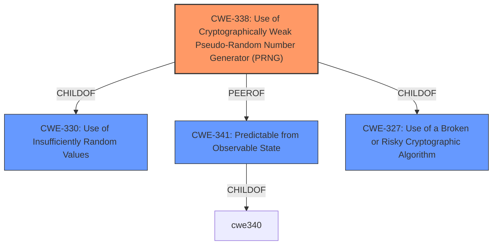

# Analysis for CVE-2021-27200

# Summary
| CWE ID | CWE Name | Confidence | CWE Abstraction Level | CWE Vulnerability Mapping Label | CWE-Vulnerability Mapping Notes |
|---|---|---|---|---|---|
| CWE-338 | Use of Cryptographically Weak Pseudo-Random Number Generator (PRNG) | 0.85 | Base | Primary | Allowed |
| CWE-341 | Predictable from Observable State | 0.75 | Base | Secondary | Allowed |
| CWE-327 | Use of a Broken or Risky Cryptographic Algorithm | 0.65 | Class | Secondary | Allowed-with-Review |

## Evidence and Confidence

*   **Confidence Score:** 0.80
*   **Evidence Strength:** HIGH

## Relationship Analysis
The primary CWE is CWE-338, representing the use of a weak PRNG. This is related to CWE-330 (Use of Insufficiently Random Values) as a child. CWE-341 (Predictable from Observable State) is also relevant as the PRNG's output is predictable due to the weak algorithm. CWE-327 (Use of a Broken or Risky Cryptographic Algorithm) is a broader classification that could encompass the use of a weak PRNG.

## Vulnerability Chain
The vulnerability chain starts with the **weak cryptographic algorithm** used for generating the password reset code. This leads to a predictable code parameter in the password reset link, which allows remote attackers to take over any account.

## Summary of Analysis
The initial analysis focused on the **weak cryptographic algorithm** used in `recover.php`. The high retriever scores for CWE-338 (Use of Cryptographically Weak Pseudo-Random Number Generator (PRNG)), CWE-341 (Predictable from Observable State), and CWE-327 (Use of a Broken or Risky Cryptographic Algorithm) indicated these as good candidates.

The vulnerability description states: "remote attackers can take over any account due to the **weak cryptographic algorithm** in recover.php. The code parameter is easily predicted from the time of day." The CVE Reference Links Content Summary elaborates, "The vulnerability stems from a **weak cryptographic algorithm** used in the `recover.php` file of the WoWonder Social Network Platform. Specifically, the "code" parameter in the password reset link is predictable" and "The password reset code is not generated using a secure random process. It is derived by combining the password reset link time with a random number between 111 and 999. The time component is predictable, and the random value has a small range, making the code guessable."

CWE-338 is selected as the primary because the PRNG is specifically mentioned. CWE-341 is secondary because the predictability is a direct consequence of the PRNG's weakness, "A number or object is predictable based on observations that the attacker can make about the state of the system or network, such as time, process ID, etc." The vulnerability description specifically mentions that the code parameter is "easily predicted from the time of day." CWE-327 is considered a more general Class that describes the root cause.

The selected CWEs are at the optimal level of specificity. CWE-338 is more specific than its parent CWE-330, and CWE-341 provides a more specific weakness than a more general predictable value.

Relevant CWE Information:

# Enhanced Context (25 CWEs)

## CWE-1240: Use of a Cryptographic Primitive with a Risky Implementation
Was considered, but the root cause is more specifically a PRNG.

## CWE-1391: Use of Weak Credentials
Not applicable as the issue is in code generation, not credential storage.

## CWE-328: Use of Weak Hash
Not applicable as the vulnerability is not about a weak hash function.

## CWE-916: Use of Password Hash With Insufficient Computational Effort
Not applicable since the problem is not with password hashing.

## CWE-330: Use of Insufficiently Random Values
Considered, but CWE-338 is more specific since it concerns a PRNG.

## CWE-321: Use of Hard-coded Cryptographic Key
Not applicable since no hardcoded key is involved.

## CWE-798: Use of Hard-coded Credentials
Not applicable since no hardcoded credentials are used.

## CWE-331: Insufficient Entropy
Not specific enough. This is more directly related to a predictable PRNG.

## CWE-1204: Generation of Weak Initialization Vector (IV)
Not applicable since IVs are not relevant to the described vulnerability.

## CWE-335: Incorrect Usage of Seeds in Pseudo-Random Number Generator (PRNG)
The description does not mention incorrect usage of seeds, but the weak algorithm itself.

## CWE-804: Guessable CAPTCHA
Not applicable as the vulnerability doesn't involve CAPTCHAs.

## CWE-259: Use of Hard-coded Password
Not applicable since the vulnerability doesn't involve hard-coded passwords.

## CWE-341: Predictable from Observable State
Secondary candidate since the code parameter is predictable from the time of day due to the weak PRNG.

## CWE-640: Weak Password Recovery Mechanism for Forgotten Password
Password recovery is involved, but the root cause is the PRNG and resulting predictable code, not the recovery mechanism itself.

## CWE-208: Observable Timing Discrepancy
Not applicable to this vulnerability.

## CWE-613: Insufficient Session Expiration
Not applicable to this vulnerability.

## CWE-1291: Public Key Re-Use for Signing both Debug and Production Code
Not applicable to this vulnerability.

## CWE-301: Reflection Attack in an Authentication Protocol
Not applicable to this vulnerability.

## CWE-311: Missing Encryption of Sensitive Data
Not applicable to this vulnerability.

## CWE-339: Small Seed Space in PRNG
The description does not mention a small seed space, but the weak algorithm itself.

# Enhanced Query for CVE-2021-27200

## Vulnerability Description
In WoWonder 3.0.4, remote attackers can take over any account due to the **weak cryptographic algorithm** in recover.php. The code parameter is easily predicted from the time of day.

### Vulnerability Description Key Phrases
- **rootcause:** **weak cryptographic algorithm**
- **impact:** take over any account
- **vector:** predicting code parameter
- **attacker:** remote attackers
- **product:** WoWonder
- **version:** 3.0.4
- **component:** recover.php

## CVE Reference Links Content Summary
Based on the provided content, here's a breakdown of the vulnerability:

**Root Cause:**
- The vulnerability stems from a weak cryptographic algorithm used in the `recover.php` file of the WoWonder Social Network Platform. Specifically, the "code" parameter in the password reset link is predictable.

**Weaknesses/Vulnerabilities:**
- **Weak Cryptography:** The password reset code is not generated using a secure random process. It is derived by combining the password reset link time with a random number between 111 and 999. The time component is predictable, and the random value has a small range, making the code guessable.
- **Authentication Bypass:** By predicting the password reset code, an attacker can bypass the intended authentication mechanism for resetting passwords and gain unauthorized access to accounts.

**Impact of Exploitation:**
- **Account Takeover:** An attacker can take over any user account on the WoWonder platform.
- **Complete System Compromise:** If successful, an attacker could potentially access and control all accounts, potentially leading to a complete compromise of the WoWonder application and its data.

**Attack Vectors:**
- **Network Access:** The attack is performed over the network by sending crafted HTTP requests.
- **Password Reset Functionality:** The vulnerability is triggered through the password reset functionality of the application.

**Required Attacker Capabilities/Position:**
- **Network Access:**  The attacker needs network access to the target WoWonder instance.
- **Email Address:** The attacker must know a valid email address registered on the WoWonder platform to initiate the password reset process.
- **Code Execution:** The provided exploit code utilizes Python, requiring the attacker to be capable of executing such code to generate valid reset codes.
- **Timing:** While not explicitly stated, the effectiveness of the attack may rely on generating the reset code near the time the password reset link was generated.

**Additional Information:**
- The vulnerability was discovered by the "Security For Everyone Team".
- The vulnerability is present in WoWonder versions prior to 3.1.
- The vendor has released a fix in version 3.1, and users are advised to update.
- The exploit code demonstrates how to predict the password reset code using a combination of the server response date and a range of numbers.

The provided content gives a more detailed explanation than the placeholder CVE description.

## Retriever Results

### Top Combined Results

| Rank | CWE ID | Name | Abstraction | Usage  | Retrievers | Individual Scores |
|------|--------|------|-------------|-------|------------|-------------------|
| 1 | 341 | Predictable from Observable State | Base | Allowed | sparse | 0.334 |
| 2 | 338 | Use of Cryptographically Weak Pseudo-Random Number Generator (PRNG) | Base | Allowed | sparse | 0.247 |
| 3 | 330 | Use of Insufficiently Random Values | Class | Discouraged | sparse | 0.243 |
| 4 | 916 | Use of Password Hash With Insufficient Computational Effort | Base | Allowed | sparse | 0.242 |
| 5 | 327 | Use of a Broken or Risky Cryptographic Algorithm | Class | Allowed-with-Review | sparse | 0.240 |
| 6 | 640 | Weak Password Recovery Mechanism for Forgotten Password | Base | Allowed-with-Review | dense | 0.560 |
| 7 | 804 | Guessable CAPTCHA | Base | Allowed | graph | 0.002 |
| 8 | 328 | Use of Weak Hash | Base | Allowed | sparse | 0.238 |
| 9 | 1240 | Use of a Cryptographic Primitive with a Risky Implementation | Base | Allowed | sparse | 0.237 |
| 10 | 321 | Use of Hard-coded Cryptographic Key | Variant | Allowed | sparse | 0.211 |

# Complete CWE Specifications

## CWE-341: Predictable from Observable State
**Abstraction:** Base
**Status:** Draft

### Description
A number or object is predictable based on observations that the attacker can make about the state of the system or network, such as time, process ID, etc.

### Extended Description
Not provided

### Alternative Terms
None

### Relationships
ChildOf -> CWE-340

### Mapping Guidance
**Usage:** Allowed
**Rationale:** This CWE entry is at the Base level of abstraction, which is a preferred level of abstraction for mapping to the root causes of vulnerabilities.
**Comments:** Carefully read both the name and description to ensure that this mapping is an appropriate fit. Do not try to 'force' a mapping to a lower-level Base/Variant simply to comply with this preferred level of abstraction.
**Reasons:**
- Acceptable-Use

### Additional Notes
**[Maintenance]** As of CWE 4.5, terminology related to randomness, entropy, and predictability can vary widely. Within the developer and other communities, "randomness" is used heavily. However, within cryptography, "entropy" is distinct, typically implied as a measurement. There are no commonly-used definitions, even within standards documents and cryptography papers. Future versions of CWE will attempt to define these terms and, if necessary, distinguish between them in ways that are appropriate for different communities but do not reduce the usability of CWE for mapping, understanding, or other scenarios.

### Observed Examples
- **CVE-2002-0389:** Mail server stores private mail messages with predictable filenames in a world-executable directory, which allows local users to read private mailing list archives.
- **CVE-2001-1141:** PRNG allows attackers to use the output of small PRNG requests to determine the internal state information, which could be used by attackers to predict future pseudo-random numbers.
- **CVE-2000-0335:** DNS resolver library uses predictable IDs, which allows a local attacker to spoof DNS query results.

## CWE-338: Use of Cryptographically Weak Pseudo-Random Number Generator (PRNG)
**Abstraction:** Base
**Status:** Draft

### Description
The product uses a Pseudo-Random Number Generator (PRNG) in a security context, but the PRNG's algorithm is not cryptographically strong.

### Extended Description

When a non-cryptographic PRNG is used in a cryptographic context, it can expose the cryptography to certain types of attacks.

Often a pseudo-random number generator (PRNG) is not designed for cryptography. Sometimes a mediocre source of randomness is sufficient or preferable for algorithms that use random numbers. Weak generators generally take less processing power and/or do not use the precious, finite, entropy sources on a system. While such PRNGs might have very useful features, these same features could be used to break the cryptography.

### Alternative Terms
None

### Relationships
ChildOf -> CWE-330
ChildOf -> CWE-330

### Mapping Guidance
**Usage:** Allowed
**Rationale:** This CWE entry is at the Base level of abstraction, which is a preferred level of abstraction for mapping to the root causes of vulnerabilities.
**Comments:** Carefully read both the name and description to ensure that this mapping is an appropriate fit. Do not try to 'force' a mapping to a lower-level Base/Variant simply to comply with this preferred level of abstraction.
**Reasons:**
- Acceptable-Use

### Additional Notes
**[Maintenance]** As of CWE 4.5, terminology related to randomness, entropy, and predictability can vary widely. Within the developer and other communities, "randomness" is used heavily. However, within cryptography, "entropy" is distinct, typically implied as a measurement. There are no commonly-used definitions, even within standards documents and cryptography papers. Future versions of CWE will attempt to define these terms and, if necessary, distinguish between them in ways that are appropriate for different communities but do not reduce the usability of CWE for mapping, understanding, or other scenarios.

### Observed Examples
- **CVE-2021-3692:** PHP framework uses mt_rand() function (Marsenne Twister) when generating tokens
- **CVE-2009-3278:** Crypto product uses rand() library function to generate a recovery key, making it easier to conduct brute force attacks.
- **CVE-2009-3238:** Random number generator can repeatedly generate the same value.

## CWE-330: Use of Insufficiently Random Values
**Abstraction:** Class
**Status:** Stable

### Description
The product uses insufficiently random numbers or values in a security context that depends on unpredictable numbers.

### Extended Description
When product generates predictable values in a context requiring unpredictability, it may be possible for an attacker to guess the next value that will be generated, and use this guess to impersonate another user or access sensitive information.

### Alternative Terms
None

### Relationships
ChildOf -> CWE-693
CanPrecede -> CWE-804

### Mapping Guidance
**Usage:** Discouraged
**Rationale:** This CWE entry is a level-1 Class (i.e., a child of a Pillar). It might have lower-level children that would be more appropriate
**Comments:** Examine children of this entry to see if there is a better fit
**Reasons:**
- Abstraction

### Additional Notes
**[Relationship]** This can be primary to many other weaknesses such as cryptographic errors, authentication errors, symlink following, information leaks, and others.

**[Maintenance]** As of CWE 4.3, CWE-330 and its descendants are being investigated by the CWE crypto team to identify gaps related to randomness and unpredictability, as well as the relationships between randomness and cryptographic primitives. This "subtree analysis" might result in the addition or deprecation of existing entries; the reorganization of relationships in some views, e.g. the research view (CWE-1000); more consistent use of terminology; and/or significant modifications to related entries.

**[Maintenance]** As of CWE 4.5, terminology related to randomness, entropy, and predictability can vary widely. Within the developer and other communities, "randomness" is used heavily. However, within cryptography, "entropy" is distinct, typically implied as a measurement. There are no commonly-used definitions, even within standards documents and cryptography papers. Future versions of CWE will attempt to define these terms and, if necessary, distinguish between them in ways that are appropriate for different communities but do not reduce the usability of CWE for mapping, understanding, or other scenarios.

### Observed Examples
- **CVE-2021-3692:** PHP framework uses mt_rand() function (Marsenne Twister) when generating tokens
- **CVE-2020-7010:** Cloud application on Kubernetes generates passwords using a weak random number generator based on deployment time.
- **CVE-2009-3278:** Crypto product uses rand() library function to generate a recovery key, making it easier to conduct brute force attacks.

## CWE-916: Use of Password Hash With Insufficient Computational Effort
**Abstraction:** Base
**Status:** Incomplete

### Description
The product generates a hash for a password, but it uses a scheme that does not provide a sufficient level of computational effort that would make password cracking attacks infeasible or expensive.

### Extended Description

Many password storage mechanisms compute a hash and store the hash, instead of storing the original password in plaintext. In this design, authentication involves accepting an incoming password, computing its hash, and comparing it to the stored hash.

Many hash algorithms are designed to execute quickly with minimal overhead, even cryptographic hashes. However, this efficiency is a problem for password storage, because it can reduce an attacker's workload for brute-force password cracking. If an attacker can obtain the hashes through some other method (such as SQL injection on a database that stores hashes), then the attacker can store the hashes offline and use various techniques to crack the passwords by computing hashes efficiently. Without a built-in workload, modern attacks can compute large numbers of hashes, or even exhaust the entire space of all possible passwords, within a very short amount of time, using massively-parallel computing (such as cloud computing) and GPU, ASIC, or FPGA hardware. In such a scenario, an efficient hash algorithm helps the attacker.

There are several properties of a hash scheme that are relevant to its strength against an offline, massively-parallel attack:

  - The amount of CPU time required to compute the hash ("stretching")

  - The amount of memory required to compute the hash ("memory-hard" operations)

  - Including a random value, along with the password, as input to the hash computation ("salting")

  - Given a hash, there is no known way of determining an input (e.g., a password) that produces this hash value, other than by guessing possible inputs ("one-way" hashing)

  - Relative to the number of all possible hashes that can be generated by the scheme, there is a low likelihood of producing the same hash for multiple different inputs ("collision resistance")

Note that the security requirements for the product may vary depending on the environment and the value of the passwords. Different schemes might not provide all of these properties, yet may still provide sufficient security for the environment. Conversely, a solution might be very strong in preserving one property, which still being very weak for an attack against another property, or it might not be able to significantly reduce the efficiency of a massively-parallel attack.

### Alternative Terms
None

### Relationships
ChildOf -> CWE-328
ChildOf -> CWE-327

### Mapping Guidance
**Usage:** Allowed
**Rationale:** This CWE entry is at the Base level of abstraction, which is a preferred level of abstraction for mapping to the root causes of vulnerabilities.
**Comments:** Carefully read both the name and description to ensure that this mapping is an appropriate fit. Do not try to 'force' a mapping to a lower-level Base/Variant simply to comply with this preferred level of abstraction.
**Reasons:**
- Acceptable-Use

### Observed Examples
- **CVE-2008-1526:** Router does not use a salt with a hash, making it easier to crack passwords.
- **CVE-2006-1058:** Router does not use a salt with a hash, making it easier to crack passwords.
- **CVE-2008-4905:** Blogging software uses a hard-coded salt when calculating a password hash.

## CWE-327: Use of a Broken or Risky Cryptographic Algorithm
**Abstraction:** Class
**Status:** Draft

### Description
The product uses a broken or risky cryptographic algorithm or protocol.

### Extended Description

Cryptographic algorithms are the methods by which data is scrambled to prevent observation or influence by unauthorized actors. Insecure cryptography can be exploited to expose sensitive information, modify data in unexpected ways, spoof identities of other users or devices, or other impacts.

It is very difficult to produce a secure algorithm, and even high-profile algorithms by accomplished cryptographic experts have been broken. Well-known techniques exist to break or weaken various kinds of cryptography. Accordingly, there are a small number of well-understood and heavily studied algorithms that should be used by most products. Using a non-standard or known-insecure algorithm is dangerous because a determined adversary may be able to break the algorithm and compromise whatever data has been protected.

Since the state of cryptography advances so rapidly, it is common for an algorithm to be considered "unsafe" even if it was once thought to be strong. This can happen when new attacks are discovered, or if computing power increases so much that the cryptographic algorithm no longer provides the amount of protection that was originally thought.

For a number of reasons, this weakness is even more challenging to manage with hardware deployment of cryptographic algorithms as opposed to software implementation. First, if a flaw is discovered with hardware-implemented cryptography, the flaw cannot be fixed in most cases without a recall of the product, because hardware is not easily replaceable like software. Second, because the hardware product is expected to work for years, the adversary's computing power will only increase over time.

### Alternative Terms
None

### Relationships
ChildOf -> CWE-693
PeerOf -> CWE-311

### Mapping Guidance
**Usage:** Allowed-with-Review
**Rationale:** This CWE entry is a Class and might have Base-level children that would be more appropriate
**Comments:** Examine children of this entry to see if there is a better fit
**Reasons:**
- Abstraction

### Additional Notes
**[Maintenance]** Since CWE 4.4, various cryptography-related entries, including CWE-327 and CWE-1240, have been slated for extensive research, analysis, and community consultation to define consistent terminology, improve relationships, and reduce overlap or duplication. As of CWE 4.6, this work is still ongoing.

**[Maintenance]** The Taxonomy_Mappings to ISA/IEC 62443 were added in CWE 4.10, but they are still under review and might change in future CWE versions. These draft mappings were performed by members of the "Mapping CWE to 62443" subgroup of the CWE-CAPEC ICS/OT Special Interest Group (SIG), and their work is incomplete as of CWE 4.10. The mappings are included to facilitate discussion and review by the broader ICS/OT community, and they are likely to change in future CWE versions.

### Observed Examples
- **CVE-2022-30273:** SCADA-based protocol supports a legacy encryption mode that uses Tiny Encryption Algorithm (TEA) in ECB mode, which leaks patterns in messages and cannot protect integrity
- **CVE-2022-30320:** Programmable Logic Controller (PLC) uses a protocol with a cryptographically insecure hashing algorithm for passwords.
- **CVE-2008-3775:** Product uses "ROT-25" to obfuscate the password in the registry.

## CWE-640: Weak Password Recovery Mechanism for Forgotten Password
**Abstraction:** Base
**Status:** Incomplete

### Description
The product contains a mechanism for users to recover or change their passwords without knowing the original password, but the mechanism is weak.

### Extended Description

It is common for an application to have a mechanism that provides a means for a user to gain access to their account in the event they forget their password. Very often the password recovery mechanism is weak, which has the effect of making it more likely that it would be possible for a person other than the legitimate system user to gain access to that user's account. Weak password recovery schemes completely undermine a strong password authentication scheme.

This weakness may be that the security question is too easy to guess or find an answer to (e.g. because the question is too common, or the answers can be found using social media). Or there might be an implementation weakness in the password recovery mechanism code that may for instance trick the system into e-mailing the new password to an e-mail account other than that of the user. There might be no throttling done on the rate of password resets so that a legitimate user can be denied service by an attacker if an attacker tries to recover their password in a rapid succession. The system may send the original password to the user rather than generating a new temporary password. In summary, password recovery functionality, if not carefully designed and implemented can often become the system's weakest link that can be misused in a way that would allow an attacker to gain unauthorized access to the system.

### Alternative Terms
None

### Relationships
ChildOf -> CWE-1390
ChildOf -> CWE-287

### Mapping Guidance
**Usage:** Allowed-with-Review
**Rationale:** This entry appears to be frequently misused for any weakness related to password changes, even though the name focuses on "Password Recovery" for a "forgotten" password.
**Comments:** CWE-640 should only be used when there is a "password recovery" mechanism for forgotten passwords. Consider password-related entries under CWE-1390: Weak Authentication.
**Reasons:**
- Frequent Misuse

### Additional Notes
**[Maintenance]** This entry might be reclassified as a category or "loose composite," since it lists multiple specific errors that can make the mechanism weak. However, under view 1000, it could be a weakness under protection mechanism failure, although it is different from most PMF issues since it is related to a feature that is designed to bypass a protection mechanism (specifically, the lack of knowledge of a password).

**[Maintenance]** This entry probably needs to be split; see extended description.

## CWE-804: Guessable CAPTCHA
**Abstraction:** Base
**Status:** Incomplete

### Description
The product uses a CAPTCHA challenge, but the challenge can be guessed or automatically recognized by a non-human actor.

### Extended Description

An automated attacker could bypass the intended protection of the CAPTCHA challenge and perform actions at a higher frequency than humanly possible, such as launching spam attacks.

There can be several different causes of a guessable CAPTCHA:

  - An audio or visual image that does not have sufficient distortion from the unobfuscated source image.

  - A question is generated with a format that can be automatically recognized, such as a math question.

  - A question for which the number of possible answers is limited, such as birth years or favorite sports teams.

  - A general-knowledge or trivia question for which the answer can be accessed using a data base, such as country capitals or popular entertainers.

  - Other data associated with the CAPTCHA may provide hints about its contents, such as an image whose filename contains the word that is used in the CAPTCHA.

### Alternative Terms
None

### Relationships
ChildOf -> CWE-863
ChildOf -> CWE-1390

### Mapping Guidance
**Usage:** Allowed
**Rationale:** This CWE entry is at the Base level of abstraction, which is a preferred level of abstraction for mapping to the root causes of vulnerabilities.
**Comments:** Carefully read both the name and description to ensure that this mapping is an appropriate fit. Do not try to 'force' a mapping to a lower-level Base/Variant simply to comply with this preferred level of abstraction.
**Reasons:**
- Acceptable-Use

### Observed Examples
- **CVE-2022-4036:** Chain: appointment booking app uses a weak hash (CWE-328) for generating a CAPTCHA, making it guessable (CWE-804)

## CWE-328: Use of Weak Hash
**Abstraction:** Base
**Status:** Draft

### Description
The product uses an algorithm that produces a digest (output value) that does not meet security expectations for a hash function that allows an adversary to reasonably determine the original input (preimage attack), find another input that can produce the same hash (2nd preimage attack), or find multiple inputs that evaluate to the same hash (birthday attack).

### Extended Description

A hash function is defined as an algorithm that maps arbitrarily sized data into a fixed-sized digest (output) such that the following properties hold:

  1. The algorithm is not invertible (also called "one-way" or "not reversible")

  1. The algorithm is deterministic; the same input produces the same digest every time

 Building on this definition, a cryptographic hash function must also ensure that a malicious actor cannot leverage the hash function to have a reasonable chance of success at determining any of the following:

  1. the original input (preimage attack), given only the digest

  1. another input that can produce the same digest (2nd preimage attack), given the original input

  1. a set of two or more inputs that evaluate to the same digest (birthday attack), given the actor can arbitrarily choose the inputs to be hashed and can do so a reasonable amount of times

What is regarded as "reasonable" varies by context and threat model, but in general, "reasonable" could cover any attack that is more efficient than brute force (i.e., on average, attempting half of all possible combinations). Note that some attacks might be more efficient than brute force but are still not regarded as achievable in the real world.

Any algorithm that does not meet the above conditions will generally be considered weak for general use in hashing.

In addition to algorithmic weaknesses, a hash function can be made weak by using the hash in a security context that breaks its security guarantees. For example, using a hash function without a salt for storing passwords (that are sufficiently short) could enable an adversary to create a "rainbow table" [REF-637] to recover the password under certain conditions; this attack works against such hash functions as MD5, SHA-1, and SHA-2.

### Alternative Terms
None

### Relationships
ChildOf -> CWE-326
ChildOf -> CWE-327

### Mapping Guidance
**Usage:** Allowed
**Rationale:** This CWE entry is at the Base level of abstraction, which is a preferred level of abstraction for mapping to the root causes of vulnerabilities.
**Comments:** Carefully read both the name and description to ensure that this mapping is an appropriate fit. Do not try to 'force' a mapping to a lower-level Base/Variant simply to comply with this preferred level of abstraction.
**Reasons:**
- Acceptable-Use

### Additional Notes
**[Maintenance]** Since CWE 4.4, various cryptography-related entries including CWE-328 have been slated for extensive research, analysis, and community consultation to define consistent terminology, improve relationships, and reduce overlap or duplication. As of CWE 4.6, this work is still ongoing.

### Observed Examples
- **CVE-2022-30320:** Programmable Logic Controller (PLC) uses a protocol with a cryptographically insecure hashing algorithm for passwords.
- **CVE-2005-4900:** SHA-1 algorithm is not collision-resistant.
- **CVE-2020-25685:** DNS product uses a weak hash (CRC32 or SHA-1) of the query name, allowing attacker to forge responses by computing domain names with the same hash.

## CWE-1240: Use of a Cryptographic Primitive with a Risky Implementation
**Abstraction:** Base
**Status:** Draft

### Description
To fulfill the need for a cryptographic primitive, the product implements a cryptographic algorithm using a non-standard, unproven, or disallowed/non-compliant cryptographic implementation.

### Extended Description

Cryptographic protocols and systems depend on cryptographic primitives (and associated algorithms) as their basic building blocks. Some common examples of primitives are digital signatures, one-way hash functions, ciphers, and public key cryptography; however, the notion of "primitive" can vary depending on point of view. See "Terminology Notes" for further explanation of some concepts.

Cryptographic primitives are defined to accomplish one very specific task in a precisely defined and mathematically reliable fashion. For example, suppose that for a specific cryptographic primitive (such as an encryption routine), the consensus is that the primitive can only be broken after trying out N different inputs (where the larger the value of N, the stronger the cryptography). For an encryption scheme like AES-256, one would expect N to be so large as to be infeasible to execute in a reasonable amount of time.

If a vulnerability is ever found that shows that one can break a cryptographic primitive in significantly less than the expected number of attempts, then that primitive is considered weakened (or sometimes in extreme cases, colloquially it is "broken"). As a result, anything using this cryptographic primitive would now be considered insecure or risky. Thus, even breaking or weakening a seemingly small cryptographic primitive has the potential to render the whole system vulnerable, due to its reliance on the primitive. A historical example can be found in TLS when using DES. One would colloquially call DES the cryptographic primitive for transport encryption in this version of TLS. In the past, DES was considered strong, because no weaknesses were found in it; importantly, DES has a key length of 56 bits. Trying N=2^56 keys was considered impractical for most actors. Unfortunately, attacking a system with 56-bit keys is now practical via brute force, which makes defeating DES encryption practical. It is now practical for an adversary to read any information sent under this version of TLS and use this information to attack the system. As a result, it can be claimed that this use of TLS is weak, and that any system depending on TLS with DES could potentially render the entire system vulnerable to attack.

Cryptographic primitives and associated algorithms are only considered safe after extensive research and review from experienced cryptographers from academia, industry, and government entities looking for any possible flaws. Furthermore, cryptographic primitives and associated algorithms are frequently reevaluated for safety when new mathematical and attack techniques are discovered. As a result and over time, even well-known cryptographic primitives can lose their compliance status with the discovery of novel attacks that might either defeat the algorithm or reduce its robustness significantly.

If ad-hoc cryptographic primitives are implemented, it is almost certain that the implementation will be vulnerable to attacks that are well understood by cryptographers, resulting in the exposure of sensitive information and other consequences.

This weakness is even more difficult to manage for hardware-implemented deployment of cryptographic algorithms. First, because hardware is not patchable as easily as software, any flaw discovered after release and production typically cannot be fixed without a recall of the product. Secondly, the hardware product is often expected to work for years, during which time computation power available to the attacker only increases. Therefore, for hardware implementations of cryptographic primitives, it is absolutely essential that only strong, proven cryptographic primitives are used.

### Alternative Terms
None

### Relationships
ChildOf -> CWE-327

### Mapping Guidance
**Usage:** Allowed
**Rationale:** This CWE entry is at the Base level of abstraction, which is a preferred level of abstraction for mapping to the root causes of vulnerabilities.
**Comments:** Carefully read both the name and description to ensure that this mapping is an appropriate fit. Do not try to 'force' a mapping to a lower-level Base/Variant simply to comply with this preferred level of abstraction.
**Reasons:**
- Acceptable-Use

### Additional Notes
**[Terminology]** 

 Terminology for cryptography varies widely, from informal and colloquial to mathematically-defined, with different precision and formalism depending on whether the stakeholder is a developer, cryptologist, etc. Yet there is a need for CWE to be self-consistent while remaining understandable and acceptable to multiple audiences.

As of CWE 4.6, CWE terminology around "primitives" and "algorithms" is emerging as shown by the following example, subject to future consultation and agreement within the CWE and cryptography communities. Suppose one wishes to send encrypted data using a CLI tool such as OpenSSL. One might choose to use AES with a 256-bit key and require tamper protection (GCM mode, for instance). For compatibility's sake, one might also choose the ciphertext to be formatted to the PKCS#5 standard. In this case, the "cryptographic system" would be AES-256-GCM with PKCS#5 formatting. The "cryptographic function" would be AES-256 in the GCM mode of operation, and the "algorithm" would be AES. Colloquially, one would say that AES (and sometimes AES-256) is the "cryptographic primitive," because it is the algorithm that realizes the concept of symmetric encryption (without modes of operation or other protocol related modifications). In practice, developers and architects typically refer to base cryptographic algorithms (AES, SHA, etc.) as cryptographic primitives.

**[Maintenance]** Since CWE 4.4, various cryptography-related entries, including CWE-327 and CWE-1240, have been slated for extensive research, analysis, and community consultation to define consistent terminology, improve relationships, and reduce overlap or duplication. As of CWE 4.6, this work is still ongoing.

### Observed Examples
- **CVE-2020-4778:** software uses MD5, which is less safe than the default SHA-256 used by related products
- **CVE-2005-2946:** Default configuration of product uses MD5 instead of stronger algorithms that are available, simplifying forgery of certificates.
- **CVE-2019-3907:** identity card uses MD5 hash of a salt and password

## CWE-321: Use of Hard-coded Cryptographic Key
**Abstraction:** Variant
**Status:** Draft

### Description
The use of a hard-coded cryptographic key significantly increases the possibility that encrypted data may be recovered.

### Extended Description
Not provided

### Alternative Terms
None

### Relationships
ChildOf -> CWE-798
ChildOf -> CWE-798
ChildOf -> CWE-798

### Mapping Guidance
**Usage:** Allowed
**Rationale:** This CWE entry is at the Variant level of abstraction, which is a preferred level of abstraction for mapping to the root causes of vulnerabilities.
**Comments:** Carefully read both the name and description to ensure that this mapping is an appropriate fit. Do not try to 'force' a mapping to a lower-level Base/Variant simply to comply with this preferred level of abstraction.
**Reasons:**
- Acceptable-Use

### Additional Notes
**[Other]** The main difference between the use of hard-coded passwords and the use of hard-coded cryptographic keys is the false sense of security that the former conveys. Many people believe that simply hashing a hard-coded password before storage will protect the information from malicious users. However, many hashes are reversible (or at least vulnerable to brute force attacks) -- and further, many authentication protocols simply request the hash itself, making it no better than a password.

**[Maintenance]** The Taxonomy_Mappings to ISA/IEC 62443 were added in CWE 4.10, but they are still under review and might change in future CWE versions. These draft mappings were performed by members of the "Mapping CWE to 62443" subgroup of the CWE-CAPEC ICS/OT Special Interest Group (SIG), and their work is incomplete as of CWE 4.10. The mappings are included to facilitate discussion and review by the broader ICS/OT community, and they are likely to change in future CWE versions.

### Observed Examples
- **CVE-2022-29960:** Engineering Workstation uses hard-coded cryptographic keys that could allow for unathorized filesystem access and privilege escalation
- **CVE-2022-30271:** Remote Terminal Unit (RTU) uses a hard-coded SSH private key that is likely to be used by default.
- **CVE-2020-10884:** WiFi router service has a hard-coded encryption key, allowing root access

