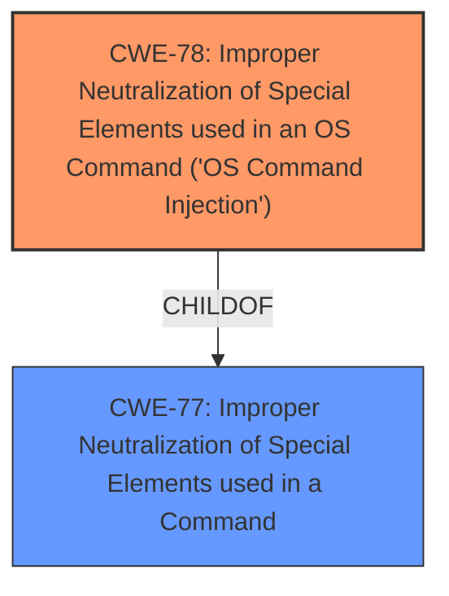

# Raw Analyzer Response for CVE-2021-27201

# Summary
| CWE ID | CWE Name | Confidence | CWE Abstraction Level | CWE Vulnerability Mapping Label | CWE-Vulnerability Mapping Notes |
|---|---|---|---|---|---|
| CWE-78 | Improper Neutralization of Special Elements used in an OS Command ('OS Command Injection') | 1.0 | Base | Allowed | Primary CWE |

## Evidence and Confidence

*   **Confidence Score:** 1.0
*   **Evidence Strength:** HIGH

## Relationship Analysis
The primary relationship influencing my decision is the ChildOf relationship between CWE-78 **[CWE-78: Improper Neutralization of Special Elements used in an OS Command ('OS Command Injection')]** and CWE-77 **[CWE-77: Improper Neutralization of Special Elements used in a Command]**. CWE-78 is a more specific case of command injection, focusing on OS commands, which aligns perfectly with the vulnerability description.

## Vulnerability Chain
The vulnerability chain involves the following steps:
1.  **Root Cause:** **Improper neutralization** of shell metacharacters in the backup comment field (CWE-78).
2.  **Vulnerability:** OS command injection.
3.  **Impact:** Execution of arbitrary OS commands with the privileges of the "nobody" user, potentially leading to further system compromise.

## Summary of Analysis
The initial analysis correctly identifies CWE-78 **[CWE-78: Improper Neutralization of Special Elements used in an OS Command ('OS Command Injection')]** as the primary weakness. The vulnerability description clearly states that remote authenticated users can execute arbitrary OS commands via shell metacharacters in a backup comment. The CVE Reference Links Content Summary confirms this, stating that the "**vulnerability stems from a lack of input validation** in the backup creation functionality...Specifically, the 'comment' field in the backup creation process is **not properly sanitized, allowing for command injection**."

The retriever results also support this selection, with CWE-78 **[CWE-78: Improper Neutralization of Special Elements used in an OS Command ('OS Command Injection')]** being the top-ranked CWE.

The CWE-78 **[CWE-78: Improper Neutralization of Special Elements used in an OS Command ('OS Command Injection')]** description, extended description, and observed examples all align with the provided vulnerability information: "The product constructs all or part of an OS command using externally-influenced input from an upstream component, but it does not neutralize or incorrectly neutralizes special elements that could modify the intended OS command when it is sent to a downstream component."

I considered other CWEs, such as CWE-95 **[CWE-95: Improper Neutralization of Directives in Dynamically Evaluated Code ('Eval Injection')]**, CWE-88 **[CWE-88: Improper Neutralization of Argument Delimiters in a Command ('Argument Injection')]**, and CWE-798 **[CWE-798: Use of Hard-coded Credentials]**, but these were not as accurate as CWE-78 **[CWE-78: Improper Neutralization of Special Elements used in an OS Command ('OS Command Injection')]**. CWE-95 **[CWE-95: Improper Neutralization of Directives in Dynamically Evaluated Code ('Eval Injection')]** involves dynamic evaluation of code, which is not explicitly mentioned in the vulnerability description. CWE-88 **[CWE-88: Improper Neutralization of Argument Delimiters in a Command ('Argument Injection')]** focuses on argument delimiters, while this vulnerability involves injecting entire commands. CWE-798 **[CWE-798: Use of Hard-coded Credentials]** is unrelated to command injection.

My assessment is based on the provided evidence, which explicitly mentions the lack of input validation and the ability to inject arbitrary OS commands. The selection of CWE-78 **[CWE-78: Improper Neutralization of Special Elements used in an OS Command ('OS Command Injection')]** is at the optimal level of specificity, as it directly addresses the root cause of the vulnerability.