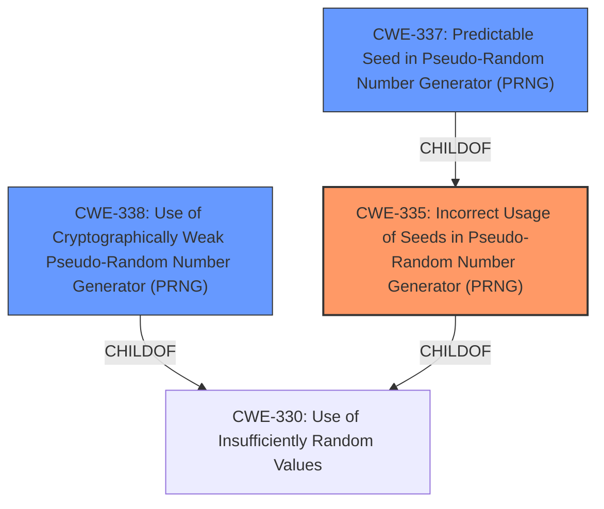

# Enhanced Analysis for CVE-2021-27211

# Summary
| CWE ID | CWE Name | Confidence | CWE Abstraction Level | CWE Vulnerability Mapping Label | CWE-Vulnerability Mapping Notes |
|---|---|---|---|---|---|
| CWE-335 | Incorrect Usage of Seeds in Pseudo-Random Number Generator (PRNG) | 1.0 | Base | Allowed | Primary CWE. The product uses a Pseudo-Random Number Generator (PRNG) but does not correctly manage seeds. |
| CWE-337 | Predictable Seed in Pseudo-Random Number Generator (PRNG) | 0.75 | Variant | Allowed | Secondary CWE. A Pseudo-Random Number Generator (PRNG) is initialized from a predictable seed, such as the process ID or system time. |
| CWE-338 | Use of Cryptographically Weak Pseudo-Random Number Generator (PRNG) | 0.75 | Base | Allowed | Secondary CWE. The product uses a Pseudo-Random Number Generator (PRNG) in a security context, but the PRNG's algorithm is not cryptographically strong. |

## Evidence and Confidence

*   **Confidence Score:** 0.9
*   **Evidence Strength:** HIGH

## Relationship Analysis
The primary CWE is CWE-335 **Incorrect Usage of Seeds in Pseudo-Random Number Generator (PRNG)**. This is a base class.
CWE-337 **Predictable Seed in Pseudo-Random Number Generator (PRNG)** is a variant of CWE-335, providing more specific information about the type of seed used.
CWE-338 **Use of Cryptographically Weak Pseudo-Random Number Generator (PRNG)** is another base class related to CWE-330, providing information about the type of PRNG used.



## Vulnerability Chain
The vulnerability chain starts with the **reliance on a certain 32-bit seed value**, leading to a small seed space that is brute-forceable. This allows attackers to detect hidden data without knowing the password.

## Summary of Analysis
The initial analysis focused on the **root cause** of the vulnerability, which is the **reliance on a certain 32-bit seed value** in steghide 0.5.1. The "Vulnerability Description Key Phrases" section highlights this as the root cause. The "CVE Reference Links Content Summary" section provides further evidence that the vulnerability stems from the way Steghide generates the seed, reducing the password's complexity to a 32-bit value, making it brute-forceable.

The retriever results and the complete CWE specifications were then reviewed to identify the most appropriate CWEs. CWE-335, CWE-337, and CWE-338 were identified as the most relevant based on their descriptions and relationships.

CWE-335 **Incorrect Usage of Seeds in Pseudo-Random Number Generator (PRNG)** is the primary CWE because it directly addresses the **incorrect seed usage**. The description matches the vulnerability where steghide uses a 32-bit seed value.
CWE-337 **Predictable Seed in Pseudo-Random Number Generator (PRNG)** is included because the 32-bit seed is predictable and can be brute-forced.
CWE-338 **Use of Cryptographically Weak Pseudo-Random Number Generator (PRNG)** is included because the process of generating the seed using MD5 and XOR operations results in a cryptographically weak PRNG.

The selected CWEs are at the optimal level of specificity. CWE-335 is a base class, while CWE-337 is a variant providing more details about the predictability of the seed. CWE-338 addresses the weakness of the PRNG.

CWE-330 **Use of Insufficiently Random Values** was considered but not chosen as the primary CWE because it is a class-level CWE. The chosen CWEs provide more specific details about the vulnerability.

The final decision is based on the provided evidence and the relationships between the CWEs, resulting in a high confidence score.


## CWE Relationship Analysis

Current CWEs represent these abstraction levels: .


### Vulnerability Chain Analysis

**Chain starting from CWE-335:**
- 335 (Incorrect Usage of Seeds in Pseudo-Random Number Generator (PRNG)) - ROOT


**Chain starting from CWE-330:**
- 330 (Use of Insufficiently Random Values) - ROOT


### CWE Relationship Diagram

```mermaid
graph TD
    classDef primary fill:#f96,stroke:#333,stroke-width:2px
    classDef secondary fill:#69f,stroke:#333
    classDef tertiary fill:#9e9,stroke:#333
```