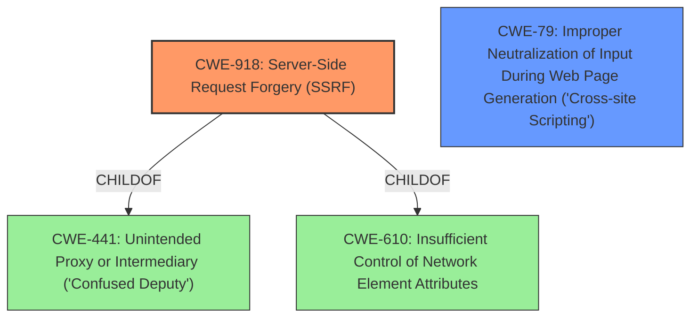

# Analysis for CVE-2021-27214

# Summary
| CWE ID | CWE Name | Confidence | CWE Abstraction Level | CWE Vulnerability Mapping Label | CWE-Vulnerability Mapping Notes |
|---|---|---|---|---|---|
| CWE-918 | Server-Side Request Forgery (SSRF) | 1.0 | Base | Allowed | Primary CWE |
| CWE-79 | Improper Neutralization of Input During Web Page Generation ('Cross-site Scripting') | 0.8 | Base | Allowed | Secondary CWE |

## Evidence and Confidence

*   **Confidence Score:** 0.9
*   **Evidence Strength:** HIGH

## Relationship Analysis
The primary CWE is CWE-918, Server-Side Request Forgery. CWE-918 is a Base level CWE, which is the preferred level of abstraction. CWE-918 is a child of CWE-441 (Unintended Proxy or Intermediary) and CWE-610 (Insufficient Control of Network Element Attributes). The vulnerability description clearly states that there is a Server-side request forgery. The secondary CWE is CWE-79, Improper Neutralization of Input During Web Page Generation ('Cross-site Scripting'). The vulnerability description states that there is Cross-site scripting.

## Vulnerability Chain
The vulnerability chain starts with a **server-side request forgery (SSRF)** vulnerability, which allows an attacker to perform blind HTTP requests. Additionally, the attacker can perform a Cross-site scripting (XSS) attack against the administrative interface.

## Summary of Analysis
The vulnerability description clearly states that there is a **server-side request forgery** (SSRF) vulnerability.
The vulnerability description also states that the vulnerability allows an attacker to perform a Cross-site scripting (XSS) attack against the administrative interface.

The evidence to support the primary CWE is from the **Vulnerability Description Key Phrases** section, which states:
- **weakness:** **server-side request forgery**

The evidence to support the secondary CWE is from the **Vulnerability Description** section, which states:
- "perform a Cross-site scripting (XSS) attack against the administrative interface"

CWE-918 is at the Base level of abstraction, which is a preferred level of abstraction for mapping to the root causes of vulnerabilities.
CWE-79 is at the Base level of abstraction, which is a preferred level of abstraction for mapping to the root causes of vulnerabilities.

The following CWEs were considered but not used:
- CWE-80: Improper Neutralization of Script-Related HTML Tags in a Web Page (Basic XSS) was not selected because CWE-79 is a more general description of XSS.
- CWE-89: Improper Neutralization of Special Elements used in an SQL Command ('SQL Injection') was not selected because there is no mention of SQL injection.
- CWE-113: Improper Neutralization of CRLF Sequences in HTTP Headers ('HTTP Request/Response Splitting') was not selected because there is no mention of CRLF injection.
- CWE-352: Cross-Site Request Forgery (CSRF) was not selected because there is no mention of CSRF.
- CWE-425: Direct Request ('Forced Browsing') was not selected because the **weakness** is **server-side request forgery**.
- CWE-444: Inconsistent Interpretation of HTTP Requests ('HTTP Request/Response Smuggling') was not selected because there is no mention of HTTP Request Smuggling.
- CWE-611: Improper Restriction of XML External Entity Reference was not selected because there is no mention of XML External Entity.
- CWE-1004: Sensitive Cookie Without 'HttpOnly' Flag was not selected because there is no mention of cookies.
- CWE-306: Missing Authentication for Critical Function was not selected because the **weakness** is **server-side request forgery**.