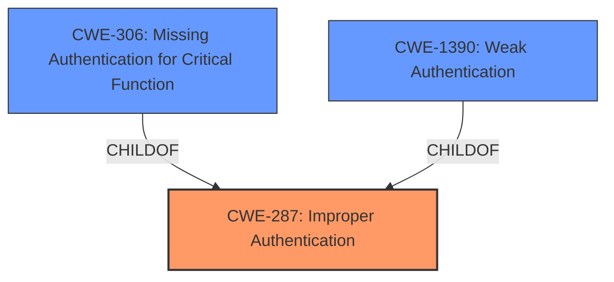

# Enhanced Analysis for CVE-2021-27215

# Summary
| CWE ID  | CWE Name                                                                          | Confidence | CWE Abstraction Level | CWE Vulnerability Mapping Label | CWE-Vulnerability Mapping Notes |
| :-------- | :---------------------------------------------------------------------------------- | :---------- | :----------------------- | :------------------------------ | :---------------------------------- |
| CWE-287   | Improper Authentication                                                             | 0.9         | Class                     | Primary                         | Discouraged                         |
| CWE-306   | Missing Authentication for Critical Function                                        | 0.8         | Base                      | Secondary                       | Allowed                             |
| CWE-1390  | Weak Authentication                                                               | 0.7         | Class                     | Secondary                       | Allowed-with-Review               |

## Evidence and Confidence

*   **Confidence Score:** 0.9
*   **Evidence Strength:** HIGH

## Relationship Analysis
The primary relationship at play is the hierarchical structure of authentication-related CWEs. CWE-287 (Improper Authentication) is a class-level CWE that has child CWEs like CWE-306 (Missing Authentication for Critical Function) and CWE-1390 (Weak Authentication). The vulnerability involves a failure in the authentication process. While CWE-287 is a general classification, the specifics of the vulnerability suggest that either authentication is completely bypassed (missing) or some aspect of the authentication is weak. Therefore, considering CWE-306 and CWE-1390 is crucial. The choice between CWE-306 and CWE-1390 hinges on whether the authentication mechanism is entirely absent or merely flawed. The description points towards a flawed mechanism making CWE-1390 a good secondary candidate. However, since the vulnerability description states that the **specific authentication method during login does not check the provided data**, it indicates that there is in effect no authentication taking place. Hence, CWE-306 is a better candidate.



## Vulnerability Chain
The vulnerability chain starts with the **root cause**: a **specific authentication method during login does not check the provided data**. This leads to an **authentication bypass**, allowing an **attacker to login to the admin panel as a user of his choice**, ultimately resulting in **unauthorized access** and potential **complete system compromise**.

## Summary of Analysis
Initially, the vulnerability description points to a failure in the authentication process. The core issue is the **specific authentication method during login does not check the provided data**, which directly translates to an **authentication bypass**.

The "CVE Reference Links Content Summary" confirms the root cause as a flaw in the authentication logic, specifically highlighting the **lack of input validation**. This absence of validation allows attackers to bypass authentication.

Given the evidence, the primary classification is CWE-287: Improper Authentication, as it broadly captures the authentication failure. However, the more specific issue is that the authentication check is effectively missing. Therefore, CWE-306: Missing Authentication for Critical Function, is included as a secondary CWE. While the vulnerability description mentions that a "specific authentication method during login does not check the provided data," the broader context implies that the authentication mechanism, when triggered under certain conditions, fails to perform any validation, thus resembling a missing authentication. The retriever results also point to CWE-306.

CWE-1390: Weak Authentication is considered because the description mentions the usage of different authentication methods. If one method is bypassed, it could be argued that the overall authentication is weakened. However, the lack of validation in the specific method is closer to missing authentication.

Therefore, the selected CWEs provide a comprehensive representation of the vulnerability, with CWE-287 as the overarching issue and CWE-306 as the more precise weakness.

Relevant CWE Information:

# Enhanced Context (25 CWEs)
The following CWEs were identified as potentially relevant to this vulnerability:

## CWE-807: Reliance on Untrusted Inputs in a Security Decision
**Abstraction Level**: Base
**Similarity Score**: 0.79
**Source**: dense

**Description**:
The product uses a protection mechanism that relies on the existence or values of an input, but the input can be modified by an untrusted actor in a way that bypasses the protection mechanism.

**Mapping Guidance**:
- Usage: Allowed
- Rationale: This CWE entry is at the Base level of abstraction, which is a preferred level of abstraction for mapping to the root causes of vulnerabilities.

## CWE-472: External Control of Assumed-Immutable Web Parameter
**Abstraction Level**: Base
**Similarity Score**: 0.77
**Source**: dense

**Description**:
The web application does not sufficiently verify inputs that are assumed to be immutable but are actually externally controllable, such as hidden form fields.

**Mapping Guidance**:
- Usage: Allowed
- Rationale: This CWE entry is at the Base level of abstraction, which is a preferred level of abstraction for mapping to the root causes of vulnerabilities.

## CWE-302: Authentication Bypass by Assumed-Immutable Data
**Abstraction Level**: Base
**Similarity Score**: 0.77
**Source**: dense

**Description**:
The authentication scheme or implementation uses key data elements that are assumed to be immutable, but can be controlled or modified by the attacker.

**Mapping Guidance**:
- Usage: Allowed
- Rationale: This CWE entry is at the Base level of abstraction, which is a preferred level of abstraction for mapping to the root causes of vulnerabilities.

## CWE-303: Incorrect Implementation of Authentication Algorithm
**Abstraction Level**: Base
**Similarity Score**: 0.77
**Source**: dense

**Description**:
The requirements for the product dictate the use of an established authentication algorithm, but the implementation of the algorithm is incorrect.

**Mapping Guidance**:
- Usage: Allowed
- Rationale: This CWE entry is at the Base level of abstraction, which is a preferred level of abstraction for mapping to the root causes of vulnerabilities.

## CWE-1390: Weak Authentication
**Abstraction Level**: Class
**Similarity Score**: 0.77
**Source**: dense

**Description**:
The product uses an authentication mechanism to restrict access to specific users or identities, but the mechanism does not sufficiently prove that the claimed identity is correct.

**Mapping Guidance**:
- Usage: Allowed-with-Review
- Rationale: This CWE entry is a Class and might have Base-level children that would be more appropriate

## CWE-212: Improper Removal of Sensitive Information Before Storage or Transfer
**Abstraction Level**: Base
**Similarity Score**: 0.77
**Source**: dense

**Description**:
The product stores, transfers, or shares a resource that contains sensitive information, but it does not properly remove that information before the product makes the resource available to unauthorized actors.

**Mapping Guidance**:
- Usage: Allowed
- Rationale: This CWE entry is at the Base level of abstraction, which is a preferred level of abstraction for mapping to the root causes of vulnerabilities.

## CWE-345: Insufficient Verification of Data Authenticity
**Abstraction Level**: Class
**Similarity Score**: 0.77
**Source**: dense

**Description**:
The product does not sufficiently verify the origin or authenticity of data, in a way that causes it to accept invalid data.

**Mapping Guidance**:
- Usage: Discouraged
- Rationale: This CWE entry is a level-1 Class (i.e., a child of a Pillar). It might have lower-level children that would be more appropriate

## CWE-1391: Use of Weak Credentials
**Abstraction Level**: Class
**Similarity Score**: 0.77
**Source**: dense

**Description**:
The product uses weak credentials (such as a default key or hard-coded password) that can be calculated, derived, reused, or guessed by an attacker.

**Mapping Guidance**:
- Usage: Allowed-with-Review
- Rationale: This CWE entry is a Class and might have Base-level children that would be more appropriate

## CWE-538: Insertion of Sensitive Information into Externally-Accessible File or Directory
**Abstraction Level**: Base
**Similarity Score**: 0.77
**Source**: dense

**Description**:
The product places sensitive information into files or directories that are accessible to actors who are allowed to have access to the files, but not to the sensitive information.

**Mapping Guidance**:
- Usage: Allowed
- Rationale: This CWE entry is at the Base level of abstraction, which is a preferred level of abstraction for mapping to the root causes of vulnerabilities.

## CWE-668: Exposure of Resource to Wrong Sphere
**Abstraction Level**: Class
**Similarity Score**: 0.76
**Source**: dense

**Description**:
The product


## CWE Relationship Analysis

Current CWEs represent these abstraction levels: .


### Vulnerability Chain Analysis

**Chain starting from CWE-306:**
- 306 (Missing Authentication for Critical Function) - ROOT


**Chain starting from CWE-303:**
- 303 (Incorrect Implementation of Authentication Algorithm) - ROOT


### CWE Relationship Diagram

```mermaid
graph TD
    classDef primary fill:#f96,stroke:#333,stroke-width:2px
    classDef secondary fill:#69f,stroke:#333
    classDef tertiary fill:#9e9,stroke:#333
```