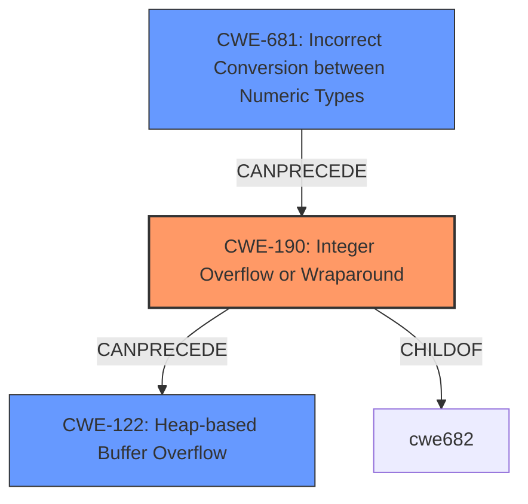

# Analysis for CVE-2021-27219

# Summary
| CWE ID | CWE Name | Confidence | CWE Abstraction Level | CWE Vulnerability Mapping Label | CWE-Vulnerability Mapping Notes |
|---|---|---|---|---|---|
| CWE-190 | Integer Overflow or Wraparound | 1.0 | Base | Primary | Allowed |
| CWE-681 | Incorrect Conversion between Numeric Types | 0.8 | Base | Secondary | Allowed |
| CWE-122 | Heap-based Buffer Overflow | 0.6 | Variant | Secondary | Allowed |

## Evidence and Confidence

*   **Confidence Score:** 0.8
*   **Evidence Strength:** HIGH

## Relationship Analysis
The primary CWE is CWE-190, which is a Base level CWE. CWE-681 is a parent of several more specific CWEs related to numeric type conversion issues, including CWE-195 (Signed to Unsigned Conversion Error), CWE-196 (Unsigned to Signed Conversion Error), and CWE-194 (Unexpected Sign Extension). CWE-122 represents the potential impact of the integer overflow in this case, potentially leading to memory corruption on the heap. The relationship shows how an incorrect type conversion can lead to an integer overflow, which in turn might cause a heap-based buffer overflow.

## Vulnerability Chain
The vulnerability chain starts with an **incorrect conversion between numeric types** (CWE-681), specifically an implicit cast from 64 bits to 32 bits. This leads to an **integer overflow** (CWE-190). The integer overflow, in turn, results in a smaller than expected buffer being allocated. When the application attempts to write data to the incorrectly sized buffer, this triggers a **heap-based buffer overflow** (CWE-122) and memory corruption.

## Summary of Analysis
The initial assessment identified CWE-190 as the primary weakness due to the **integer overflow** in `g_bytes_new`. The analysis was refined by considering the surrounding context. The implicit cast from 64 bits to 32 bits is a key aspect of the vulnerability, pointing to CWE-681 (**Incorrect Conversion between Numeric Types**) as a contributing factor. The potential for memory corruption due to a buffer overflow suggests CWE-122 (**Heap-based Buffer Overflow**) as a possible outcome.

The evidence from the vulnerability description states: "The function g_bytes_new has an **integer overflow** on 64-bit platforms due to an implicit cast from 64 bits to 32 bits. The overflow could potentially lead to memory corruption." The CVE Reference Links Content Summary confirms this, stating the "Root Cause of Vulnerability" is an "Integer overflow in the `g_bytes_new` function due to an implicit cast from 64-bit `gsize` to 32-bit `guint` when calling `g_memdup`."

CWE-190 is chosen because the core issue is the **integer overflow** itself, which occurs due to the implicit type conversion. It is the direct cause of the vulnerability. CWE-681 is included because the **incorrect conversion** sets the stage for the overflow. CWE-122 is included because the overflow could lead to memory corruption.

The selected CWEs are at the optimal level of specificity. CWE-190 is a Base level CWE, which is a preferred level of abstraction. While more specific variants of CWE-190 might exist, they don't capture the core issue as accurately as the base CWE.

Relevant CWE Information:

# Enhanced Context (25 CWEs)

## CWE-191: Integer Underflow (Wrap or Wraparound)
**Abstraction Level**: Base
**Similarity Score**: 0.79

Not Selected: This CWE describes a situation where the result is less than the minimum allowable integer value. The vulnerability description and summary focus on the overflow condition.

## CWE-197: Numeric Truncation Error
**Abstraction Level**: Base
**Similarity Score**: 0.77

Not Selected: Although related to the type conversion, the core issue is the overflow rather than the truncation.

## CWE-131: Incorrect Calculation of Buffer Size
**Abstraction Level**: Base
**Similarity Score**: 0.77

Not Selected: While the integer overflow leads to an incorrect buffer size, the root cause is the overflow itself.

## CWE-126: Buffer Over-read
**Abstraction Level**: Variant
**Similarity Score**: 0.77

Not Selected: The described issue is an overflow, not an over-read.

## CWE-681: Incorrect Conversion between Numeric Types
**Abstraction Level**: Base
**Similarity Score**: 0.77

Selected: This CWE is included as a secondary weakness. The implicit cast from 64-bit to 32-bit is a type conversion issue that sets the stage for the integer overflow.

## CWE-190: Integer Overflow or Wraparound
**Abstraction Level**: Base
**Similarity Score**: 0.77

Selected: This is the primary CWE. The integer overflow is the direct cause of the vulnerability.

## CWE-125: Out-of-bounds Read
**Abstraction Level**: Base
**Similarity Score**: 0.77

Not Selected: The vulnerability description focuses on memory corruption due to a potential buffer overflow, not an out-of-bounds read.

## CWE-805: Buffer Access with Incorrect Length Value
**Abstraction Level**: Base
**Similarity Score**: 0.76

Not Selected: While the overflow can lead to incorrect length values, the core issue is the overflow itself.

## CWE-680: Integer Overflow to Buffer Overflow
**Abstraction Level**: Compound
**Similarity Score**: 0.75

Not Selected: This is a compound CWE, and the guidance discourages its use. It's more precise to map to the individual weaknesses in the chain (CWE-190 and CWE-122).

## CWE-193: Off-by-one Error
**Abstraction Level**: Base
**Similarity Score**: 0.75

Not Selected: An off-by-one error is not explicitly mentioned in the vulnerability description.