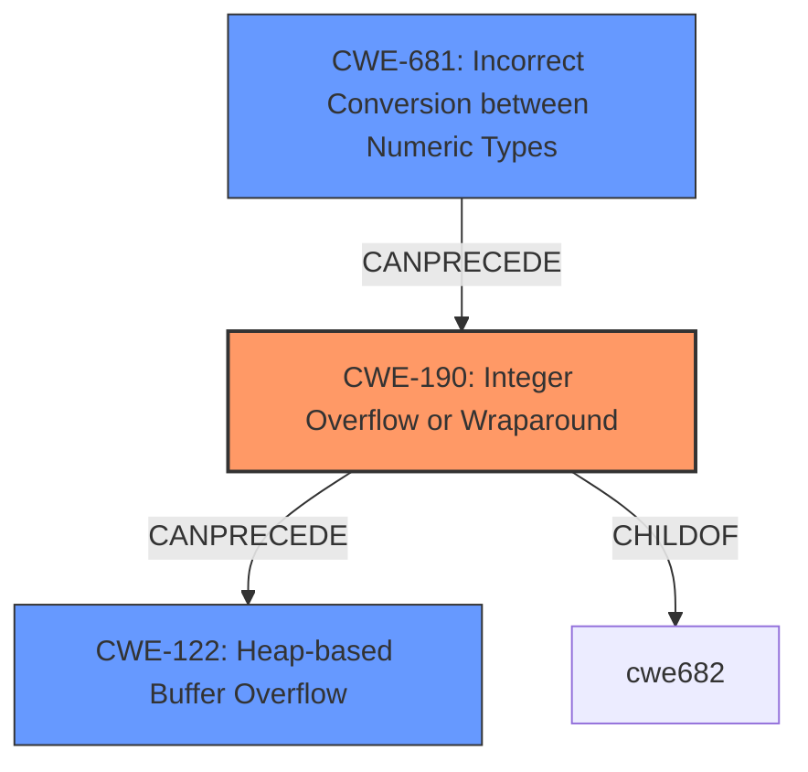

# Analysis for CVE-2021-27219

# Summary
| CWE ID | CWE Name | Confidence | CWE Abstraction Level | CWE Vulnerability Mapping Label | CWE-Vulnerability Mapping Notes |
|---|---|---|---|---|---|
| CWE-190 | Integer Overflow or Wraparound | 1.0 | Base | Primary | Allowed |
| CWE-681 | Incorrect Conversion between Numeric Types | 0.8 | Base | Secondary | Allowed |
| CWE-122 | Heap-based Buffer Overflow | 0.6 | Variant | Secondary | Allowed |

## Evidence and Confidence

*   **Confidence Score:** 0.8
*   **Evidence Strength:** HIGH

## Relationship Analysis
The primary CWE is CWE-190, which is a Base level CWE. CWE-681 is a parent of several more specific CWEs related to numeric type conversion issues, including CWE-195 (Signed to Unsigned Conversion Error), CWE-196 (Unsigned to Signed Conversion Error), and CWE-194 (Unexpected Sign Extension). CWE-122 represents the potential impact of the integer overflow in this case, potentially leading to memory corruption on the heap. The relationship shows how an incorrect type conversion can lead to an integer overflow, which in turn might cause a heap-based buffer overflow.

## Vulnerability Chain
The vulnerability chain starts with an **incorrect conversion between numeric types** (CWE-681), specifically an implicit cast from 64 bits to 32 bits. This leads to an **integer overflow** (CWE-190). The integer overflow, in turn, results in a smaller than expected buffer being allocated. When the application attempts to write data to the incorrectly sized buffer, this triggers a **heap-based buffer overflow** (CWE-122) and memory corruption.

## Summary of Analysis
The initial assessment identified CWE-190 as the primary weakness due to the **integer overflow** in `g_bytes_new`. The analysis was refined by considering the surrounding context. The implicit cast from 64 bits to 32 bits is a key aspect of the vulnerability, pointing to CWE-681 (**Incorrect Conversion between Numeric Types**) as a contributing factor. The potential for memory corruption due to a buffer overflow suggests CWE-122 (**Heap-based Buffer Overflow**) as a possible outcome.

The evidence from the vulnerability description states: "The function g_bytes_new has an **integer overflow** on 64-bit platforms due to an implicit cast from 64 bits to 32 bits. The overflow could potentially lead to memory corruption." The CVE Reference Links Content Summary confirms this, stating the "Root Cause of Vulnerability" is an "Integer overflow in the `g_bytes_new` function due to an implicit cast from 64-bit `gsize` to 32-bit `guint` when calling `g_memdup`."

CWE-190 is chosen because the core issue is the **integer overflow** itself, which occurs due to the implicit type conversion. It is the direct cause of the vulnerability. CWE-681 is included because the **incorrect conversion** sets the stage for the overflow. CWE-122 is included because the overflow could lead to memory corruption.

The selected CWEs are at the optimal level of specificity. CWE-190 is a Base level CWE, which is a preferred level of abstraction. While more specific variants of CWE-190 might exist, they don't capture the core issue as accurately as the base CWE.

Relevant CWE Information:

# Enhanced Context (25 CWEs)

## CWE-191: Integer Underflow (Wrap or Wraparound)
**Abstraction Level**: Base
**Similarity Score**: 0.79

Not Selected: This CWE describes a situation where the result is less than the minimum allowable integer value. The vulnerability description and summary focus on the overflow condition.

## CWE-197: Numeric Truncation Error
**Abstraction Level**: Base
**Similarity Score**: 0.77

Not Selected: Although related to the type conversion, the core issue is the overflow rather than the truncation.

## CWE-131: Incorrect Calculation of Buffer Size
**Abstraction Level**: Base
**Similarity Score**: 0.77

Not Selected: While the integer overflow leads to an incorrect buffer size, the root cause is the overflow itself.

## CWE-126: Buffer Over-read
**Abstraction Level**: Variant
**Similarity Score**: 0.77

Not Selected: The described issue is an overflow, not an over-read.

## CWE-681: Incorrect Conversion between Numeric Types
**Abstraction Level**: Base
**Similarity Score**: 0.77

Selected: This CWE is included as a secondary weakness. The implicit cast from 64-bit to 32-bit is a type conversion issue that sets the stage for the integer overflow.

## CWE-190: Integer Overflow or Wraparound
**Abstraction Level**: Base
**Similarity Score**: 0.77

Selected: This is the primary CWE. The integer overflow is the direct cause of the vulnerability.

## CWE-125: Out-of-bounds Read
**Abstraction Level**: Base
**Similarity Score**: 0.77

Not Selected: The vulnerability description focuses on memory corruption due to a potential buffer overflow, not an out-of-bounds read.

## CWE-805: Buffer Access with Incorrect Length Value
**Abstraction Level**: Base
**Similarity Score**: 0.76

Not Selected: While the overflow can lead to incorrect length values, the core issue is the overflow itself.

## CWE-680: Integer Overflow to Buffer Overflow
**Abstraction Level**: Compound
**Similarity Score**: 0.75

Not Selected: This is a compound CWE, and the guidance discourages its use. It's more precise to map to the individual weaknesses in the chain (CWE-190 and CWE-122).

## CWE-193: Off-by-one Error
**Abstraction Level**: Base
**Similarity Score**: 0.75

Not Selected: An off-by-one error is not explicitly mentioned in the vulnerability description.

# Enhanced Query for CVE-2021-27219

## Vulnerability Description
An issue was discovered in GNOME GLib before 2.66.6 and 2.67.x before 2.67.3. The function g_bytes_new has an **integer overflow** on 64-bit platforms due to an implicit cast from 64 bits to 32 bits. The overflow could potentially lead to memory corruption.

### Vulnerability Description Key Phrases
- **rootcause:** **integer overflow**
- **impact:** memory corruption
- **product:** GNOME GLib
- **version:** before 2.66.6 and 2.67.x before 2.67.3
- **component:** g_bytes_new function

## CVE Reference Links Content Summary
Based on the provided content, here's an analysis of CVE-2021-27219:

**Root Cause of Vulnerability:**

- Integer overflow in the `g_bytes_new` function due to an implicit cast from 64-bit `gsize` to 32-bit `guint` when calling `g_memdup`.

**Weaknesses/Vulnerabilities Present:**

- **Integer Overflow:** The core issue is the implicit cast causing an overflow when a large size value is passed to `g_bytes_new` on a 64-bit system. This results in `g_memdup` allocating a much smaller buffer than intended.
- **Memory Corruption:** The overflow causes `g_bytes_new` to return a `GBytes` object that claims to hold a large buffer, but it actually holds a significantly smaller one. This mismatch can lead to memory corruption issues when the application uses the returned `GBytes` object with the expected larger size.

**Impact of Exploitation:**

- **Memory Corruption:** The most serious impact is the potential for memory corruption when applications attempt to use the incorrectly sized buffer. This could lead to various issues, including crashes, data corruption, or potentially, code execution.
- **Denial of Service:** In the provided Proof of Concept (PoC), the overflow caused a crash with a `SIGABRT`, leading to a denial of service.
- **Potential Code Execution:** Although no specific code execution exploit is described in the provided content, it is explicitly stated that there is a risk that the memory corruption could be used for code execution in an application using GLib.

**Attack Vectors:**

- **Calling `g_bytes_new` with a large size parameter:** The vulnerability is triggered when the `g_bytes_new` function is called with a `size` parameter that, when implicitly cast to a 32-bit integer, will cause an integer overflow.
- **Triggering via SUID binary:** The provided PoC demonstrates triggering the overflow by sending a large "cookie" to `polkit-agent-helper-1`, which is a SUID binary. This highlights that vulnerable code can be reached through system services that may have elevated privileges.

**Required Attacker Capabilities/Position:**

- **Ability to call `g_bytes_new`:** An attacker needs the ability to influence the size parameter when calling `g_bytes_new`.
- **Local or Remote Access:** Exploitation can be triggered locally (via the PoC) or remotely through vulnerable services.
- **Understanding of affected applications:** To develop a more targeted and potentially code-executing exploit, an attacker would need to understand how the vulnerable GLib function is used within a specific application.

**Additional Details:**

- **PoC:** A proof-of-concept was provided which triggers an assertion failure and causes a crash in `polkit-agent-helper-1`.
- **Wide usage:**  GLib is a widely used library, making this a critical vulnerability to address.
- **Fix:** The vulnerability is fixed in GLib by changing the type of the `byte_size` parameter of `g_memdup`.

In summary, CVE-2021-27219 describes an integer overflow vulnerability in GLib's `g_bytes_new` function, which could lead to memory corruption, DoS, or potentially code execution. It is triggered by passing an excessively large size parameter, and due to GLib's widespread use, many applications are potentially vulnerable.

## Retriever Results

### Top Combined Results

| Rank | CWE ID | Name | Abstraction | Usage  | Retrievers | Individual Scores |
|------|--------|------|-------------|-------|------------|-------------------|
| 1 | 190 | Integer Overflow or Wraparound | Base | Allowed | alternate_terms | 0.800 |
| 2 | 704 | Incorrect Type Conversion or Cast | Class | Allowed-with-Review | sparse | 0.557 |
| 3 | 197 | Numeric Truncation Error | Base | Allowed | sparse | 0.364 |
| 4 | 681 | Incorrect Conversion between Numeric Types | Base | Allowed | sparse | 0.364 |
| 5 | 194 | Unexpected Sign Extension | Variant | Allowed | sparse | 0.335 |
| 6 | 122 | Heap-based Buffer Overflow | Variant | Allowed | dense | 0.576 |
| 7 | 195 | Signed to Unsigned Conversion Error | Variant | Allowed | graph | 0.003 |
| 8 | 680 | Integer Overflow to Buffer Overflow | Compound | Discouraged | sparse | 0.295 |
| 9 | 121 | Stack-based Buffer Overflow | Variant | Allowed | sparse | 0.278 |
| 10 | 125 | Out-of-bounds Read | Base | Allowed | sparse | 0.275 |

# Complete CWE Specifications

## CWE-190: Integer Overflow or Wraparound
**Abstraction:** Base
**Status:** Stable

### Description
The product performs a calculation that can
         produce an integer overflow or wraparound when the logic
         assumes that the resulting value will always be larger than
         the original value. This occurs when an integer value is
         incremented to a value that is too large to store in the
         associated representation. When this occurs, the value may
         become a very small or negative number.

### Extended Description
Not provided

### Alternative Terms
Overflow: The terms "overflow" and "wraparound" are used interchangeably by some people, but they can have more precise distinctions by others. See Terminology Notes.
Wraparound: The terms "overflow" and "wraparound" are used interchangeably by some people, but they can have more precise distinctions by others. See Terminology Notes.
wrap, wrap-around, wrap around: Alternate spellings of "wraparound"

### Relationships
ChildOf -> CWE-682
ChildOf -> CWE-682
ChildOf -> CWE-20
CanPrecede -> CWE-119

### Mapping Guidance
**Usage:** Allowed
**Rationale:** This CWE entry is at the Base level of abstraction, which is a preferred level of abstraction for mapping to the root causes of vulnerabilities.
**Comments:** Be careful of terminology problems with "overflow," "underflow," and "wraparound" - see Terminology Notes. Carefully read both the name and description to ensure that this mapping is an appropriate fit. Do not try to 'force' a mapping to a lower-level Base/Variant simply to comply with this preferred level of abstraction.
**Reasons:**
- Acceptable-Use
**Suggested Alternatives:**
- CWE-191: Integer Underflow (Wrap or Wraparound). Consider CWE-191 when the result is less than the minimum value that can be represented (sometimes called "underflows").

### Additional Notes
**[Relationship]** Integer overflows can be primary to buffer overflows when they cause less memory to be allocated than expected.

**[Terminology]** 

"Integer overflow" is sometimes used to cover several types of errors, including signedness errors, or buffer overflows that involve manipulation of integer data types instead of characters. Part of the confusion results from the fact that 0xffffffff is -1 in a signed context. Other confusion also arises because of the role that integer overflows have in chains.

A "wraparound" is a well-defined, standard behavior that follows specific rules for how to handle situations when the intended numeric value is too large or too small to be represented, as specified in standards such as C11.

"Overflow" is sometimes conflated with "wraparound" but typically indicates a non-standard or undefined behavior.

The "overflow" term is sometimes used to indicate cases where either the maximum or the minimum is exceeded, but others might only use "overflow" to indicate exceeding the maximum while using "underflow" for exceeding the minimum.

Some people use "overflow" to mean any value outside the representable range - whether greater than the maximum, or less than the minimum - but CWE uses "underflow" for cases in which the intended result is less than the minimum.

See [REF-1440] for additional explanation of the ambiguity of terminology.

**[Other]** While there may be circumstances in which the logic intentionally relies on wrapping - such as with modular arithmetic in timers or counters - it can have security consequences if the wrap is unexpected. This is especially the case if the integer overflow can be triggered using user-supplied inputs.

### Observed Examples
- **CVE-2021-43537:** Chain: in a web browser, an unsigned 64-bit integer is forcibly cast to a 32-bit integer (CWE-681) and potentially leading to an integer overflow (CWE-190). If an integer overflow occurs, this can cause heap memory corruption (CWE-122)
- **CVE-2022-21668:** Chain: Python library does not limit the resources used to process images that specify a very large number of bands (CWE-1284), leading to excessive memory consumption (CWE-789) or an integer overflow (CWE-190).
- **CVE-2022-0545:** Chain: 3D renderer has an integer overflow (CWE-190) leading to write-what-where condition (CWE-123) using a crafted image.

## CWE-704: Incorrect Type Conversion or Cast
**Abstraction:** Class
**Status:** Incomplete

### Description
The product does not correctly convert an object, resource, or structure from one type to a different type.

### Extended Description
Not provided

### Alternative Terms
None

### Relationships
ChildOf -> CWE-664

### Mapping Guidance
**Usage:** Allowed-with-Review
**Rationale:** This CWE entry is a Class and might have Base-level children that would be more appropriate
**Comments:** Examine children of this entry to see if there is a better fit
**Reasons:**
- Abstraction

### Observed Examples
- **CVE-2021-43537:** Chain: in a web browser, an unsigned 64-bit integer is forcibly cast to a 32-bit integer (CWE-681) and potentially leading to an integer overflow (CWE-190). If an integer overflow occurs, this can cause heap memory corruption (CWE-122)
- **CVE-2022-3979:** Chain: data visualization program written in PHP uses the "!=" operator instead of the type-strict "!==" operator (CWE-480) when validating hash values, potentially leading to an incorrect type conversion (CWE-704)

## CWE-197: Numeric Truncation Error
**Abstraction:** Base
**Status:** Incomplete

### Description
Truncation errors occur when a primitive is cast to a primitive of a smaller size and data is lost in the conversion.

### Extended Description
When a primitive is cast to a smaller primitive, the high order bits of the large value are lost in the conversion, potentially resulting in an unexpected value that is not equal to the original value. This value may be required as an index into a buffer, a loop iterator, or simply necessary state data. In any case, the value cannot be trusted and the system will be in an undefined state. While this method may be employed viably to isolate the low bits of a value, this usage is rare, and truncation usually implies that an implementation error has occurred.

### Alternative Terms
None

### Relationships
ChildOf -> CWE-681
ChildOf -> CWE-681
ChildOf -> CWE-681
CanAlsoBe -> CWE-195
CanAlsoBe -> CWE-196
CanAlsoBe -> CWE-192
CanAlsoBe -> CWE-194

### Mapping Guidance
**Usage:** Allowed
**Rationale:** This CWE entry is at the Base level of abstraction, which is a preferred level of abstraction for mapping to the root causes of vulnerabilities.
**Comments:** Carefully read both the name and description to ensure that this mapping is an appropriate fit. Do not try to 'force' a mapping to a lower-level Base/Variant simply to comply with this preferred level of abstraction.
**Reasons:**
- Acceptable-Use

### Additional Notes
**[Research Gap]** This weakness has traditionally been under-studied and under-reported, although vulnerabilities in popular software have been published in 2008 and 2009.

### Observed Examples
- **CVE-2020-17087:** Chain: integer truncation (CWE-197) causes small buffer allocation (CWE-131) leading to out-of-bounds write (CWE-787) in kernel pool, as exploited in the wild per CISA KEV.
- **CVE-2009-0231:** Integer truncation of length value leads to heap-based buffer overflow.
- **CVE-2008-3282:** Size of a particular type changes for 64-bit platforms, leading to an integer truncation in document processor causes incorrect index to be generated.

## CWE-681: Incorrect Conversion between Numeric Types
**Abstraction:** Base
**Status:** Draft

### Description
When converting from one data type to another, such as long to integer, data can be omitted or translated in a way that produces unexpected values. If the resulting values are used in a sensitive context, then dangerous behaviors may occur.

### Extended Description
Not provided

### Alternative Terms
None

### Relationships
ChildOf -> CWE-704
ChildOf -> CWE-704
CanPrecede -> CWE-682

### Mapping Guidance
**Usage:** Allowed
**Rationale:** This CWE entry is at the Base level of abstraction, which is a preferred level of abstraction for mapping to the root causes of vulnerabilities.
**Comments:** Carefully read both the name and description to ensure that this mapping is an appropriate fit. Do not try to 'force' a mapping to a lower-level Base/Variant simply to comply with this preferred level of abstraction.
**Reasons:**
- Acceptable-Use

### Observed Examples
- **CVE-2022-2639:** Chain: integer coercion error (CWE-192) prevents a return value from indicating an error, leading to out-of-bounds write (CWE-787)
- **CVE-2021-43537:** Chain: in a web browser, an unsigned 64-bit integer is forcibly cast to a 32-bit integer (CWE-681) and potentially leading to an integer overflow (CWE-190). If an integer overflow occurs, this can cause heap memory corruption (CWE-122)
- **CVE-2007-4268:** Chain: integer signedness error (CWE-195) passes signed comparison, leading to heap overflow (CWE-122)

## CWE-194: Unexpected Sign Extension
**Abstraction:** Variant
**Status:** Incomplete

### Description
The product performs an operation on a number that causes it to be sign extended when it is transformed into a larger data type. When the original number is negative, this can produce unexpected values that lead to resultant weaknesses.

### Extended Description
Not provided

### Alternative Terms
None

### Relationships
ChildOf -> CWE-681
ChildOf -> CWE-681
ChildOf -> CWE-681

### Mapping Guidance
**Usage:** Allowed
**Rationale:** This CWE entry is at the Variant level of abstraction, which is a preferred level of abstraction for mapping to the root causes of vulnerabilities.
**Comments:** Carefully read both the name and description to ensure that this mapping is an appropriate fit. Do not try to 'force' a mapping to a lower-level Base/Variant simply to comply with this preferred level of abstraction.
**Reasons:**
- Acceptable-Use

### Additional Notes
**[Relationship]** Sign extension errors can lead to buffer overflows and other memory-based problems. They are also likely to be factors in other weaknesses that are not based on memory operations, but rely on numeric calculation.

**[Maintenance]** This entry is closely associated with signed-to-unsigned conversion errors (CWE-195) and other numeric errors. These relationships need to be more closely examined within CWE.

### Observed Examples
- **CVE-2018-10887:** Chain: unexpected sign extension (CWE-194) leads to integer overflow (CWE-190), causing an out-of-bounds read (CWE-125)
- **CVE-1999-0234:** Sign extension error produces -1 value that is treated as a command separator, enabling OS command injection.
- **CVE-2003-0161:** Product uses "char" type for input character. When char is implemented as a signed type, ASCII value 0xFF (255), a sign extension produces a -1 value that is treated as a program-specific separator value, effectively disabling a length check and leading to a buffer overflow. This is also a multiple interpretation error.

## CWE-122: Heap-based Buffer Overflow
**Abstraction:** Variant
**Status:** Draft

### Description
A heap overflow condition is a buffer overflow, where the buffer that can be overwritten is allocated in the heap portion of memory, generally meaning that the buffer was allocated using a routine such as malloc().

### Extended Description
Not provided

### Alternative Terms
None

### Relationships
ChildOf -> CWE-788
ChildOf -> CWE-787

### Mapping Guidance
**Usage:** Allowed
**Rationale:** This CWE entry is at the Variant level of abstraction, which is a preferred level of abstraction for mapping to the root causes of vulnerabilities.
**Comments:** Carefully read both the name and description to ensure that this mapping is an appropriate fit. Do not try to 'force' a mapping to a lower-level Base/Variant simply to comply with this preferred level of abstraction.
**Reasons:**
- Acceptable-Use

### Additional Notes
**[Relationship]** Heap-based buffer overflows are usually just as dangerous as stack-based buffer overflows.

### Observed Examples
- **CVE-2021-43537:** Chain: in a web browser, an unsigned 64-bit integer is forcibly cast to a 32-bit integer (CWE-681) and potentially leading to an integer overflow (CWE-190). If an integer overflow occurs, this can cause heap memory corruption (CWE-122)
- **CVE-2007-4268:** Chain: integer signedness error (CWE-195) passes signed comparison, leading to heap overflow (CWE-122)
- **CVE-2009-2523:** Chain: product does not handle when an input string is not NULL terminated (CWE-170), leading to buffer over-read (CWE-125) or heap-based buffer overflow (CWE-122).

## CWE-195: Signed to Unsigned Conversion Error
**Abstraction:** Variant
**Status:** Draft

### Description
The product uses a signed primitive and performs a cast to an unsigned primitive, which can produce an unexpected value if the value of the signed primitive can not be represented using an unsigned primitive.

### Extended Description

It is dangerous to rely on implicit casts between signed and unsigned numbers because the result can take on an unexpected value and violate assumptions made by the program.

Often, functions will return negative values to indicate a failure. When the result of a function is to be used as a size parameter, using these negative return values can have unexpected results. For example, if negative size values are passed to the standard memory copy or allocation functions they will be implicitly cast to a large unsigned value. This may lead to an exploitable buffer overflow or underflow condition.

### Alternative Terms
None

### Relationships
ChildOf -> CWE-681
ChildOf -> CWE-681
ChildOf -> CWE-681
CanPrecede -> CWE-119

### Mapping Guidance
**Usage:** Allowed
**Rationale:** This CWE entry is at the Variant level of abstraction, which is a preferred level of abstraction for mapping to the root causes of vulnerabilities.
**Comments:** Carefully read both the name and description to ensure that this mapping is an appropriate fit. Do not try to 'force' a mapping to a lower-level Base/Variant simply to comply with this preferred level of abstraction.
**Reasons:**
- Acceptable-Use

### Observed Examples
- **CVE-2007-4268:** Chain: integer signedness error (CWE-195) passes signed comparison, leading to heap overflow (CWE-122)

## CWE-680: Integer Overflow to Buffer Overflow
**Abstraction:** Compound
**Status:** Draft

### Description
The product performs a calculation to determine how much memory to allocate, but an integer overflow can occur that causes less memory to be allocated than expected, leading to a buffer overflow.

### Extended Description
Not provided

### Alternative Terms
None

### Relationships
StartsWith -> CWE-190
ChildOf -> CWE-190

### Mapping Guidance
**Usage:** Discouraged
**Rationale:** This CWE entry is a named chain, which combines multiple weaknesses.
**Comments:** Mapping to each separate weakness in the chain would be more precise.
**Reasons:**
- Other

### Observed Examples
- **CVE-2021-43537:** Chain: in a web browser, an unsigned 64-bit integer is forcibly cast to a 32-bit integer (CWE-681) and potentially leading to an integer overflow (CWE-190). If an integer overflow occurs, this can cause heap memory corruption (CWE-122)
- **CVE-2017-1000121:** chain: unchecked message size metadata allows integer overflow (CWE-190) leading to buffer overflow (CWE-119).

## CWE-121: Stack-based Buffer Overflow
**Abstraction:** Variant
**Status:** Draft

### Description
A stack-based buffer overflow condition is a condition where the buffer being overwritten is allocated on the stack (i.e., is a local variable or, rarely, a parameter to a function).

### Extended Description
Not provided

### Alternative Terms
Stack Overflow: "Stack Overflow" is often used to mean the same thing as stack-based buffer overflow, however it is also used on occasion to mean stack exhaustion, usually a result from an excessively recursive function call. Due to the ambiguity of the term, use of stack overflow to describe either circumstance is discouraged.

### Relationships
ChildOf -> CWE-788
ChildOf -> CWE-787

### Mapping Guidance
**Usage:** Allowed
**Rationale:** This CWE entry is at the Variant level of abstraction, which is a preferred level of abstraction for mapping to the root causes of vulnerabilities.
**Comments:** Carefully read both the name and description to ensure that this mapping is an appropriate fit. Do not try to 'force' a mapping to a lower-level Base/Variant simply to comply with this preferred level of abstraction.
**Reasons:**
- Acceptable-Use

### Additional Notes
**[Other]** Stack-based buffer overflows can instantiate in return address overwrites, stack pointer overwrites or frame pointer overwrites. They can also be considered function pointer overwrites, array indexer overwrites or write-what-where condition, etc.

### Observed Examples
- **CVE-2021-35395:** Stack-based buffer overflows in SFK for wifi chipset used for IoT/embedded devices, as exploited in the wild per CISA KEV.

## CWE-125: Out-of-bounds Read
**Abstraction:** Base
**Status:** Draft

### Description
The product reads data past the end, or before the beginning, of the intended buffer.

### Extended Description
Not provided

### Alternative Terms
OOB read: Shorthand for "Out of bounds" read

### Relationships
ChildOf -> CWE-119
ChildOf -> CWE-119
ChildOf -> CWE-119
ChildOf -> CWE-119

### Mapping Guidance
**Usage:** Allowed
**Rationale:** This CWE entry is at the Base level of abstraction, which is a preferred level of abstraction for mapping to the root causes of vulnerabilities.
**Comments:** Carefully read both the name and description to ensure that this mapping is an appropriate fit. Do not try to 'force' a mapping to a lower-level Base/Variant simply to comply with this preferred level of abstraction.
**Reasons:**
- Acceptable-Use

### Observed Examples
- **CVE-2023-1018:** The reference implementation code for a Trusted Platform Module does not implement length checks on data, allowing for an attacker to read 2 bytes past the end of a buffer.
- **CVE-2020-11899:** Out-of-bounds read in IP stack used in embedded systems, as exploited in the wild per CISA KEV.
- **CVE-2014-0160:** Chain: "Heartbleed" bug receives an inconsistent length parameter (CWE-130) enabling an out-of-bounds read (CWE-126), returning memory that could include private cryptographic keys and other sensitive data.

