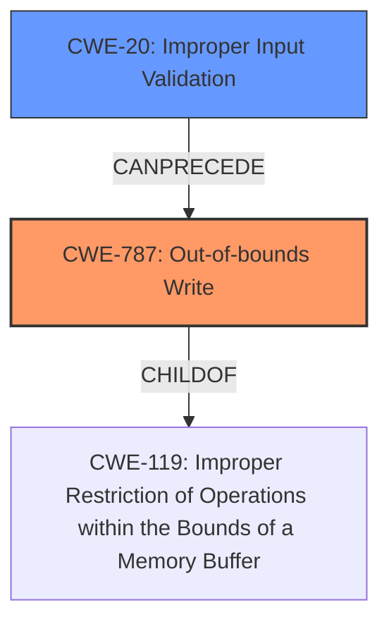

# Raw Analyzer Response for CVE-2021-27242

# Summary
| CWE ID | CWE Name | Confidence | CWE Abstraction Level | CWE Vulnerability Mapping Label | CWE-Vulnerability Mapping Notes |
|---|---|---|---|---|---|
| CWE-787 | Out-of-bounds Write | 0.9 | Base | Primary | Allowed |
| CWE-20 | Improper Input Validation | 0.7 | Class | Secondary | Discouraged |

## Evidence and Confidence

*   **Confidence Score:** 0.8
*   **Evidence Strength:** HIGH

## Relationship Analysis
The primary CWE is CWE-787 **Out-of-bounds Write**, which is a **Base** level CWE. It is related to CWE-119 **Improper Restriction of Operations within the Bounds of a Memory Buffer**, indicating that the write occurs outside the allocated memory region. CWE-20 **Improper Input Validation** is a **Class** level CWE and a potential contributing factor, as the vulnerability description mentions the **lack of proper validation of user-supplied data** leading to **memory corruption**.

## Vulnerability Chain
The vulnerability chain starts with **lack of proper validation of user-supplied data** (CWE-20), which leads to a **memory corruption** condition (CWE-787). This, in turn, allows a local attacker to escalate privileges and execute code in the context of the hypervisor.

## Summary of Analysis
The initial analysis identified the **lack of proper validation of user-supplied data** as a key factor, pointing towards CWE-20 **Improper Input Validation**. However, the more specific consequence of this **lack of validation** is **memory corruption**, which directly leads to an out-of-bounds write condition. The retriever results and the provided CVE reference links content summary also support this. CWE-787 **Out-of-bounds Write** is a more precise classification because it describes the direct consequence of the vulnerability, where data is written outside the intended buffer. While CWE-20 is a contributing factor, it is a more general class, and the evidence strongly supports the out-of-bounds write.

The final decision is based on the vulnerability description highlighting the **lack of proper validation of user-supplied data** and the direct consequence of **memory corruption** which is an **Out-of-bounds Write**, enabling privilege escalation. This aligns with the description of CWE-787 **Out-of-bounds Write**, which states: "The product writes data past the end, or before the beginning, of the intended buffer."

Relevant CWE Information:

# Enhanced Context (25 CWEs)

## CWE-653: Improper Isolation or Compartmentalization
**Abstraction Level**: Class
**Similarity Score**: 0.77
**Source**: dense

**Description**:
The product does not properly compartmentalize or isolate functionality, processes, or resources that require different privilege levels, rights, or permissions.
*This CWE was not selected as the vulnerability is not caused by a lack of isolation but by the **lack of input validation** leading to **memory corruption***.

## CWE-274: Improper Handling of Insufficient Privileges
**Abstraction Level**: Base
**Similarity Score**: 0.76
**Source**: dense

**Description**:
The product does not handle or incorrectly handles when it has insufficient privileges to perform an operation, leading to resultant weaknesses.
*This CWE was not selected as the vulnerability is not caused by improper handling of privileges but by the **lack of input validation** leading to **memory corruption***.

## CWE-1220: Insufficient Granularity of Access Control
**Abstraction Level**: Base
**Similarity Score**: 0.76
**Source**: dense

**Description**:
The product implements access controls via a policy or other feature with the intention to disable or restrict accesses (reads and/or writes) to assets in a system from untrusted agents. However, implemented access controls lack required granularity, which renders the control policy too broad because it allows accesses from unauthorized agents to the security-sensitive assets.
*This CWE was not selected as the vulnerability is not caused by insufficient granularity of access control but by the **lack of input validation** leading to **memory corruption***.

## CWE-691: Insufficient Control Flow Management
**Abstraction Level**: Pillar
**Similarity Score**: 0.75
**Source**: dense

**Description**:
The code does not sufficiently manage its control flow during execution, creating conditions in which the control flow can be modified in unexpected ways.
*This CWE was not selected as it is too high-level and does not accurately describe the root cause of the vulnerability, which is the **lack of input validation** leading to **memory corruption***.

## CWE-664: Improper Control of a Resource Through its Lifetime
**Abstraction Level**: Pillar
**Similarity Score**: 0.75
**Source**: dense

**Description**:
The product does not maintain or incorrectly maintains control over a resource throughout its lifetime of creation, use, and release.
*This CWE was not selected as it is too high-level and does not accurately describe the root cause of the vulnerability, which is the **lack of input validation** leading to **memory corruption***.

## CWE-1289: Improper Validation of Unsafe Equivalence in Input
**Abstraction Level**: Base
**Similarity Score**: 0.75
**Source**: dense

**Description**:
The product receives an input value that is used as a resource identifier or other type of reference, but it does not validate or incorrectly validates that the input is equivalent to a potentially-unsafe value.
*This CWE was not selected as the **lack of proper validation of user-supplied data** in this vulnerability isn't about unsafe equivalence but more generally about the data itself.*

## CWE-280: Improper Handling of Insufficient Permissions or Privileges
**Abstraction Level**: Base
**Similarity Score**: 0.75
**Source**: dense

**Description**:
The product does not handle or incorrectly handles when it has insufficient privileges to access resources or functionality as specified by their permissions. This may cause it to follow unexpected code paths that may leave the product in an invalid state.
*This CWE was not selected as the vulnerability is not about insufficient permissions but about the **lack of input validation** leading to **memory corruption***.

## CWE-668: Exposure of Resource to Wrong Sphere
**Abstraction Level**: Class
**Similarity Score**: 0.75
**Source**: dense

**Description**:
The product exposes a resource to the wrong control sphere, providing unintended actors with inappropriate access to the resource.
*This CWE was not selected as the vulnerability is not about exposing resources to the wrong sphere but about the **lack of input validation** leading to **memory corruption***.

## CWE-807: Reliance on Untrusted Inputs in a Security Decision
**Abstraction Level**: Base
**Similarity Score**: 0.75
**Source**: dense

**Description**:
The product uses a protection mechanism that relies on the existence or values of an input, but the input can be modified by an untrusted actor in a way that bypasses the protection mechanism.
*This CWE was not selected as the vulnerability is not about relying on untrusted inputs in a security decision but about the **lack of input validation** leading to **memory corruption***.

## CWE-639: Authorization Bypass Through User-Controlled Key
**Abstraction Level**: Base
**Similarity Score**: 0.75
**Source**: dense

**Description**:
The system's authorization functionality does not prevent one user from gaining access to another user's data or record by modifying the key value identifying the data.
*This CWE was not selected as the vulnerability is not about authorization bypass but about the **lack of input validation** leading to **memory corruption***.

## CWE-367: Time-of-check Time-of-use (TOCTOU) Race Condition
**Abstraction Level**: Base
**Similarity Score**: 7276.54
**Source**: sparse

**Description**:
The product checks the state of a resource before using that resource, but the resource's state can change between the check and the use in a way that invalidates the results of the check. This can cause the product to perform invalid actions when the resource is in an unexpected state.
*This CWE was not selected as the vulnerability is not about a race condition but about the **lack of input validation** leading to **memory corruption***.

## CWE-1284: Improper Validation of Specified Quantity in Input
**Abstraction Level**: Base
**Similarity Score**: 7087.99
**Source**: sparse

**Description**:
The product receives input that is expected to specify a quantity (such as size or length),