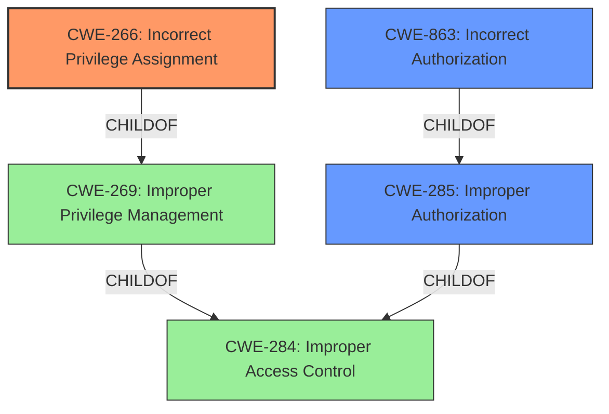

# Raw Analyzer Response for CVE-2021-27258

# Summary
| CWE ID | CWE Name | Confidence | CWE Abstraction Level | CWE Vulnerability Mapping Label | CWE-Vulnerability Mapping Notes |
|---|---|---|---|---|---|
| CWE-266 | Incorrect Privilege Assignment | 0.9 | Base | Allowed | Primary CWE |
| CWE-863 | Incorrect Authorization | 0.7 | Class | Allowed-with-Review | Secondary Candidate |
| CWE-285 | Improper Authorization | 0.6 | Class | Discouraged | Secondary Candidate |

## Evidence and Confidence

*   **Confidence Score:** 0.9
*   **Evidence Strength:** HIGH

## Relationship Analysis
The primary CWE selected is CWE-266, which is a Base level CWE and a child of CWE-269 (Improper Privilege Management). CWE-266 directly reflects the **incorrect privilege assignment** that leads to the vulnerability. CWE-863 and CWE-285 were considered as they relate to authorization issues, but they are higher-level Classes and less specific than CWE-266. The relationships between CWEs influenced the decision to choose the most specific, Base-level CWE available.

## Vulnerability Chain
The vulnerability chain starts with the **improper restriction** of the `SaveUserSetting` endpoint, leading to an **incorrect privilege assignment** (CWE-266). This allows an attacker to **escalate privileges**, resulting in the ability to execute commands with elevated permissions.

## Summary of Analysis
The analysis is based on the provided vulnerability description and the "CVE Reference Links Content Summary". The key phrase is "**improper restriction** of this endpoint to unprivileged users," which directly points to a privilege assignment issue. The evidence "An attacker can leverage this vulnerability to escalate privileges their privileges from Guest to Administrator" further supports this.

CWE-266 (Incorrect Privilege Assignment) is chosen because it accurately describes the root cause of the vulnerability, which is the **incorrect assignment of privileges** to unauthenticated users for the `SaveUserSetting` endpoint. This aligns with the CWE's description: "A product incorrectly assigns a privilege to a particular actor, creating an unintended sphere of control for that actor." The abstraction level of Base is appropriate as it is the most specific level available for this type of weakness.

CWE-863 (Incorrect Authorization) and CWE-285 (Improper Authorization) were considered but ultimately deemed less specific. While authorization is related, the core issue is the initial assignment of privileges, making CWE-266 the more precise choice. The mapping guidance for CWE-285 discourages its use when more specific CWEs are available, further supporting the decision to use CWE-266.

Relevant CWE Information:

# Enhanced Context (25 CWEs)
The following CWEs were identified as potentially relevant to this vulnerability:

## CWE-266: Incorrect Privilege Assignment
**Abstraction Level**: Base
**Similarity Score**: 0.78
**Source**: dense

**Description**:
A product incorrectly assigns a privilege to a particular actor, creating an unintended sphere of control for that actor.

**Mapping Guidance**:
- Usage: Allowed
- Rationale: This CWE entry is at the Base level of abstraction, which is a preferred level of abstraction for mapping to the root causes of vulnerabilities.