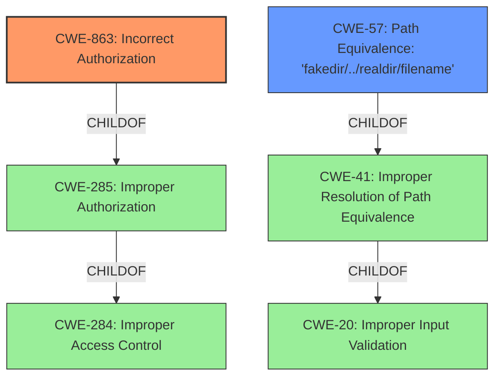

# Analysis for CVE-2021-27306

# Summary
| CWE ID | CWE Name | Confidence | CWE Abstraction Level | CWE Vulnerability Mapping Label | CWE-Vulnerability Mapping Notes |
|---|---|---|---|---|---|
| CWE-863 | Incorrect Authorization | 0.8 | Class | Primary | Allowed-with-Review |
| CWE-57 | Path Equivalence: 'fakedir/../realdir/filename' | 0.7 | Variant | Secondary | Allowed |

## Evidence and Confidence

*   **Confidence Score:** 0.75
*   **Evidence Strength:** MEDIUM

## Relationship Analysis
The primary CWE is CWE-863 which is a Class-level weakness, with CWE-285 as a parent and CWE-284 as a grandparent.
CWE-57 is a Variant-level weakness and a child of CWE-41, Path Equivalence, which in turn is a child of CWE-20.
The relationship between CWE-57 and CWE-863 is that the path equivalence issue can lead to authorization bypass.

## Vulnerability Chain
The vulnerability chain starts with a **path traversal** vulnerability (CWE-57). This leads to an authentication bypass, ultimately resulting in **improper access control** (CWE-863), allowing unauthenticated users to access authenticated routes.

## Summary of Analysis
The vulnerability description clearly states an "**improper access control**" vulnerability. The CVE Reference Links Content Summary indicates that the root cause is that "Kong API Gateway prior to 2.3.2.0 **does not normalize the incoming request URI** before matching against the Router. This allowed an attacker to bypass authentication by using an unauthenticated route with a **path traversal**."

Based on this, CWE-863 (Incorrect Authorization) is selected as the primary CWE, due to the "**improper access control**" at the application level.
CWE-57 (Path Equivalence: 'fakedir/../realdir/filename') is selected as a secondary CWE since this is the **path traversal** issue that enables the bypass.

The retriever results also list CWE-863 as a candidate with a high similarity score. Although it is a Class, a more specific Base CWE is not apparent.
CWE-57 is also a top candidate with a lower score.

CWE-284 (Improper Access Control) is a parent of CWE-863 but is a Pillar and too abstract. Therefore, CWE-863 is more appropriate.
CWE-287 (Improper Authentication) is too general, as the core issue is authorization after a successful, albeit flawed, authentication bypass.
CWE-807 (Reliance on Untrusted Inputs in a Security Decision) is also considered but not as direct a match as CWE-863. The **path traversal** is more specific.
CWE-347 (Improper Verification of Cryptographic Signature) is not relevant since the issue is not related to signature verification.

The selected CWEs are at the optimal level of specificity, given the available information. They accurately represent the root cause and consequence of the vulnerability.